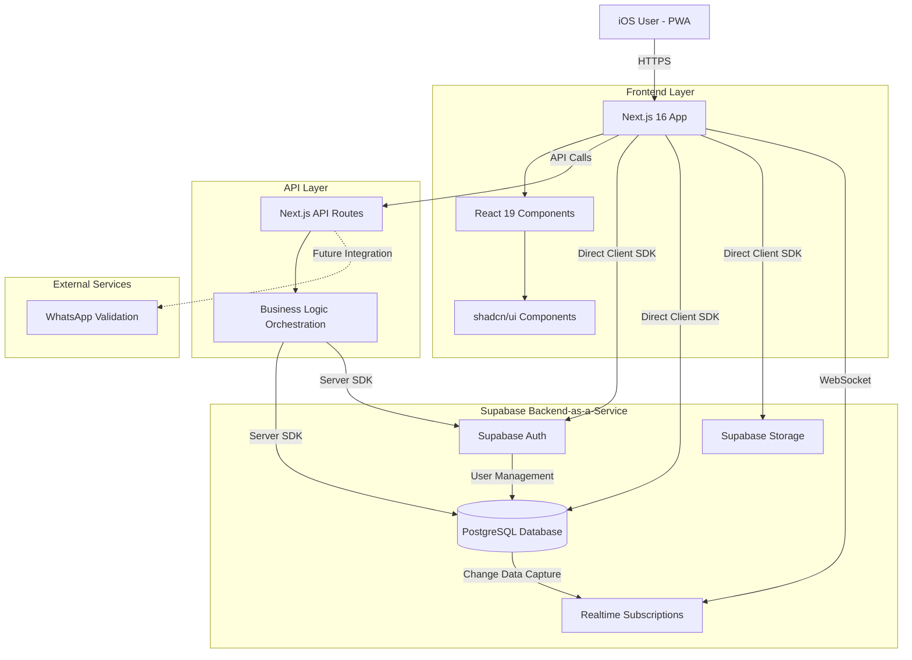

# Auralux Architecture - Overview

## Introduction

This document outlines the overall project architecture for **Auralux**, including backend systems, shared services, and non-UI specific concerns. Its primary goal is to serve as the guiding architectural blueprint for AI-driven development, ensuring consistency and adherence to chosen patterns and technologies.

**Relationship to Frontend Architecture:**
If the project includes a significant user interface, a separate Frontend Architecture Document will detail the frontend-specific design and MUST be used in conjunction with this document. Core technology stack choices documented herein (see "Tech Stack") are definitive for the entire project, including any frontend components.

### Starter Template or Existing Project

**Analysis:**

The **Auralux** project is based on:

- **Next.js 16.0.0** as the core framework
- **React 19.2.0** for UI components
- **shadcn/ui** component library (60+ components configured)
- **Supabase** as backend-as-a-service (configured via MCP)

**Starter Template Used:**
- **Next.js App Router Template** (version 16.0.0 with App Directory)
- **shadcn/ui** (style: "new-york")

**Pre-configured Structure:**
- App directory structure (`app/layout.tsx`, `app/page.tsx`)
- TailwindCSS 4.1.9 configured
- TypeScript 5 configured
- PostCSS configured
- PWA manifest configured
- shadcn/ui components installed and customized

**Constraints from Starter:**
- Next.js App Router requires specific directory structure (`app/`)
- File-system based routing
- Server Components by default
- Native support for API Routes in `app/api/`
- Optimized for Vercel deployment (compatible with other platforms)

**Decision:** The project is already initialized with Next.js + shadcn/ui. Backend architecture will be designed to integrate with this existing structure via Supabase.

### Change Log

| Date | Version | Description | Author |
|------|---------|-------------|--------|
| 2025-11-07 | v1.0 | Initial Backend Architecture creation | Winston (Architect Agent) |
| 2025-11-07 | v1.1 | Fragmented into modular documents | System |

---

## High Level Architecture

### Technical Summary

Auralux employs a **serverless-first architecture** using Supabase as the primary backend-as-a-service (BaaS) platform, integrated with a Next.js 16 frontend application. The system follows a **monolithic-frontend with distributed backend services** pattern, where the Next.js application serves as the presentation and application layer, while Supabase provides managed PostgreSQL database, authentication, real-time subscriptions, and file storage. This architecture prioritizes rapid development, cost efficiency, and automatic scalability—directly supporting the PRD goals of delivering a mobile-first PWA for retail store management with minimal operational overhead. The system leverages Row Level Security (RLS) for multi-tenancy and data isolation, with API Routes handling business logic orchestration.

### High Level Overview

**Architectural Style:** Serverless Monolith with Managed Backend Services

**Key Decisions:**

1. **Repository Structure:** **Monorepo** (Single repository)
   - Rationale: For an MVP with tightly coupled frontend/backend, a monorepo simplifies development, deployment, and maintains consistency across the stack.

2. **Service Architecture:** **Backend-as-a-Service (BaaS) with Serverless Functions**
   - Rationale: Supabase provides managed PostgreSQL, Auth, Storage, and Real-time subscriptions. Next.js API Routes handle custom business logic. This eliminates infrastructure management while maintaining flexibility.

3. **Primary User Flow:**
   ```
   User (iOS PWA)
   → Next.js Frontend (React 19)
   → Next.js API Routes (Business Logic)
   → Supabase (Auth, Database, Storage)
   → PostgreSQL (Data Persistence)
   ```

4. **Data Flow:**
   - Authentication flows through Supabase Auth
   - CRUD operations use Supabase JS Client with RLS policies
   - Complex business logic (e.g., sale completion with inventory updates) orchestrated via Next.js API Routes
   - Real-time updates via Supabase Realtime subscriptions

5. **Multi-tenancy:** Implemented via Supabase Row Level Security (RLS) policies, ensuring each user sees only their own data

### High Level Project Diagram



### Architectural and Design Patterns

- **Backend-as-a-Service (BaaS) Pattern:** Using Supabase for managed backend services - _Rationale:_ Eliminates infrastructure management, provides automatic scaling, and significantly reduces time-to-market for MVP while maintaining production-grade reliability and security.

- **Serverless Functions Pattern:** Next.js API Routes for custom business logic - _Rationale:_ Enables complex orchestration (e.g., atomic sale transactions with inventory updates) without managing servers, with automatic scaling and pay-per-use pricing.

- **Repository Pattern:** Abstraction layer for data access via Supabase client - _Rationale:_ Encapsulates database operations, enables testing with mocks, and provides flexibility for future database migrations or query optimizations.

- **Row Level Security (RLS) Pattern:** Multi-tenancy at database level - _Rationale:_ Ensures data isolation between users without complex application-level checks, enforced at PostgreSQL level for guaranteed security.

- **Real-time Pub/Sub Pattern:** Supabase Realtime for dashboard updates - _Rationale:_ Provides instant UI updates when sales/inventory change without polling, improving user experience and reducing server load.

- **Optimistic UI Updates Pattern:** Client-side state updates before server confirmation - _Rationale:_ Creates responsive user experience on mobile, with rollback on failures, critical for the mobile-first use case.

- **API Gateway Pattern:** Next.js API Routes as orchestration layer - _Rationale:_ Centralizes business logic, handles complex transactions, and provides clean separation between frontend and backend concerns.

---

## Related Documents

- **[Tech Stack](./01-tech-stack.md)** - Complete technology stack and versions
- **[Data Models](./02-data-models.md)** - Database entity models and relationships
- **[Services](./03-services.md)** - Backend service components
- **[Database Schema](./04-database-schema.md)** - PostgreSQL schema and migrations
- **[Core Workflows](./05-workflows.md)** - Key system workflows with diagrams
- **[Infrastructure](./06-infrastructure.md)** - Deployment and environments
- **[Error Handling](./07-error-handling.md)** - Error handling and logging strategies
- **[Source Tree](./08-source-tree.md)** - Project file structure
- **[Coding Standards](./09-coding-standards.md)** - Code quality and testing standards
- **[Security](./10-security.md)** - Security policies and practices

---

**Document Version:** v1.1
**Last Updated:** 2025-11-07
**Author:** Winston (Architect Agent)
**Status:** Complete - Modularized
