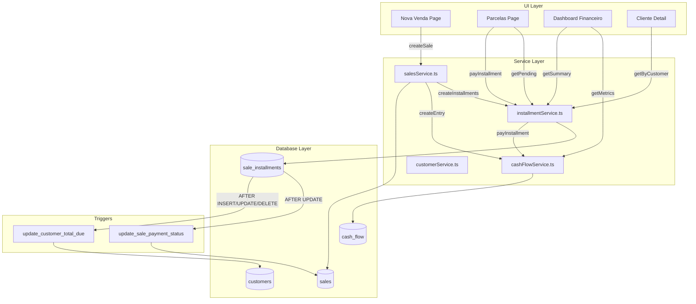

# Auralux - Arquitetura do Sistema de Fluxo de Caixa

## Brownfield Enhancement Architecture

**Versão:** 1.0
**Data:** 2025-11-29
**PRD de Referência:** `docs/prd-cash-flow.md`
**Arquitetura Base:** `docs/architecture.md`

---

## 1. Introdução

Este documento define a arquitetura técnica para implementação do **Sistema de Fluxo de Caixa e Gestão de Parcelas** no Auralux. Serve como blueprint para desenvolvimento AI-driven, garantindo integração consistente com o sistema existente.

### 1.1 Relacionamento com Arquitetura Existente

Este documento **suplementa** a arquitetura principal (`docs/architecture.md`) e deve ser usado em conjunto. Onde houver conflitos, este documento prevalece para o módulo financeiro.

### 1.2 Análise do Projeto Existente

| Aspecto | Estado Atual |
|---------|--------------|
| **Propósito** | Sistema de gestão para loja de perfumes de luxo |
| **Tech Stack** | Next.js 16 + React 19 + Supabase + shadcn/ui |
| **Estilo Arquitetural** | Serverless Monolith com BaaS |
| **Deployment** | Vercel + Supabase Cloud |

### 1.3 Documentação Disponível

- `docs/architecture.md` - Arquitetura principal do sistema
- `docs/prd-cash-flow.md` - PRD desta feature
- `lib/services/salesService.ts` - Service de vendas existente
- `lib/services/inventoryService.ts` - Service de estoque existente

### 1.4 Restrições Identificadas

| Restrição | Impacto | Mitigação |
|-----------|---------|-----------|
| Vendas existentes sem parcelas | Migração necessária | Script idempotente |
| Campo `actual_amount_received` ambíguo | Lógica legada | Manter compatibilidade |
| Triggers existentes (`update_customer_on_sale`) | Não quebrar | Testes de regressão |
| RLS por `user_id` | Novas tabelas devem seguir padrão | Copiar policies existentes |

### 1.5 Change Log

| Data | Versão | Descrição | Autor |
|------|--------|-----------|-------|
| 2025-11-29 | 1.0 | Criação inicial | Winston (Architect Agent) |

---

## 2. Escopo da Enhancement e Estratégia de Integração

### 2.1 Visão Geral da Enhancement

| Aspecto | Valor |
|---------|-------|
| **Tipo** | New Feature Addition + Major Feature Modification |
| **Escopo** | Módulo financeiro completo |
| **Impacto de Integração** | Alto - modifica fluxo de vendas |

### 2.2 Abordagem de Integração

```
┌─────────────────────────────────────────────────────────────────┐
│                    FLUXO DE INTEGRAÇÃO                          │
├─────────────────────────────────────────────────────────────────┤
│                                                                 │
│  [Venda Existente]                [Nova Funcionalidade]         │
│        │                                  │                     │
│        ▼                                  ▼                     │
│  ┌──────────┐    ┌──────────────┐   ┌──────────────┐           │
│  │  sales   │───▶│ sale_install │───▶│  cash_flow   │           │
│  │ (modify) │    │   ments      │    │   (new)      │           │
│  └──────────┘    │   (new)      │    └──────────────┘           │
│        │         └──────────────┘           │                   │
│        │                │                   │                   │
│        ▼                ▼                   ▼                   │
│  ┌──────────────────────────────────────────────────┐          │
│  │              salesService.ts (modify)             │          │
│  │         + installmentService.ts (new)             │          │
│  │         + cashFlowService.ts (new)                │          │
│  └──────────────────────────────────────────────────┘          │
│                                                                 │
└─────────────────────────────────────────────────────────────────┘
```

### 2.3 Estratégia por Camada

| Camada | Estratégia |
|--------|------------|
| **Código** | Novos services + modificação mínima do `salesService.ts` |
| **Database** | Novas tabelas + 2 colunas em `sales` + triggers |
| **API** | Novos endpoints + extensão de `createSale()` |
| **UI** | Novas páginas em `/admin/financeiro/` |

### 2.4 Requisitos de Compatibilidade

| Requisito | Abordagem |
|-----------|-----------|
| **API Existente** | `createSale()` mantém assinatura, adiciona geração de parcelas internamente |
| **Schema do Banco** | Colunas adicionais em `sales`, novas tabelas não quebram nada |
| **UI/UX** | Fluxo de venda permanece similar, campo "entrada" adicionado |
| **Triggers** | Triggers existentes continuam funcionando |

---

## 3. Alinhamento do Tech Stack

### 3.1 Stack Existente (Obrigatório)

| Categoria | Tecnologia | Versão | Uso na Enhancement |
|-----------|------------|--------|-------------------|
| Framework | Next.js | 16.0.0 | App Router para novas páginas |
| UI | React | 19.2.0 | Componentes de parcelas/dashboard |
| Componentes | shadcn/ui | Latest | Cards, Tables, Dialogs, Charts |
| Styling | Tailwind CSS | 4.1.9 | Classes utilitárias |
| Backend | Supabase | Latest | Novas tabelas, RLS, queries |
| Database | PostgreSQL | 15.8 | Triggers, indexes |
| State | TanStack Query | 5.x | Cache de parcelas e cash flow |
| Forms | React Hook Form | 7.x | Formulário de baixa de parcela |
| Validation | Zod | 3.x | Schemas de parcelas |
| Charts | Recharts | 2.x | Gráficos de fluxo de caixa |

### 3.2 Novas Adições de Tecnologia

**Nenhuma nova tecnologia necessária.** Todo o stack existente suporta a implementação.

---

## 4. Modelos de Dados e Alterações de Schema

### 4.1 Novos Modelos de Dados

#### 4.1.1 `sale_installments` - Parcelas de Venda

**Propósito:** Rastrear cada parcela individual de vendas parceladas

**Integração:** FK para `sales.id` e `users.id`

```sql
CREATE TABLE sale_installments (
  id UUID PRIMARY KEY DEFAULT gen_random_uuid(),
  sale_id UUID NOT NULL REFERENCES sales(id) ON DELETE CASCADE,
  user_id UUID NOT NULL REFERENCES users(id),
  installment_number INTEGER NOT NULL,        -- 1, 2, 3...
  amount DECIMAL(10,2) NOT NULL,              -- Valor da parcela
  due_date DATE NOT NULL,                     -- Data de vencimento
  status TEXT DEFAULT 'pending',              -- pending, paid, partial, overdue, cancelled
  paid_amount DECIMAL(10,2) DEFAULT 0,        -- Quanto já foi pago
  paid_at TIMESTAMPTZ,                        -- Quando foi pago
  payment_method TEXT,                        -- pix, cash, etc (ao pagar)
  notes TEXT,                                 -- Observações
  created_at TIMESTAMPTZ DEFAULT NOW(),
  updated_at TIMESTAMPTZ DEFAULT NOW(),

  CONSTRAINT valid_status CHECK (status IN ('pending', 'paid', 'partial', 'overdue', 'cancelled')),
  CONSTRAINT valid_amount CHECK (amount > 0),
  CONSTRAINT valid_paid CHECK (paid_amount >= 0 AND paid_amount <= amount),
  CONSTRAINT unique_installment UNIQUE (sale_id, installment_number)
);

-- Indexes para queries frequentes
CREATE INDEX idx_installments_sale ON sale_installments(sale_id);
CREATE INDEX idx_installments_user_due ON sale_installments(user_id, due_date);
CREATE INDEX idx_installments_status ON sale_installments(status) WHERE status != 'paid';
CREATE INDEX idx_installments_overdue ON sale_installments(user_id, due_date, status)
  WHERE status IN ('pending', 'partial');
```

**Relacionamentos:**
- `sale_id` → `sales.id` (N:1)
- `user_id` → `users.id` (N:1)

#### 4.1.2 `cash_flow` - Fluxo de Caixa

**Propósito:** Registrar entradas e saídas reais de dinheiro

**Integração:** Referência polimórfica para origem (venda, parcela, etc.)

```sql
CREATE TABLE cash_flow (
  id UUID PRIMARY KEY DEFAULT gen_random_uuid(),
  user_id UUID NOT NULL REFERENCES users(id),
  type TEXT NOT NULL,                         -- 'income' ou 'expense'
  category TEXT NOT NULL,                     -- 'sale', 'installment', 'refund', etc.
  amount DECIMAL(10,2) NOT NULL,              -- Valor (sempre positivo)
  description TEXT,                           -- Descrição do lançamento
  reference_type TEXT,                        -- 'sale', 'installment', etc.
  reference_id UUID,                          -- ID do registro de origem
  transaction_date DATE NOT NULL,             -- Data da transação
  created_at TIMESTAMPTZ DEFAULT NOW(),
  created_by UUID REFERENCES users(id),       -- Quem registrou (audit)

  CONSTRAINT valid_type CHECK (type IN ('income', 'expense')),
  CONSTRAINT valid_category CHECK (category IN (
    'sale_cash',           -- Venda à vista (pix/dinheiro)
    'sale_down_payment',   -- Entrada de venda parcelada
    'installment_payment', -- Pagamento de parcela
    'refund',              -- Estorno
    'adjustment',          -- Ajuste manual
    'other'                -- Outros
  )),
  CONSTRAINT valid_amount CHECK (amount > 0)
);

-- Indexes para queries frequentes
CREATE INDEX idx_cashflow_user_date ON cash_flow(user_id, transaction_date DESC);
CREATE INDEX idx_cashflow_type_date ON cash_flow(user_id, type, transaction_date);
CREATE INDEX idx_cashflow_reference ON cash_flow(reference_type, reference_id);
CREATE INDEX idx_cashflow_category ON cash_flow(user_id, category, transaction_date);
```

### 4.2 Alterações em Tabelas Existentes

#### 4.2.1 Alterações em `sales`

```sql
-- Adicionar colunas para controle de pagamento
ALTER TABLE sales
  ADD COLUMN payment_status TEXT DEFAULT 'paid',
  ADD COLUMN down_payment DECIMAL(10,2) DEFAULT 0;

-- Constraint para payment_status
ALTER TABLE sales ADD CONSTRAINT valid_payment_status
  CHECK (payment_status IN ('paid', 'partial', 'pending'));

-- Comentários para documentação
COMMENT ON COLUMN sales.payment_status IS
  'Status de pagamento: paid (quitado), partial (parcialmente pago), pending (aguardando)';
COMMENT ON COLUMN sales.down_payment IS
  'Valor da entrada/sinal em vendas parceladas';
```

### 4.3 Row Level Security (RLS)

```sql
-- RLS para sale_installments
ALTER TABLE sale_installments ENABLE ROW LEVEL SECURITY;

CREATE POLICY "Users can view own installments" ON sale_installments
  FOR SELECT USING (auth.uid() = user_id);

CREATE POLICY "Users can insert own installments" ON sale_installments
  FOR INSERT WITH CHECK (auth.uid() = user_id);

CREATE POLICY "Users can update own installments" ON sale_installments
  FOR UPDATE USING (auth.uid() = user_id);

CREATE POLICY "Users can delete own installments" ON sale_installments
  FOR DELETE USING (auth.uid() = user_id);

-- RLS para cash_flow
ALTER TABLE cash_flow ENABLE ROW LEVEL SECURITY;

CREATE POLICY "Users can view own cash flow" ON cash_flow
  FOR SELECT USING (auth.uid() = user_id);

CREATE POLICY "Users can insert own cash flow" ON cash_flow
  FOR INSERT WITH CHECK (auth.uid() = user_id);

CREATE POLICY "Users can update own cash flow" ON cash_flow
  FOR UPDATE USING (auth.uid() = user_id);

CREATE POLICY "Users can delete own cash flow" ON cash_flow
  FOR DELETE USING (auth.uid() = user_id);
```

### 4.4 Triggers e Functions

#### 4.4.1 Atualizar Status de Parcelas Vencidas (Cron)

```sql
-- Function para marcar parcelas vencidas
CREATE OR REPLACE FUNCTION update_overdue_installments()
RETURNS void AS $$
BEGIN
  UPDATE sale_installments
  SET
    status = 'overdue',
    updated_at = NOW()
  WHERE
    status IN ('pending', 'partial')
    AND due_date < CURRENT_DATE;
END;
$$ LANGUAGE plpgsql SECURITY DEFINER;

-- Pode ser chamada via Supabase Edge Function com cron
```

#### 4.4.2 Atualizar Status da Venda ao Pagar Parcela

```sql
-- Function para atualizar payment_status da venda
CREATE OR REPLACE FUNCTION update_sale_payment_status()
RETURNS TRIGGER AS $$
DECLARE
  total_installments INTEGER;
  paid_installments INTEGER;
BEGIN
  -- Contar parcelas da venda
  SELECT
    COUNT(*),
    COUNT(*) FILTER (WHERE status = 'paid')
  INTO total_installments, paid_installments
  FROM sale_installments
  WHERE sale_id = NEW.sale_id;

  -- Atualizar status da venda
  UPDATE sales
  SET
    payment_status = CASE
      WHEN paid_installments = total_installments THEN 'paid'
      WHEN paid_installments > 0 THEN 'partial'
      ELSE 'pending'
    END,
    updated_at = NOW()
  WHERE id = NEW.sale_id;

  RETURN NEW;
END;
$$ LANGUAGE plpgsql SECURITY DEFINER;

-- Trigger
CREATE TRIGGER trigger_update_sale_payment_status
  AFTER UPDATE OF status ON sale_installments
  FOR EACH ROW
  WHEN (OLD.status IS DISTINCT FROM NEW.status)
  EXECUTE FUNCTION update_sale_payment_status();
```

#### 4.4.3 Atualizar total_due do Cliente

```sql
-- Function para atualizar total_due do cliente
CREATE OR REPLACE FUNCTION update_customer_total_due()
RETURNS TRIGGER AS $$
DECLARE
  customer_uuid UUID;
  new_total_due DECIMAL(10,2);
BEGIN
  -- Pegar customer_id da venda
  SELECT customer_id INTO customer_uuid
  FROM sales
  WHERE id = COALESCE(NEW.sale_id, OLD.sale_id);

  IF customer_uuid IS NOT NULL THEN
    -- Calcular total devido
    SELECT COALESCE(SUM(amount - paid_amount), 0)
    INTO new_total_due
    FROM sale_installments si
    JOIN sales s ON s.id = si.sale_id
    WHERE s.customer_id = customer_uuid
      AND si.status IN ('pending', 'partial', 'overdue');

    -- Atualizar cliente
    UPDATE customers
    SET
      total_due = new_total_due,
      updated_at = NOW()
    WHERE id = customer_uuid;
  END IF;

  RETURN COALESCE(NEW, OLD);
END;
$$ LANGUAGE plpgsql SECURITY DEFINER;

-- Triggers
CREATE TRIGGER trigger_customer_due_on_installment_change
  AFTER INSERT OR UPDATE OR DELETE ON sale_installments
  FOR EACH ROW
  EXECUTE FUNCTION update_customer_total_due();
```

### 4.5 Estratégia de Migração de Dados

```sql
-- Script de migração para vendas parceladas existentes
-- IMPORTANTE: Executar em transação, é idempotente

DO $$
DECLARE
  sale_record RECORD;
  installment_amount DECIMAL(10,2);
  installment_date DATE;
  i INTEGER;
BEGIN
  -- Iterar vendas parceladas sem parcelas criadas
  FOR sale_record IN
    SELECT s.*
    FROM sales s
    WHERE s.payment_method = 'installment'
      AND s.installment_count > 0
      AND NOT EXISTS (
        SELECT 1 FROM sale_installments si WHERE si.sale_id = s.id
      )
  LOOP
    -- Calcular valor de cada parcela
    installment_amount := sale_record.total_amount / sale_record.installment_count;

    -- Criar parcelas
    FOR i IN 1..sale_record.installment_count LOOP
      installment_date := (sale_record.created_at::DATE + (i - 1) * INTERVAL '1 month')::DATE;

      INSERT INTO sale_installments (
        sale_id,
        user_id,
        installment_number,
        amount,
        due_date,
        status,
        paid_amount,
        paid_at,
        payment_method,
        notes
      ) VALUES (
        sale_record.id,
        sale_record.user_id,
        i,
        installment_amount,
        installment_date,
        'paid',  -- Assumir pagas (histórico)
        installment_amount,
        installment_date,
        'migrated',
        'Parcela migrada automaticamente'
      );

      -- Criar registro no cash_flow
      INSERT INTO cash_flow (
        user_id,
        type,
        category,
        amount,
        description,
        reference_type,
        reference_id,
        transaction_date
      ) VALUES (
        sale_record.user_id,
        'income',
        'installment_payment',
        installment_amount,
        'Parcela ' || i || '/' || sale_record.installment_count || ' (migração)',
        'installment',
        NULL,  -- Será atualizado após insert
        installment_date
      );
    END LOOP;

    -- Atualizar venda
    UPDATE sales
    SET
      payment_status = 'paid',
      down_payment = 0
    WHERE id = sale_record.id;

    RAISE NOTICE 'Migrada venda %: % parcelas', sale_record.id, sale_record.installment_count;
  END LOOP;
END $$;
```

---

## 5. Arquitetura de Componentes

### 5.1 Novos Services (Backend)

#### 5.1.1 `installmentService.ts`

**Responsabilidade:** Gestão completa de parcelas

**Interfaces:**

```typescript
// lib/services/installmentService.ts

export interface Installment {
  id: string
  sale_id: string
  user_id: string
  installment_number: number
  amount: number
  due_date: string
  status: 'pending' | 'paid' | 'partial' | 'overdue' | 'cancelled'
  paid_amount: number
  paid_at: string | null
  payment_method: string | null
  notes: string | null
  created_at: string
  updated_at: string
  // Joins
  sale?: {
    id: string
    total_amount: number
    customer_id: string
  }
  customer?: {
    id: string
    full_name: string
    whatsapp: string
  }
}

export interface InstallmentFilters {
  status?: Installment['status'][]
  dueDateFrom?: Date
  dueDateTo?: Date
  customerId?: string
  saleId?: string
}

export interface PayInstallmentInput {
  installmentId: string
  amount: number
  paymentMethod: 'pix' | 'cash'
  paidAt?: Date
  notes?: string
}

export interface InstallmentSummary {
  totalPending: number
  totalOverdue: number
  countPending: number
  countOverdue: number
  dueThisWeek: number
  dueThisMonth: number
}

// Functions
export async function getInstallmentsBySale(saleId: string): Promise<Installment[]>
export async function getInstallmentsByCustomer(customerId: string): Promise<Installment[]>
export async function getPendingInstallments(filters?: InstallmentFilters): Promise<Installment[]>
export async function getOverdueInstallments(): Promise<Installment[]>
export async function getInstallmentsSummary(): Promise<InstallmentSummary>
export async function payInstallment(input: PayInstallmentInput): Promise<Installment>
export async function createInstallmentsForSale(
  saleId: string,
  totalAmount: number,
  downPayment: number,
  installmentCount: number,
  startDate: Date
): Promise<Installment[]>
```

#### 5.1.2 `cashFlowService.ts`

**Responsabilidade:** Consultas e métricas de fluxo de caixa

**Interfaces:**

```typescript
// lib/services/cashFlowService.ts

export interface CashFlowEntry {
  id: string
  user_id: string
  type: 'income' | 'expense'
  category: string
  amount: number
  description: string | null
  reference_type: string | null
  reference_id: string | null
  transaction_date: string
  created_at: string
}

export interface CashFlowSummary {
  totalIncome: number
  totalExpense: number
  balance: number
  period: {
    start: string
    end: string
  }
}

export interface CashFlowMetrics {
  today: number
  thisWeek: number
  thisMonth: number
  pendingReceivables: number
  overdueReceivables: number
}

export interface ReceivablesForecast {
  month: string
  expected: number
  count: number
}[]

// Functions
export async function getCashFlowByPeriod(
  startDate: Date,
  endDate: Date
): Promise<CashFlowEntry[]>

export async function getCashFlowSummary(
  startDate: Date,
  endDate: Date
): Promise<CashFlowSummary>

export async function getDailyCashFlow(date: Date): Promise<CashFlowEntry[]>

export async function getCashFlowMetrics(): Promise<CashFlowMetrics>

export async function getReceivablesForecast(months: number): Promise<ReceivablesForecast>

export async function createCashFlowEntry(input: {
  type: 'income' | 'expense'
  category: string
  amount: number
  description?: string
  referenceType?: string
  referenceId?: string
  transactionDate: Date
}): Promise<CashFlowEntry>
```

### 5.2 Modificações em Services Existentes

#### 5.2.1 Modificações em `salesService.ts`

**Arquivo:** `lib/services/salesService.ts`

**Mudanças necessárias:**

```typescript
// 1. Atualizar CreateSaleInput
export interface CreateSaleInput {
  customer_id: string
  cartItems: Array<{...}>
  payment_method: 'pix' | 'cash' | 'installment'
  installment_count?: number
  actual_amount_received?: number
  down_payment?: number  // NOVO: entrada/sinal
  notes?: string
}

// 2. Modificar createSale() para:
// - Aceitar down_payment
// - Chamar createInstallmentsForSale() para parcelados
// - Criar entrada no cash_flow para vendas à vista
// - Criar entrada no cash_flow para down_payment se existir
// - Setar payment_status corretamente

// 3. Manter compatibilidade:
// - Se down_payment não for passado, comportamento atual
// - actual_amount_received continua funcionando para legado
```

### 5.3 Diagrama de Interação de Componentes



### 5.4 Novos Componentes UI

| Componente | Localização | Propósito |
|------------|-------------|-----------|
| `InstallmentCard` | `components/financeiro/` | Card individual de parcela |
| `InstallmentTable` | `components/financeiro/` | Tabela de parcelas com filtros |
| `PayInstallmentDialog` | `components/financeiro/` | Modal para dar baixa |
| `CashFlowSummary` | `components/financeiro/` | Cards de métricas |
| `ReceivablesChart` | `components/financeiro/` | Gráfico de evolução |
| `OverdueAlert` | `components/financeiro/` | Alerta de vencidas |

---

## 6. Design de API e Integração

### 6.1 Estratégia de API

| Aspecto | Abordagem |
|---------|-----------|
| **Padrão** | Services diretos (Supabase Client) |
| **Autenticação** | Supabase Auth (JWT via RLS) |
| **Validação** | Zod schemas |
| **Error Handling** | Try-catch com mensagens em português |

### 6.2 Novos Endpoints/Functions

#### 6.2.1 Parcelas

**`getInstallmentsBySale(saleId: string)`**

```typescript
// Request
const installments = await getInstallmentsBySale('uuid-da-venda')

// Response
[
  {
    id: 'uuid',
    sale_id: 'uuid-da-venda',
    installment_number: 1,
    amount: 243.33,
    due_date: '2025-11-13',
    status: 'paid',
    paid_amount: 243.33,
    paid_at: '2025-11-13T10:00:00Z',
    payment_method: 'pix'
  },
  {
    id: 'uuid',
    installment_number: 2,
    amount: 243.33,
    due_date: '2025-12-13',
    status: 'pending',
    paid_amount: 0,
    paid_at: null
  }
]
```

**`getPendingInstallments(filters)`**

```typescript
// Request
const pending = await getPendingInstallments({
  status: ['pending', 'overdue'],
  dueDateFrom: new Date('2025-11-01'),
  dueDateTo: new Date('2025-11-30')
})

// Response
[
  {
    ...installment,
    sale: { id, total_amount, customer_id },
    customer: { id, full_name, whatsapp }
  }
]
```

**`payInstallment(input)`**

```typescript
// Request
const paid = await payInstallment({
  installmentId: 'uuid',
  amount: 243.33,
  paymentMethod: 'pix',
  paidAt: new Date(),
  notes: 'Pago via PIX'
})

// Response
{
  ...installment,
  status: 'paid',
  paid_amount: 243.33,
  paid_at: '2025-11-29T15:30:00Z'
}

// Side Effects:
// 1. cash_flow entry created
// 2. sale.payment_status updated via trigger
// 3. customer.total_due updated via trigger
```

#### 6.2.2 Fluxo de Caixa

**`getCashFlowMetrics()`**

```typescript
// Response
{
  today: 1500.00,           // Entradas de hoje
  thisWeek: 4200.00,        // Entradas da semana
  thisMonth: 15800.00,      // Entradas do mês
  pendingReceivables: 3200.00,  // A receber
  overdueReceivables: 487.00    // Vencidas
}
```

**`getReceivablesForecast(months: 3)`**

```typescript
// Response
[
  { month: '2025-12', expected: 2430.00, count: 5 },
  { month: '2026-01', expected: 1820.00, count: 4 },
  { month: '2026-02', expected: 890.00, count: 2 }
]
```

### 6.3 Integração com createSale()

**Assinatura mantida (backward compatible):**

```typescript
// Antes (continua funcionando)
await createSale({
  customer_id: 'uuid',
  cartItems: [...],
  payment_method: 'installment',
  installment_count: 3,
  actual_amount_received: 243.33
})

// Depois (com nova funcionalidade)
await createSale({
  customer_id: 'uuid',
  cartItems: [...],
  payment_method: 'installment',
  installment_count: 3,
  down_payment: 200.00,  // NOVO: entrada
  notes: 'Cliente pagou R$ 200 de entrada'
})
```

**Comportamento interno:**

```typescript
// Pseudo-código do novo fluxo
async function createSale(input) {
  // 1. Validar estoque (existente)
  // 2. Calcular total (existente)

  // 3. NOVO: Determinar payment_status
  const paymentStatus = input.payment_method === 'installment'
    ? (input.down_payment > 0 ? 'partial' : 'pending')
    : 'paid'

  // 4. Criar venda com novos campos
  const sale = await supabase.from('sales').insert({
    ...existingFields,
    payment_status: paymentStatus,
    down_payment: input.down_payment || 0
  })

  // 5. Criar itens (existente)

  // 6. NOVO: Se parcelado, criar parcelas
  if (input.payment_method === 'installment') {
    const parcelableAmount = total - (input.down_payment || 0)
    await createInstallmentsForSale(
      sale.id,
      parcelableAmount,
      input.installment_count,
      new Date()
    )
  }

  // 7. NOVO: Registrar no cash_flow
  if (input.payment_method !== 'installment') {
    // Venda à vista - registra total
    await createCashFlowEntry({
      type: 'income',
      category: 'sale_cash',
      amount: total,
      referenceType: 'sale',
      referenceId: sale.id
    })
  } else if (input.down_payment > 0) {
    // Entrada de parcelado
    await createCashFlowEntry({
      type: 'income',
      category: 'sale_down_payment',
      amount: input.down_payment,
      referenceType: 'sale',
      referenceId: sale.id
    })
  }

  return sale
}
```

---

## 7. Integração na Árvore de Código

### 7.1 Estrutura Existente Relevante

```
project-root/
├── app/
│   ├── admin/
│   │   ├── vendas/
│   │   │   └── page.tsx          # Lista de vendas
│   │   ├── clientes/
│   │   │   └── [id]/
│   │   │       └── page.tsx      # Detalhe do cliente
│   │   └── layout.tsx
│   └── layout.tsx
├── components/
│   ├── ui/                        # shadcn/ui
│   ├── vendas/
│   └── clientes/
├── lib/
│   ├── services/
│   │   ├── salesService.ts       # A MODIFICAR
│   │   ├── customerService.ts
│   │   └── inventoryService.ts
│   ├── supabase/
│   │   └── client.ts
│   └── validations/
│       └── saleSchemas.ts
└── types/
    └── supabase.ts               # Tipos gerados
```

### 7.2 Novas Adições

```
project-root/
├── app/
│   └── admin/
│       └── financeiro/                    # NOVA PASTA
│           ├── page.tsx                   # Dashboard financeiro
│           ├── parcelas/
│           │   └── page.tsx               # Lista de parcelas
│           └── fluxo-caixa/
│               └── page.tsx               # Extrato de caixa
├── components/
│   └── financeiro/                        # NOVA PASTA
│       ├── InstallmentCard.tsx
│       ├── InstallmentTable.tsx
│       ├── PayInstallmentDialog.tsx
│       ├── CashFlowSummary.tsx
│       ├── ReceivablesChart.tsx
│       ├── OverdueAlert.tsx
│       └── index.ts                       # Barrel export
├── lib/
│   ├── services/
│   │   ├── salesService.ts                # MODIFICAR
│   │   ├── installmentService.ts          # NOVO
│   │   └── cashFlowService.ts             # NOVO
│   └── validations/
│       ├── saleSchemas.ts                 # MODIFICAR
│       └── installmentSchemas.ts          # NOVO
└── types/
    └── supabase.ts                        # REGENERAR
```

### 7.3 Diretrizes de Integração

| Aspecto | Padrão a Seguir |
|---------|-----------------|
| **Nomes de arquivo** | kebab-case (`cash-flow-service.ts` ou `cashFlowService.ts`) |
| **Nomes de componentes** | PascalCase (`InstallmentCard.tsx`) |
| **Exports** | Named exports, barrel files em `index.ts` |
| **Imports** | Alias `@/` para root |

---

## 8. Infraestrutura e Deployment

### 8.1 Infraestrutura Existente

| Aspecto | Valor |
|---------|-------|
| **Deployment** | Vercel (Next.js nativo) |
| **Backend** | Supabase Cloud |
| **Database** | PostgreSQL 15.8 (Supabase managed) |
| **Ambientes** | Production (Supabase project único) |

### 8.2 Estratégia de Deployment da Enhancement

| Etapa | Ação | Risco |
|-------|------|-------|
| 1 | Criar tabelas e RLS via migration | Baixo - aditivo |
| 2 | Criar triggers e functions | Baixo - aditivo |
| 3 | Deploy do código (services + UI) | Médio - novo código |
| 4 | Executar migração de dados | Médio - modifica dados |
| 5 | Validar em produção | - |

### 8.3 Estratégia de Rollback

| Cenário | Rollback |
|---------|----------|
| **Tabelas criadas com problema** | DROP tables (sem dados ainda) |
| **Triggers com bug** | DROP TRIGGER + DROP FUNCTION |
| **Código com bug** | Revert Git + Redeploy |
| **Migração de dados errada** | Script reverso (marcar parcelas como não migradas) |

### 8.4 Monitoramento

- **Erros:** Vercel Analytics + Console logs
- **Performance:** Query execution time via Supabase Dashboard
- **Dados:** Verificar consistência via SQL queries

---

## 9. Padrões de Código

### 9.1 Padrões Existentes a Seguir

| Padrão | Exemplo do Projeto |
|--------|-------------------|
| **Estrutura de Service** | Ver `salesService.ts` |
| **Error Handling** | Try-catch com mensagens em português |
| **Supabase Client** | `createClient()` de `@/lib/supabase/client` |
| **Tipos** | Derivar de `Database['public']['Tables']` |
| **Validação** | Zod schemas em `lib/validations/` |

### 9.2 Padrão de Service Function

```typescript
// Padrão a seguir (copiado de salesService.ts)
export async function getInstallmentsBySale(saleId: string): Promise<Installment[]> {
  const supabase = createClient()

  try {
    const {
      data: { user },
    } = await supabase.auth.getUser()

    if (!user) {
      throw new Error('Usuário não autenticado')
    }

    const { data, error } = await supabase
      .from('sale_installments')
      .select('*')
      .eq('sale_id', saleId)
      .order('installment_number', { ascending: true })

    if (error) throw error

    return data || []
  } catch (error) {
    console.error('Error fetching installments:', error)
    throw new Error('Erro ao carregar parcelas. Tente novamente')
  }
}
```

### 9.3 Regras Críticas de Integração

| Regra | Descrição |
|-------|-----------|
| **API Compatibility** | `createSale()` deve aceitar chamadas antigas sem `down_payment` |
| **Database Integration** | Usar transações onde possível, rollback manual se necessário |
| **Error Handling** | Mensagens em português, log técnico em inglês |
| **Logging** | `console.error()` para erros, sem logs de sucesso em produção |

---

## 10. Estratégia de Testes

### 10.1 Integração com Testes Existentes

| Aspecto | Estado Atual |
|---------|--------------|
| **Framework** | Vitest configurado |
| **Organização** | `__tests__/` ou colocated |
| **Coverage** | Não definido |

### 10.2 Novos Requisitos de Teste

#### 10.2.1 Testes Unitários

| Service | Casos de Teste |
|---------|----------------|
| `installmentService` | Criação de parcelas, cálculo de valores, pagamento parcial |
| `cashFlowService` | Métricas, filtros por período, categorias |
| `salesService` (modificado) | Venda com entrada, venda sem entrada, compatibilidade |

#### 10.2.2 Testes de Integração

| Fluxo | Validação |
|-------|-----------|
| Criar venda parcelada com entrada | Parcelas criadas, cash_flow com entrada, payment_status correto |
| Pagar parcela | cash_flow entry, status atualizado, trigger de venda executado |
| Migração de dados | Parcelas criadas corretamente, idempotência |

#### 10.2.3 Testes de Regressão

| Funcionalidade Existente | Verificação |
|--------------------------|-------------|
| Criar venda à vista | Continua funcionando sem parcelas |
| Métricas do dashboard | Valores consistentes |
| Triggers de estoque | Não afetados |
| Triggers de cliente | `purchase_count` e `total_purchases` corretos |

---

## 11. Integração de Segurança

### 11.1 Medidas de Segurança Existentes

| Aspecto | Implementação |
|---------|---------------|
| **Autenticação** | Supabase Auth (email/password) |
| **Autorização** | RLS policies por `user_id` |
| **Data Protection** | Dados isolados por usuário |

### 11.2 Segurança da Enhancement

| Medida | Implementação |
|--------|---------------|
| **RLS nas novas tabelas** | Policies idênticas às existentes |
| **Validação de input** | Zod schemas para todos os inputs |
| **Audit trail** | Campo `created_by` no `cash_flow` |
| **Integridade de dados** | Constraints no PostgreSQL |

### 11.3 Checklist de Segurança

- [x] RLS habilitado em `sale_installments`
- [x] RLS habilitado em `cash_flow`
- [x] Constraints de validação no banco
- [x] Validação Zod no frontend
- [x] Sem exposição de dados entre usuários

---

## 12. Checklist de Arquitetura

### 12.1 Validação Técnica

| Item | Status |
|------|--------|
| Schema de banco definido | ✅ |
| RLS policies especificadas | ✅ |
| Triggers documentados | ✅ |
| Indexes para performance | ✅ |
| Services interfaces definidas | ✅ |
| Integração com código existente clara | ✅ |
| Compatibilidade backward garantida | ✅ |
| Estratégia de migração de dados | ✅ |

### 12.2 Pontos de Atenção

| Ponto | Mitigação |
|-------|-----------|
| Trigger `update_customer_on_sale` existente | Testar que não conflita |
| Campo `actual_amount_received` ambíguo | Manter para legado, usar `down_payment` para novo |
| Performance de queries de período | Indexes criados, testar com volume |

---

## 13. Próximos Passos

### 13.1 Handoff para Story Manager

```
CONTEXTO: Arquitetura brownfield para Sistema de Fluxo de Caixa (Auralux)

DOCUMENTOS:
- PRD: docs/prd-cash-flow.md
- Arquitetura: docs/architecture-cash-flow.md

SEQUÊNCIA DE STORIES (do PRD):
1. Story 1.1: Schema de Parcelas e Fluxo de Caixa
2. Story 1.2: Geração Automática de Parcelas na Venda
3. Story 1.3: Serviço de Gestão de Parcelas
4. Story 1.4: Serviço de Fluxo de Caixa
5. Story 1.5: Interface de Gestão de Parcelas
6. Story 1.6: Dashboard de Fluxo de Caixa
7. Story 1.7: Migração de Vendas Parceladas Existentes
8. Story 1.8: Integração com Detalhes do Cliente

PRIMEIRA STORY: 1.1 (Schema)
- Criar tabelas via Supabase migration
- Configurar RLS
- Criar triggers
- Regenerar tipos TypeScript

CONSTRAINT CRÍTICA:
- Não quebrar funcionalidade existente de vendas
- Triggers existentes devem continuar funcionando
```

### 13.2 Handoff para Desenvolvedor

```
INÍCIO: Story 1.1 - Schema de Parcelas e Fluxo de Caixa

ARQUIVOS A CRIAR:
- Migrations no Supabase (via MCP ou Dashboard)

PADRÕES A SEGUIR:
- Ver lib/services/salesService.ts para estrutura de services
- Usar createClient() de @/lib/supabase/client
- Mensagens de erro em português
- Tipos derivados de Database['public']['Tables']

VERIFICAÇÕES OBRIGATÓRIAS APÓS CADA STORY:
1. Vendas à vista continuam funcionando
2. Triggers de estoque executam normalmente
3. RLS isola dados por usuário
4. Tipos TypeScript atualizados (pnpm supabase gen types)

ORDEM DE IMPLEMENTAÇÃO CRÍTICA:
1. Schema primeiro (base para tudo)
2. Depois services (lógica de negócio)
3. Por último UI (consome services)
```

---

## Apêndice A: SQL Completo para Migrations

```sql
-- Migration 1: Create Tables
-- ============================

-- 1. Tabela de Parcelas
CREATE TABLE sale_installments (
  id UUID PRIMARY KEY DEFAULT gen_random_uuid(),
  sale_id UUID NOT NULL REFERENCES sales(id) ON DELETE CASCADE,
  user_id UUID NOT NULL REFERENCES users(id),
  installment_number INTEGER NOT NULL,
  amount DECIMAL(10,2) NOT NULL,
  due_date DATE NOT NULL,
  status TEXT DEFAULT 'pending',
  paid_amount DECIMAL(10,2) DEFAULT 0,
  paid_at TIMESTAMPTZ,
  payment_method TEXT,
  notes TEXT,
  created_at TIMESTAMPTZ DEFAULT NOW(),
  updated_at TIMESTAMPTZ DEFAULT NOW(),
  CONSTRAINT valid_status CHECK (status IN ('pending', 'paid', 'partial', 'overdue', 'cancelled')),
  CONSTRAINT valid_amount CHECK (amount > 0),
  CONSTRAINT valid_paid CHECK (paid_amount >= 0 AND paid_amount <= amount),
  CONSTRAINT unique_installment UNIQUE (sale_id, installment_number)
);

-- 2. Tabela de Fluxo de Caixa
CREATE TABLE cash_flow (
  id UUID PRIMARY KEY DEFAULT gen_random_uuid(),
  user_id UUID NOT NULL REFERENCES users(id),
  type TEXT NOT NULL,
  category TEXT NOT NULL,
  amount DECIMAL(10,2) NOT NULL,
  description TEXT,
  reference_type TEXT,
  reference_id UUID,
  transaction_date DATE NOT NULL,
  created_at TIMESTAMPTZ DEFAULT NOW(),
  created_by UUID REFERENCES users(id),
  CONSTRAINT valid_type CHECK (type IN ('income', 'expense')),
  CONSTRAINT valid_category CHECK (category IN (
    'sale_cash', 'sale_down_payment', 'installment_payment',
    'refund', 'adjustment', 'other'
  )),
  CONSTRAINT valid_amount CHECK (amount > 0)
);

-- 3. Alterações em sales
ALTER TABLE sales
  ADD COLUMN IF NOT EXISTS payment_status TEXT DEFAULT 'paid',
  ADD COLUMN IF NOT EXISTS down_payment DECIMAL(10,2) DEFAULT 0;

ALTER TABLE sales DROP CONSTRAINT IF EXISTS valid_payment_status;
ALTER TABLE sales ADD CONSTRAINT valid_payment_status
  CHECK (payment_status IN ('paid', 'partial', 'pending'));

-- Migration 2: Create Indexes
-- ============================

CREATE INDEX IF NOT EXISTS idx_installments_sale ON sale_installments(sale_id);
CREATE INDEX IF NOT EXISTS idx_installments_user_due ON sale_installments(user_id, due_date);
CREATE INDEX IF NOT EXISTS idx_installments_status ON sale_installments(status) WHERE status != 'paid';
CREATE INDEX IF NOT EXISTS idx_installments_overdue ON sale_installments(user_id, due_date, status)
  WHERE status IN ('pending', 'partial');

CREATE INDEX IF NOT EXISTS idx_cashflow_user_date ON cash_flow(user_id, transaction_date DESC);
CREATE INDEX IF NOT EXISTS idx_cashflow_type_date ON cash_flow(user_id, type, transaction_date);
CREATE INDEX IF NOT EXISTS idx_cashflow_reference ON cash_flow(reference_type, reference_id);
CREATE INDEX IF NOT EXISTS idx_cashflow_category ON cash_flow(user_id, category, transaction_date);

-- Migration 3: Create RLS Policies
-- ============================

ALTER TABLE sale_installments ENABLE ROW LEVEL SECURITY;
ALTER TABLE cash_flow ENABLE ROW LEVEL SECURITY;

-- sale_installments policies
CREATE POLICY "Users can view own installments" ON sale_installments
  FOR SELECT USING (auth.uid() = user_id);
CREATE POLICY "Users can insert own installments" ON sale_installments
  FOR INSERT WITH CHECK (auth.uid() = user_id);
CREATE POLICY "Users can update own installments" ON sale_installments
  FOR UPDATE USING (auth.uid() = user_id);
CREATE POLICY "Users can delete own installments" ON sale_installments
  FOR DELETE USING (auth.uid() = user_id);

-- cash_flow policies
CREATE POLICY "Users can view own cash flow" ON cash_flow
  FOR SELECT USING (auth.uid() = user_id);
CREATE POLICY "Users can insert own cash flow" ON cash_flow
  FOR INSERT WITH CHECK (auth.uid() = user_id);
CREATE POLICY "Users can update own cash flow" ON cash_flow
  FOR UPDATE USING (auth.uid() = user_id);
CREATE POLICY "Users can delete own cash flow" ON cash_flow
  FOR DELETE USING (auth.uid() = user_id);

-- Migration 4: Create Triggers and Functions
-- ============================

-- Function: Update sale payment status
CREATE OR REPLACE FUNCTION update_sale_payment_status()
RETURNS TRIGGER AS $$
DECLARE
  total_installments INTEGER;
  paid_installments INTEGER;
BEGIN
  SELECT
    COUNT(*),
    COUNT(*) FILTER (WHERE status = 'paid')
  INTO total_installments, paid_installments
  FROM sale_installments
  WHERE sale_id = NEW.sale_id;

  UPDATE sales
  SET
    payment_status = CASE
      WHEN paid_installments = total_installments THEN 'paid'
      WHEN paid_installments > 0 THEN 'partial'
      ELSE 'pending'
    END,
    updated_at = NOW()
  WHERE id = NEW.sale_id;

  RETURN NEW;
END;
$$ LANGUAGE plpgsql SECURITY DEFINER;

CREATE TRIGGER trigger_update_sale_payment_status
  AFTER UPDATE OF status ON sale_installments
  FOR EACH ROW
  WHEN (OLD.status IS DISTINCT FROM NEW.status)
  EXECUTE FUNCTION update_sale_payment_status();

-- Function: Update customer total_due
CREATE OR REPLACE FUNCTION update_customer_total_due()
RETURNS TRIGGER AS $$
DECLARE
  customer_uuid UUID;
  new_total_due DECIMAL(10,2);
BEGIN
  SELECT customer_id INTO customer_uuid
  FROM sales
  WHERE id = COALESCE(NEW.sale_id, OLD.sale_id);

  IF customer_uuid IS NOT NULL THEN
    SELECT COALESCE(SUM(amount - paid_amount), 0)
    INTO new_total_due
    FROM sale_installments si
    JOIN sales s ON s.id = si.sale_id
    WHERE s.customer_id = customer_uuid
      AND si.status IN ('pending', 'partial', 'overdue');

    UPDATE customers
    SET
      total_due = new_total_due,
      updated_at = NOW()
    WHERE id = customer_uuid;
  END IF;

  RETURN COALESCE(NEW, OLD);
END;
$$ LANGUAGE plpgsql SECURITY DEFINER;

CREATE TRIGGER trigger_customer_due_on_installment_change
  AFTER INSERT OR UPDATE OR DELETE ON sale_installments
  FOR EACH ROW
  EXECUTE FUNCTION update_customer_total_due();
```

---

*Documento gerado por Winston (Architect Agent) em 2025-11-29*
*🤖 Generated with [Claude Code](https://claude.com/claude-code)*
