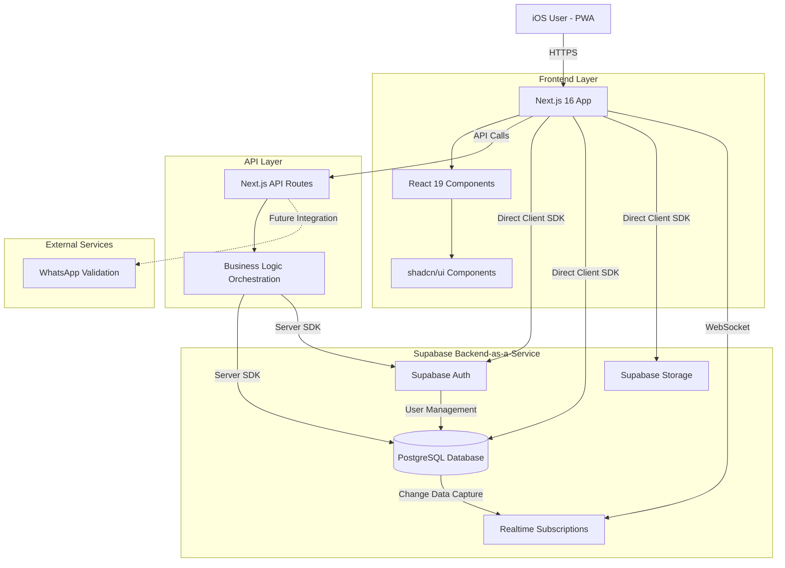
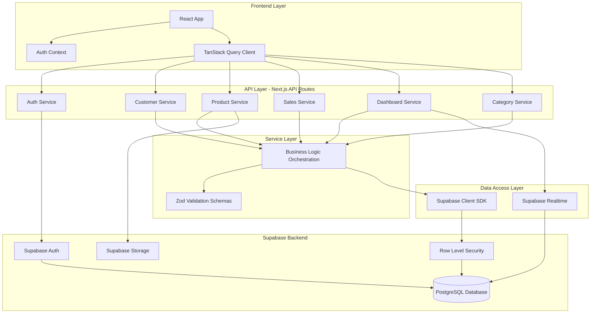
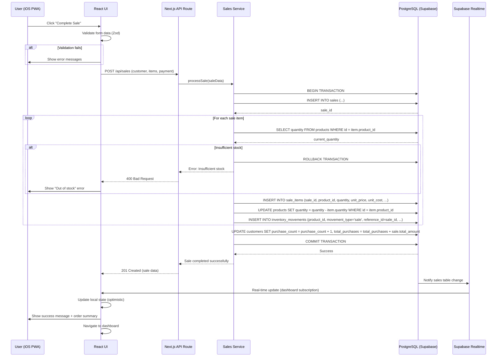
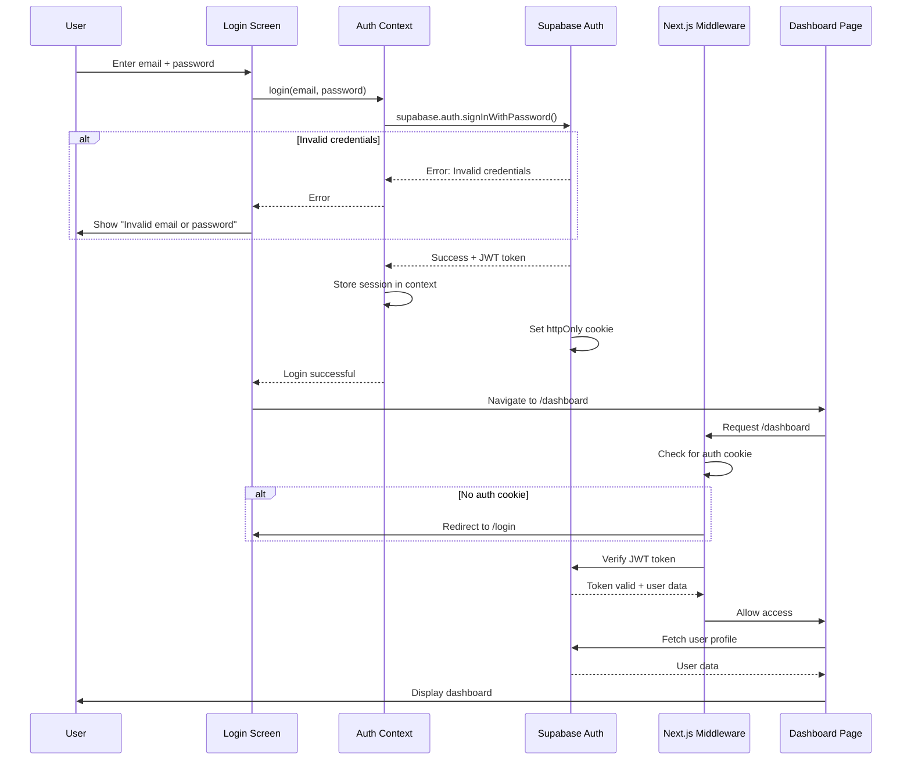
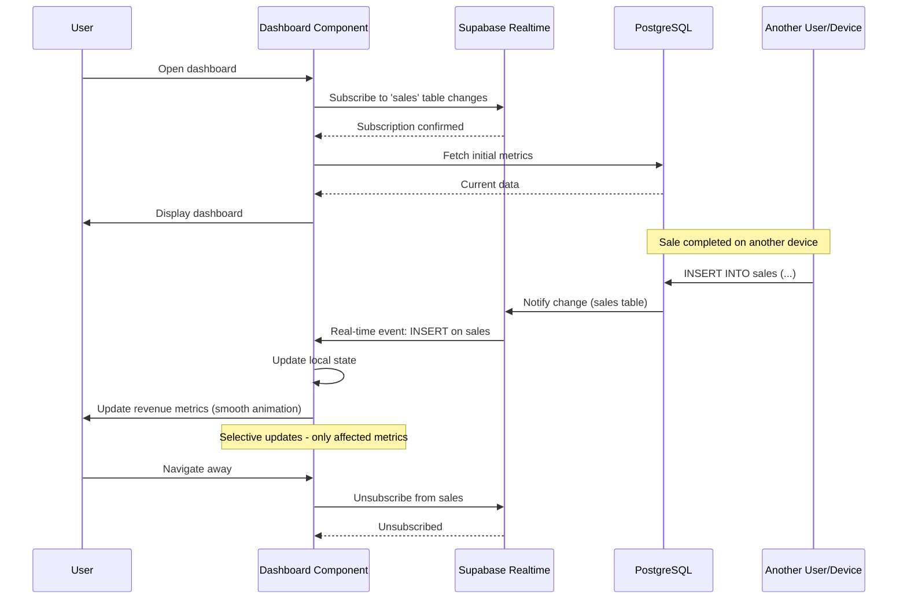

# Auralux Architecture Document

## Introduction

This document outlines the overall project architecture for **Auralux**, including backend systems, shared services, and non-UI specific concerns. Its primary goal is to serve as the guiding architectural blueprint for AI-driven development, ensuring consistency and adherence to chosen patterns and technologies.

**Relationship to Frontend Architecture:**
If the project includes a significant user interface, a separate Frontend Architecture Document will detail the frontend-specific design and MUST be used in conjunction with this document. Core technology stack choices documented herein (see "Tech Stack") are definitive for the entire project, including any frontend components.

### Starter Template or Existing Project

**Analysis:**

The **Auralux** project is based on:

- **Next.js 16.0.0** as the core framework
- **React 19.2.0** for UI components
- **shadcn/ui** component library (60+ components configured)
- **Supabase** as backend-as-a-service (configured via MCP)

**Starter Template Used:**
- **Next.js App Router Template** (version 16.0.0 with App Directory)
- **shadcn/ui** (style: "new-york")

**Pre-configured Structure:**
- App directory structure (`app/layout.tsx`, `app/page.tsx`)
- TailwindCSS 4.1.9 configured
- TypeScript 5 configured
- PostCSS configured
- PWA manifest configured
- shadcn/ui components installed and customized

**Constraints from Starter:**
- Next.js App Router requires specific directory structure (`app/`)
- File-system based routing
- Server Components by default
- Native support for API Routes in `app/api/`
- Optimized for Vercel deployment (compatible with other platforms)

**Decision:** The project is already initialized with Next.js + shadcn/ui. Backend architecture will be designed to integrate with this existing structure via Supabase.

### Change Log

| Date | Version | Description | Author |
|------|---------|-------------|--------|
| 2025-11-07 | v1.0 | Initial Backend Architecture creation | Winston (Architect Agent) |

---

## High Level Architecture

### Technical Summary

Auralux employs a **serverless-first architecture** using Supabase as the primary backend-as-a-service (BaaS) platform, integrated with a Next.js 16 frontend application. The system follows a **monolithic-frontend with distributed backend services** pattern, where the Next.js application serves as the presentation and application layer, while Supabase provides managed PostgreSQL database, authentication, real-time subscriptions, and file storage. This architecture prioritizes rapid development, cost efficiency, and automatic scalability—directly supporting the PRD goals of delivering a mobile-first PWA for retail store management with minimal operational overhead. The system leverages Row Level Security (RLS) for multi-tenancy and data isolation, with API Routes handling business logic orchestration.

### High Level Overview

**Architectural Style:** Serverless Monolith with Managed Backend Services

**Key Decisions:**

1. **Repository Structure:** **Monorepo** (Single repository)
   - Rationale: For an MVP with tightly coupled frontend/backend, a monorepo simplifies development, deployment, and maintains consistency across the stack.

2. **Service Architecture:** **Backend-as-a-Service (BaaS) with Serverless Functions**
   - Rationale: Supabase provides managed PostgreSQL, Auth, Storage, and Real-time subscriptions. Next.js API Routes handle custom business logic. This eliminates infrastructure management while maintaining flexibility.

3. **Primary User Flow:**
   ```
   User (iOS PWA)
   → Next.js Frontend (React 19)
   → Next.js API Routes (Business Logic)
   → Supabase (Auth, Database, Storage)
   → PostgreSQL (Data Persistence)
   ```

4. **Data Flow:**
   - Authentication flows through Supabase Auth
   - CRUD operations use Supabase JS Client with RLS policies
   - Complex business logic (e.g., sale completion with inventory updates) orchestrated via Next.js API Routes
   - Real-time updates via Supabase Realtime subscriptions

5. **Multi-tenancy:** Implemented via Supabase Row Level Security (RLS) policies, ensuring each user sees only their own data

### High Level Project Diagram



### Architectural and Design Patterns

- **Backend-as-a-Service (BaaS) Pattern:** Using Supabase for managed backend services - _Rationale:_ Eliminates infrastructure management, provides automatic scaling, and significantly reduces time-to-market for MVP while maintaining production-grade reliability and security.

- **Serverless Functions Pattern:** Next.js API Routes for custom business logic - _Rationale:_ Enables complex orchestration (e.g., atomic sale transactions with inventory updates) without managing servers, with automatic scaling and pay-per-use pricing.

- **Repository Pattern:** Abstraction layer for data access via Supabase client - _Rationale:_ Encapsulates database operations, enables testing with mocks, and provides flexibility for future database migrations or query optimizations.

- **Row Level Security (RLS) Pattern:** Multi-tenancy at database level - _Rationale:_ Ensures data isolation between users without complex application-level checks, enforced at PostgreSQL level for guaranteed security.

- **Real-time Pub/Sub Pattern:** Supabase Realtime for dashboard updates - _Rationale:_ Provides instant UI updates when sales/inventory change without polling, improving user experience and reducing server load.

- **Optimistic UI Updates Pattern:** Client-side state updates before server confirmation - _Rationale:_ Creates responsive user experience on mobile, with rollback on failures, critical for the mobile-first use case.

- **API Gateway Pattern:** Next.js API Routes as orchestration layer - _Rationale:_ Centralizes business logic, handles complex transactions, and provides clean separation between frontend and backend concerns.

---

## Tech Stack

### Cloud Infrastructure

- **Provider:** Supabase Cloud (Built on AWS)
- **Key Services:**
  - Managed PostgreSQL 15+
  - Supabase Auth (JWT-based authentication)
  - Supabase Storage (S3-compatible object storage)
  - Supabase Realtime (Change Data Capture via WebSockets)
  - Edge Functions (Deno-based serverless functions)
- **Deployment Regions:** Auto-selected by Supabase (primary: us-east-1)

### Technology Stack Table

| Category | Technology | Version | Purpose | Rationale |
|----------|-----------|---------|---------|-----------|
| **Language** | TypeScript | 5.x | Primary development language | Strong typing prevents runtime errors, excellent IDE support, team expertise, required for Next.js |
| **Runtime** | Node.js | 20.x LTS | JavaScript runtime for Next.js | LTS version, stable performance, wide ecosystem, Next.js requirement |
| **Frontend Framework** | Next.js | 16.0.0 | Full-stack React framework | Already configured, App Router for modern patterns, built-in API routes, optimized for PWA |
| **UI Framework** | React | 19.2.0 | UI component library | Latest version with concurrent features, Next.js dependency |
| **UI Components** | shadcn/ui | Latest | Component library | Already configured with 60+ components, accessible, customizable |
| **Styling** | Tailwind CSS | 4.1.9 | Utility-first CSS framework | Already configured, mobile-first, rapid development, small bundle size |
| **Backend-as-a-Service** | Supabase | Latest | Database, Auth, Storage, Realtime | Already configured via MCP, PostgreSQL-based, RLS support, reduces backend complexity |
| **Database** | PostgreSQL | 15+ (Supabase managed) | Primary database | Managed by Supabase, ACID compliance, powerful RLS, JSON support |
| **Authentication** | Supabase Auth | Latest | User authentication | Built-in with Supabase, JWT-based, session management, email/password auth |
| **File Storage** | Supabase Storage | Latest | Product image storage | Integrated with Supabase, S3-compatible, CDN support, automatic image optimization |
| **Realtime** | Supabase Realtime | Latest | Live dashboard updates | Change Data Capture, WebSocket-based, automatic reconnection |
| **State Management** | React Context API + Zustand | 4.x | Client state management | Built-in Context for auth, Zustand for complex state, minimal boilerplate |
| **Server State** | TanStack Query (React Query) | 5.x | Server state caching | Data fetching, caching, synchronization, optimistic updates |
| **Form Management** | React Hook Form | 7.x | Form handling | Already in use, excellent performance, built-in validation |
| **Validation** | Zod | 3.x | Schema validation | Already in use, TypeScript-first, runtime safety |
| **Charts** | Recharts | 2.x | Dashboard visualizations | Already in use, composable, responsive charts |
| **Icons** | Lucide React | Latest | Icon system | Already in use, consistent design, tree-shakeable |
| **Notifications** | Sonner | Latest | Toast notifications | Already in use, beautiful defaults, accessible |
| **Build Tool** | Next.js (Turbopack) | Built-in | Build and bundling | Native Next.js bundler, faster than Webpack |
| **Package Manager** | pnpm | 8.x | Dependency management | Faster than npm, disk efficient, strict by default |
| **Testing (Unit)** | Vitest | 1.x | Unit testing framework | Fast, Vite-compatible, Jest-compatible API |
| **Testing (Component)** | React Testing Library | 14.x | Component testing | User-centric testing, best practices |
| **Testing (E2E)** | Playwright | 1.x | End-to-end testing | Cross-browser, iOS Safari simulation, reliable |
| **Linting** | ESLint | 8.x | Code linting | Next.js config, TypeScript support |
| **Formatting** | Prettier | 3.x | Code formatting | Consistent style, integrates with ESLint |
| **Type Checking** | TypeScript Compiler | 5.x | Static type checking | Strict mode enabled, prevents type errors |
| **Deployment Platform** | Vercel | N/A | Hosting and CI/CD | Native Next.js support, automatic previews, edge network |
| **Environment Management** | dotenv | Built-in | Environment variables | Next.js native support, local and production configs |
| **Monitoring** | Vercel Analytics | N/A | Performance monitoring | Built-in Web Vitals tracking |
| **Error Tracking** | Sentry | 7.x | Error monitoring and tracking | Production error capture, stack traces, user context |

**CRITICAL NOTES:**

1. **Versions:** All versions are pinned based on current project setup. Update with caution and test thoroughly.

2. **Supabase vs Custom Backend:** Supabase was chosen for MVP speed and managed services. For scale beyond 10,000 concurrent users or complex business logic, evaluate migration to custom backend.

3. **Next.js API Routes vs Supabase Edge Functions:** Currently using Next.js API Routes for business logic. Supabase Edge Functions (Deno) are available but not primary choice to maintain consistency with TypeScript/Node.js ecosystem.

4. **PostgreSQL RLS:** Critical security feature—all database access MUST respect RLS policies. Direct database access without RLS will expose data across users.

---

## Data Models

### User (extends Supabase auth.users)

**Purpose:** Represents store owners/staff who use the system. Extends Supabase's built-in authentication user with store-specific metadata.

**Key Attributes:**
- `id`: UUID (PK, references auth.users.id) - Unique user identifier from Supabase Auth
- `store_name`: TEXT - Name of the retail store (optional, for branding)
- `created_at`: TIMESTAMP - Account creation timestamp
- `updated_at`: TIMESTAMP - Last profile update timestamp

**Relationships:**
- One-to-many with Customers (user owns multiple customers)
- One-to-many with Products (user owns product catalog)
- One-to-many with Sales (user creates multiple sales)
- One-to-many with Categories (user defines product categories)

**Business Rules:**
- User ID comes from Supabase Auth (not manually created)
- All user data isolated via RLS policies
- Soft delete not required (Supabase Auth handles this)

---

### Customer

**Purpose:** Represents retail customers who make purchases. Stores customer contact information and purchase history metrics.

**Key Attributes:**
- `id`: UUID (PK, default gen_random_uuid()) - Unique customer identifier
- `user_id`: UUID (FK to users.id) - Store owner who registered this customer
- `full_name`: TEXT (NOT NULL) - Customer's full name
- `whatsapp`: TEXT (NOT NULL) - WhatsApp phone number (Brazilian format)
- `email`: TEXT (NULLABLE) - Optional email address
- `address`: TEXT (NULLABLE) - Optional physical address
- `purchase_count`: INTEGER (default 0) - Total number of purchases made
- `total_purchases`: DECIMAL(10,2) (default 0.00) - Lifetime purchase amount
- `total_due`: DECIMAL(10,2) (default 0.00) - Amount owed (future installment tracking)
- `created_at`: TIMESTAMP (default now()) - Customer registration date
- `updated_at`: TIMESTAMP (default now()) - Last update timestamp

**Relationships:**
- Many-to-one with User (customer belongs to one store owner)
- One-to-many with Sales (customer can have multiple sales)

**Business Rules:**
- WhatsApp number must be validated (Brazilian format: +55 XX XXXXX-XXXX)
- purchase_count and total_purchases updated automatically on sale completion
- RLS policy ensures user sees only their customers

**Indexes:**
- Index on `user_id` for fast user-specific queries
- Index on `whatsapp` for search functionality
- Unique constraint on (user_id, whatsapp) to prevent duplicate customers per user

---

### Category

**Purpose:** Organizes products into logical groups for inventory management and reporting.

**Key Attributes:**
- `id`: UUID (PK, default gen_random_uuid()) - Unique category identifier
- `user_id`: UUID (FK to users.id) - Store owner who created this category
- `name`: TEXT (NOT NULL) - Category name (e.g., "Electronics", "Clothing")
- `description`: TEXT (NULLABLE) - Optional category description
- `created_at`: TIMESTAMP (default now()) - Creation timestamp
- `updated_at`: TIMESTAMP (default now()) - Last update timestamp

**Relationships:**
- Many-to-one with User (category belongs to one store owner)
- One-to-many with Products (category can contain multiple products)

**Business Rules:**
- Category names must be unique per user
- Deleting a category sets product.category_id to NULL (soft relationship)
- System should prevent deletion if products exist (soft delete instead)

**Indexes:**
- Index on `user_id` for fast user-specific queries
- Unique constraint on (user_id, name) to prevent duplicate category names

---

### Product

**Purpose:** Represents inventory items available for sale. Tracks pricing, stock levels, and profitability metrics.

**Key Attributes:**
- `id`: UUID (PK, default gen_random_uuid()) - Unique product identifier
- `user_id`: UUID (FK to users.id) - Store owner who manages this product
- `category_id`: UUID (FK to categories.id, NULLABLE) - Product category
- `name`: TEXT (NOT NULL) - Product name
- `sku`: TEXT (NULLABLE) - Stock Keeping Unit (optional barcode/code)
- `image_url`: TEXT (NULLABLE) - URL to product image in Supabase Storage
- `sale_price`: DECIMAL(10,2) (NOT NULL) - Price customers pay
- `cost_price`: DECIMAL(10,2) (NOT NULL) - Cost to acquire/produce the product
- `quantity`: INTEGER (NOT NULL, default 0) - Current stock quantity
- `low_stock_threshold`: INTEGER (default 5) - Alert when stock falls below this
- `supplier`: TEXT (NULLABLE) - Optional supplier information
- `created_at`: TIMESTAMP (default now()) - Product creation date
- `updated_at`: TIMESTAMP (default now()) - Last update timestamp

**Computed Fields (via SQL views or functions):**
- `profit_margin`: ((sale_price - cost_price) / sale_price) * 100 - Profit percentage
- `profit_amount`: sale_price - cost_price - Absolute profit per unit
- `is_low_stock`: quantity <= low_stock_threshold - Stock alert flag

**Relationships:**
- Many-to-one with User (product belongs to one store owner)
- Many-to-one with Category (product belongs to one category, optional)
- One-to-many with SaleItems (product can appear in multiple sales)
- One-to-many with InventoryMovements (product has movement history)

**Business Rules:**
- sale_price must be greater than or equal to cost_price (validation)
- quantity cannot be negative (constraint)
- Quantity automatically updated on sale completion
- Image upload limited to 5MB, formats: JPG, PNG, WEBP
- SKU must be unique per user (if provided)

**Indexes:**
- Index on `user_id` for fast user-specific queries
- Index on `category_id` for filtering by category
- Index on `quantity` for low stock queries
- Unique constraint on (user_id, sku) if SKU provided

---

### Sale

**Purpose:** Represents a completed sales transaction. Captures payment details and links customer to purchased products.

**Key Attributes:**
- `id`: UUID (PK, default gen_random_uuid()) - Unique sale identifier
- `user_id`: UUID (FK to users.id) - Store owner who processed the sale
- `customer_id`: UUID (FK to customers.id) - Customer who made the purchase
- `total_amount`: DECIMAL(10,2) (NOT NULL) - Total sale amount before discounts
- `payment_method`: TEXT (NOT NULL) - Payment type: 'pix', 'cash', 'installment'
- `installment_count`: INTEGER (NULLABLE) - Number of installments (1-12) if payment_method='installment'
- `actual_amount_received`: DECIMAL(10,2) (NULLABLE) - Actual amount after card fees (for installments)
- `discount_amount`: DECIMAL(10,2) (COMPUTED: total_amount - actual_amount_received) - Card processing fees
- `status`: TEXT (default 'completed') - Sale status: 'completed', 'pending', 'cancelled'
- `notes`: TEXT (NULLABLE) - Optional sale notes
- `created_at`: TIMESTAMP (default now()) - Sale completion timestamp
- `updated_at`: TIMESTAMP (default now()) - Last update timestamp

**Computed Fields:**
- `discount_percentage`: (discount_amount / total_amount) * 100 - Discount as percentage
- `profit_total`: SUM(sale_items.quantity * (unit_price - unit_cost)) - Total profit for sale

**Relationships:**
- Many-to-one with User (sale belongs to one store owner)
- Many-to-one with Customer (sale belongs to one customer)
- One-to-many with SaleItems (sale contains multiple line items)
- One-to-many with InventoryMovements (sale triggers inventory movements)

**Business Rules:**
- payment_method must be one of: 'pix', 'cash', 'installment'
- If payment_method='installment', installment_count is REQUIRED (1-12)
- If payment_method='installment', actual_amount_received is REQUIRED
- total_amount calculated from SUM(sale_items.subtotal)
- Sale creation triggers:
  - Customer.purchase_count increment
  - Customer.total_purchases increment
  - Product.quantity decrement for each item
  - InventoryMovement records creation

**Indexes:**
- Index on `user_id` for fast user-specific queries
- Index on `customer_id` for customer purchase history
- Index on `created_at` for date-range queries (dashboard metrics)
- Index on `payment_method` for payment breakdown reports

---

### SaleItem

**Purpose:** Represents individual line items within a sale. Captures product snapshots at time of sale for historical accuracy.

**Key Attributes:**
- `id`: UUID (PK, default gen_random_uuid()) - Unique line item identifier
- `sale_id`: UUID (FK to sales.id, ON DELETE CASCADE) - Parent sale
- `product_id`: UUID (FK to products.id) - Product sold (current reference)
- `product_name`: TEXT (NOT NULL) - Snapshot of product name at time of sale
- `quantity`: INTEGER (NOT NULL) - Quantity sold
- `unit_price`: DECIMAL(10,2) (NOT NULL) - Snapshot of sale_price at time of sale
- `unit_cost`: DECIMAL(10,2) (NOT NULL) - Snapshot of cost_price at time of sale
- `subtotal`: DECIMAL(10,2) (COMPUTED: quantity * unit_price) - Line item total
- `created_at`: TIMESTAMP (default now()) - Line item creation timestamp

**Computed Fields:**
- `line_profit`: quantity * (unit_price - unit_cost) - Profit for this line item
- `line_margin`: ((unit_price - unit_cost) / unit_price) * 100 - Profit margin percentage

**Relationships:**
- Many-to-one with Sale (line item belongs to one sale)
- Many-to-one with Product (line item references one product)

**Business Rules:**
- Snapshot product details (name, unit_price, unit_cost) at time of sale
- Prevents historical data corruption if product prices change later
- quantity must be positive (validation)
- Cascading delete: if sale deleted, all line items deleted

**Indexes:**
- Index on `sale_id` for fast sale detail queries
- Index on `product_id` for product sales history

---

### InventoryMovement

**Purpose:** Audit trail for all inventory changes. Tracks additions, sales, and manual adjustments for accountability and reporting.

**Key Attributes:**
- `id`: UUID (PK, default gen_random_uuid()) - Unique movement identifier
- `user_id`: UUID (FK to users.id) - Store owner who performed the movement
- `product_id`: UUID (FK to products.id) - Product affected by movement
- `movement_type`: TEXT (NOT NULL) - Type: 'addition', 'sale', 'adjustment'
- `quantity_change`: INTEGER (NOT NULL) - Quantity change (positive or negative)
- `quantity_before`: INTEGER (NOT NULL) - Product quantity before movement
- `quantity_after`: INTEGER (NOT NULL) - Product quantity after movement
- `reference_id`: UUID (NULLABLE) - Reference to related entity (sale_id if movement_type='sale')
- `notes`: TEXT (NULLABLE) - Optional movement notes (reason for adjustment)
- `created_at`: TIMESTAMP (default now()) - Movement timestamp

**Relationships:**
- Many-to-one with User (movement belongs to one store owner)
- Many-to-one with Product (movement affects one product)
- Many-to-one with Sale (optional, if movement_type='sale')

**Business Rules:**
- movement_type must be one of: 'addition', 'sale', 'adjustment'
- If movement_type='sale', reference_id MUST point to sale.id
- Immutable after creation (no updates/deletes allowed)
- Created automatically on sale completion
- Manual movements created via inventory adjustment UI

**Indexes:**
- Index on `user_id` for user-specific movement history
- Index on `product_id` for product movement history
- Index on `created_at` for date-range queries
- Index on `reference_id` for linking to sales

---

## Components

### Component Architecture Overview

The Auralux backend follows a **layered serverless architecture** with clear separation of concerns:

```
Presentation Layer (React Components)
    ↓
API Layer (Next.js API Routes)
    ↓
Service Layer (Business Logic)
    ↓
Data Access Layer (Supabase Client + Repository Pattern)
    ↓
Database Layer (PostgreSQL with RLS)
```

---

### 1. Authentication Service

**Responsibility:** Manages user authentication, session management, and authorization using Supabase Auth.

**Key Interfaces:**
- `POST /api/auth/login` - User login with email/password
- `POST /api/auth/logout` - User logout and session cleanup
- `POST /api/auth/signup` - New user registration
- `POST /api/auth/reset-password` - Password reset flow
- `GET /api/auth/session` - Get current user session
- Supabase Auth hooks for client-side auth state

**Dependencies:**
- Supabase Auth SDK (authentication provider)
- Next.js middleware (route protection)
- Database: users table (extended user profile)

**Technology Stack:**
- Supabase Auth (JWT-based authentication)
- Next.js API Routes (custom auth logic)
- React Context API (auth state management)

**Implementation Details:**
- Uses Supabase's built-in email/password authentication
- JWT tokens stored in httpOnly cookies
- Session persistence via Supabase client
- Protected routes enforced via Next.js middleware
- RLS policies automatically enforce user_id context

**Security:**
- JWT tokens with short expiration (1 hour)
- Refresh tokens for session renewal
- httpOnly cookies prevent XSS attacks
- CSRF protection via SameSite cookies

---

### 2. Customer Management Service

**Responsibility:** Handles customer registration, search, and profile management.

**Key Interfaces:**
- `GET /api/customers` - List all customers for authenticated user
- `GET /api/customers/:id` - Get customer details
- `POST /api/customers` - Create new customer
- `PUT /api/customers/:id` - Update customer information
- `DELETE /api/customers/:id` - Soft delete customer
- `GET /api/customers/search?q=` - Search customers by name/WhatsApp

**Dependencies:**
- Database: customers table
- Validation: Zod schemas for customer data
- External: WhatsApp number validation (future integration)

**Technology Stack:**
- Next.js API Routes (orchestration)
- Supabase Client (data access)
- Zod (input validation)
- React Hook Form (form handling)

**Implementation Details:**
- RLS policies ensure user sees only their customers
- WhatsApp number validation (Brazilian format: +55 XX XXXXX-XXXX)
- Duplicate detection via unique constraint (user_id, whatsapp)
- Search uses PostgreSQL ILIKE for fuzzy matching
- Optimistic UI updates for instant feedback

**Business Logic:**
- Validate WhatsApp number format before insertion
- Auto-increment purchase_count on sale completion (via trigger)
- Prevent deletion if customer has sales (referential integrity)

---

### 3. Inventory Management Service

**Responsibility:** Manages product catalog, stock levels, and inventory movements.

**Key Interfaces:**
- `GET /api/products` - List all products with filtering/sorting
- `GET /api/products/:id` - Get product details
- `POST /api/products` - Create new product
- `PUT /api/products/:id` - Update product information
- `DELETE /api/products/:id` - Soft delete product
- `POST /api/products/:id/upload-image` - Upload product image to Supabase Storage
- `GET /api/inventory/movements` - Get inventory movement history
- `POST /api/inventory/adjust` - Manual inventory adjustment

**Dependencies:**
- Database: products, categories, inventory_movements tables
- Supabase Storage (product images)
- Validation: Zod schemas for product data

**Technology Stack:**
- Next.js API Routes (orchestration)
- Supabase Client (data access)
- Supabase Storage (image storage)
- Zod (input validation)

**Implementation Details:**
- RLS policies ensure user sees only their products
- Image upload to Supabase Storage bucket (products/)
- Automatic profit margin calculation: ((sale_price - cost_price) / sale_price) * 100
- Low stock alerts when quantity <= low_stock_threshold
- Inventory movements tracked automatically on stock changes
- Category filtering and product search via PostgreSQL full-text search

**Business Logic:**
- Validate sale_price >= cost_price
- Prevent quantity from going negative
- Create inventory_movement record on manual adjustments
- Trigger inventory updates on sale completion
- Optimize images on upload (resize, compress)

---

### 4. Sales Processing Service

**Responsibility:** Orchestrates sale creation, payment processing, inventory updates, and customer metrics updates.

**Key Interfaces:**
- `GET /api/sales` - List sales with pagination and filters
- `GET /api/sales/:id` - Get sale details with line items
- `POST /api/sales` - Create new sale (complex transaction)
- `PUT /api/sales/:id/cancel` - Cancel sale (reverse inventory)
- `GET /api/sales/metrics` - Dashboard metrics (daily, weekly, monthly)
- `GET /api/sales/recent` - Recent sales list

**Dependencies:**
- Database: sales, sale_items, customers, products, inventory_movements tables
- Customer Management Service (update purchase counts)
- Inventory Management Service (update stock levels)
- Validation: Zod schemas for sale data

**Technology Stack:**
- Next.js API Routes (orchestration)
- Supabase Client with PostgreSQL transactions
- Zod (input validation)

**Implementation Details:**
- **Atomic transactions:** Sale creation uses PostgreSQL transactions to ensure:
  1. Sale record created
  2. Sale items created with price snapshots
  3. Product quantities decremented
  4. Inventory movements recorded
  5. Customer purchase_count and total_purchases incremented
  6. Rollback on any failure

- **Payment method handling:**
  - PIX/Cash: Record total_amount only
  - Installment: Require actual_amount_received, calculate discount_amount

- **Inventory updates:** Trigger-based automatic updates on sale completion

- **Real-time updates:** Dashboard subscribes to sales table changes

**Business Logic:**
- Validate product availability (quantity >= requested amount)
- Snapshot product prices at time of sale (historical accuracy)
- Calculate total_amount from SUM(sale_items.subtotal)
- For installments, validate actual_amount_received <= total_amount
- Create inventory_movement records for audit trail
- Update customer metrics atomically

---

### 5. Dashboard & Analytics Service

**Responsibility:** Aggregates business metrics and provides real-time dashboard data.

**Key Interfaces:**
- `GET /api/dashboard/metrics` - Overall KPIs (sales, revenue, customers, inventory)
- `GET /api/dashboard/sales-chart` - Sales data for chart visualization (daily/weekly/monthly)
- `GET /api/dashboard/payment-breakdown` - Payment method distribution
- `GET /api/dashboard/top-products` - Best-selling products
- `GET /api/dashboard/low-stock-alerts` - Products below threshold
- `GET /api/dashboard/revenue-analysis` - Revenue vs actual received (installment impact)
- Supabase Realtime subscriptions for live updates

**Dependencies:**
- Database: sales, products, customers, sale_items tables
- Sales Processing Service (data source)
- Inventory Management Service (low stock alerts)

**Technology Stack:**
- Next.js API Routes (data aggregation)
- Supabase Client with SQL views/functions
- Supabase Realtime (live updates)
- Recharts (frontend visualization)

**Implementation Details:**
- **Metrics calculated via PostgreSQL views:**
  - `v_daily_sales_metrics`: Daily sales count and revenue
  - `v_payment_method_breakdown`: Payment type distribution
  - `v_low_stock_products`: Products below threshold
  - `v_top_selling_products`: Products by sales volume

- **Real-time subscriptions:**
  - Sales table: Update revenue metrics on new sale
  - Products table: Update inventory alerts on quantity change

- **Caching:** TanStack Query caches dashboard data client-side (5-minute TTL)

**Business Logic:**
- Calculate actual vs expected revenue (installment discount impact)
- Aggregate sales by date range (day, week, month, year)
- Identify best-selling products by revenue and quantity
- Flag low-stock products for reorder alerts

---

### 6. Category Management Service

**Responsibility:** Manages product categories for organization and reporting.

**Key Interfaces:**
- `GET /api/categories` - List all categories for user
- `POST /api/categories` - Create new category
- `PUT /api/categories/:id` - Update category
- `DELETE /api/categories/:id` - Delete category (soft delete if products exist)

**Dependencies:**
- Database: categories table
- Inventory Management Service (check product associations)

**Technology Stack:**
- Next.js API Routes (orchestration)
- Supabase Client (data access)
- Zod (input validation)

**Implementation Details:**
- RLS policies ensure user sees only their categories
- Unique constraint on (user_id, name) prevents duplicates
- Soft delete if products exist (set products.category_id to NULL)
- Hard delete if no products associated

---

### Component Diagram



---

## External APIs

### Supabase API

- **Purpose:** Primary backend-as-a-service for database, authentication, storage, and real-time features
- **Documentation:** https://supabase.com/docs
- **Base URL(s):**
  - Project URL: https://[project-id].supabase.co
  - API URL: https://[project-id].supabase.co/rest/v1
  - Auth URL: https://[project-id].supabase.co/auth/v1
  - Storage URL: https://[project-id].supabase.co/storage/v1
- **Authentication:** API Key (anon/service role) + JWT tokens
- **Rate Limits:** Depends on plan (Free: 500 requests/minute, Pro: 1000 requests/minute)

**Key Endpoints Used:**

Database (REST API):
- `GET /rest/v1/customers` - Query customers table
- `POST /rest/v1/customers` - Insert customer
- `PATCH /rest/v1/customers?id=eq.{id}` - Update customer
- `DELETE /rest/v1/customers?id=eq.{id}` - Delete customer
- Similar patterns for products, sales, categories, etc.

Authentication:
- `POST /auth/v1/signup` - User registration
- `POST /auth/v1/token?grant_type=password` - User login
- `POST /auth/v1/logout` - User logout
- `GET /auth/v1/user` - Get current user

Storage:
- `POST /storage/v1/object/products/{filename}` - Upload product image
- `GET /storage/v1/object/public/products/{filename}` - Get product image URL
- `DELETE /storage/v1/object/products/{filename}` - Delete product image

Realtime (WebSocket):
- `wss://[project-id].supabase.co/realtime/v1/websocket` - Real-time subscriptions

**Integration Notes:**
- Use Supabase JavaScript Client SDK (not direct REST calls)
- RLS policies enforced automatically on all database operations
- JWT tokens included automatically in SDK requests
- Realtime subscriptions require authenticated connection
- Storage bucket policies control image access (public read, authenticated write)

---

### WhatsApp Business API (Future Integration)

- **Purpose:** Validate WhatsApp numbers and send notifications (planned for post-MVP)
- **Documentation:** https://developers.facebook.com/docs/whatsapp
- **Base URL(s):** https://graph.facebook.com/v18.0
- **Authentication:** Bearer token (Facebook Business Manager)
- **Rate Limits:** Varies by tier (1000 messages/day free tier)

**Key Endpoints Used:**
- `POST /v18.0/{phone-number-id}/messages` - Send WhatsApp message
- `GET /v18.0/{phone-number-id}` - Verify phone number

**Integration Notes:**
- Not implemented in MVP
- Future use case: Send sale receipts to customers
- Requires Facebook Business Manager account and verification
- Consider alternative: Twilio WhatsApp API for simpler integration

---

## Core Workflows

### Workflow 1: Complete Sale Transaction

This workflow shows the complex orchestration required to complete a sale atomically.



**Error Handling:**
- If any step fails, ROLLBACK entire transaction
- Show specific error to user (e.g., "Product X has only 2 in stock, you requested 5")
- Optimistic UI updates rolled back on error

---

### Workflow 2: User Authentication Flow

Shows Supabase Auth integration with Next.js.



**Session Management:**
- JWT tokens expire after 1 hour
- Refresh tokens used for automatic renewal
- Middleware checks auth on every protected route
- Client-side auth state synced with Supabase

---

### Workflow 3: Real-time Dashboard Updates

Shows how Supabase Realtime provides live updates to the dashboard.



**Real-time Features:**
- Dashboard subscribes to sales, products tables
- Updates only affected metrics (not full page reload)
- Automatic reconnection on network issues
- Subscription cleaned up on component unmount

---

## Database Schema

### PostgreSQL Schema (Supabase)

```sql
-- Enable UUID extension
CREATE EXTENSION IF NOT EXISTS "uuid-ossp";

-- =======================
-- USERS TABLE (extends auth.users)
-- =======================
CREATE TABLE public.users (
  id UUID PRIMARY KEY REFERENCES auth.users(id) ON DELETE CASCADE,
  store_name TEXT,
  created_at TIMESTAMPTZ DEFAULT NOW() NOT NULL,
  updated_at TIMESTAMPTZ DEFAULT NOW() NOT NULL
);

-- RLS Policies for users
ALTER TABLE public.users ENABLE ROW LEVEL SECURITY;

CREATE POLICY "Users can view own profile"
  ON public.users FOR SELECT
  USING (auth.uid() = id);

CREATE POLICY "Users can update own profile"
  ON public.users FOR UPDATE
  USING (auth.uid() = id);

-- =======================
-- CATEGORIES TABLE
-- =======================
CREATE TABLE public.categories (
  id UUID PRIMARY KEY DEFAULT uuid_generate_v4(),
  user_id UUID NOT NULL REFERENCES public.users(id) ON DELETE CASCADE,
  name TEXT NOT NULL,
  description TEXT,
  created_at TIMESTAMPTZ DEFAULT NOW() NOT NULL,
  updated_at TIMESTAMPTZ DEFAULT NOW() NOT NULL,

  CONSTRAINT unique_category_per_user UNIQUE (user_id, name)
);

-- Indexes
CREATE INDEX idx_categories_user_id ON public.categories(user_id);

-- RLS Policies for categories
ALTER TABLE public.categories ENABLE ROW LEVEL SECURITY;

CREATE POLICY "Users can view own categories"
  ON public.categories FOR SELECT
  USING (auth.uid() = user_id);

CREATE POLICY "Users can insert own categories"
  ON public.categories FOR INSERT
  WITH CHECK (auth.uid() = user_id);

CREATE POLICY "Users can update own categories"
  ON public.categories FOR UPDATE
  USING (auth.uid() = user_id);

CREATE POLICY "Users can delete own categories"
  ON public.categories FOR DELETE
  USING (auth.uid() = user_id);

-- =======================
-- CUSTOMERS TABLE
-- =======================
CREATE TABLE public.customers (
  id UUID PRIMARY KEY DEFAULT uuid_generate_v4(),
  user_id UUID NOT NULL REFERENCES public.users(id) ON DELETE CASCADE,
  full_name TEXT NOT NULL,
  whatsapp TEXT NOT NULL,
  email TEXT,
  address TEXT,
  purchase_count INTEGER DEFAULT 0 NOT NULL CHECK (purchase_count >= 0),
  total_purchases DECIMAL(10,2) DEFAULT 0.00 NOT NULL CHECK (total_purchases >= 0),
  total_due DECIMAL(10,2) DEFAULT 0.00 NOT NULL CHECK (total_due >= 0),
  created_at TIMESTAMPTZ DEFAULT NOW() NOT NULL,
  updated_at TIMESTAMPTZ DEFAULT NOW() NOT NULL,

  CONSTRAINT unique_whatsapp_per_user UNIQUE (user_id, whatsapp)
);

-- Indexes
CREATE INDEX idx_customers_user_id ON public.customers(user_id);
CREATE INDEX idx_customers_whatsapp ON public.customers(whatsapp);
CREATE INDEX idx_customers_full_name ON public.customers USING gin(to_tsvector('portuguese', full_name));

-- RLS Policies for customers
ALTER TABLE public.customers ENABLE ROW LEVEL SECURITY;

CREATE POLICY "Users can view own customers"
  ON public.customers FOR SELECT
  USING (auth.uid() = user_id);

CREATE POLICY "Users can insert own customers"
  ON public.customers FOR INSERT
  WITH CHECK (auth.uid() = user_id);

CREATE POLICY "Users can update own customers"
  ON public.customers FOR UPDATE
  USING (auth.uid() = user_id);

CREATE POLICY "Users can delete own customers"
  ON public.customers FOR DELETE
  USING (auth.uid() = user_id);

-- =======================
-- PRODUCTS TABLE
-- =======================
CREATE TABLE public.products (
  id UUID PRIMARY KEY DEFAULT uuid_generate_v4(),
  user_id UUID NOT NULL REFERENCES public.users(id) ON DELETE CASCADE,
  category_id UUID REFERENCES public.categories(id) ON DELETE SET NULL,
  name TEXT NOT NULL,
  sku TEXT,
  image_url TEXT,
  sale_price DECIMAL(10,2) NOT NULL CHECK (sale_price >= 0),
  cost_price DECIMAL(10,2) NOT NULL CHECK (cost_price >= 0),
  quantity INTEGER NOT NULL DEFAULT 0 CHECK (quantity >= 0),
  low_stock_threshold INTEGER DEFAULT 5 CHECK (low_stock_threshold >= 0),
  supplier TEXT,
  created_at TIMESTAMPTZ DEFAULT NOW() NOT NULL,
  updated_at TIMESTAMPTZ DEFAULT NOW() NOT NULL,

  CONSTRAINT valid_pricing CHECK (sale_price >= cost_price),
  CONSTRAINT unique_sku_per_user UNIQUE (user_id, sku)
);

-- Indexes
CREATE INDEX idx_products_user_id ON public.products(user_id);
CREATE INDEX idx_products_category_id ON public.products(category_id);
CREATE INDEX idx_products_quantity ON public.products(quantity);
CREATE INDEX idx_products_name ON public.products USING gin(to_tsvector('portuguese', name));

-- RLS Policies for products
ALTER TABLE public.products ENABLE ROW LEVEL SECURITY;

CREATE POLICY "Users can view own products"
  ON public.products FOR SELECT
  USING (auth.uid() = user_id);

CREATE POLICY "Users can insert own products"
  ON public.products FOR INSERT
  WITH CHECK (auth.uid() = user_id);

CREATE POLICY "Users can update own products"
  ON public.products FOR UPDATE
  USING (auth.uid() = user_id);

CREATE POLICY "Users can delete own products"
  ON public.products FOR DELETE
  USING (auth.uid() = user_id);

-- =======================
-- SALES TABLE
-- =======================
CREATE TABLE public.sales (
  id UUID PRIMARY KEY DEFAULT uuid_generate_v4(),
  user_id UUID NOT NULL REFERENCES public.users(id) ON DELETE CASCADE,
  customer_id UUID NOT NULL REFERENCES public.customers(id) ON DELETE RESTRICT,
  total_amount DECIMAL(10,2) NOT NULL CHECK (total_amount >= 0),
  payment_method TEXT NOT NULL CHECK (payment_method IN ('pix', 'cash', 'installment')),
  installment_count INTEGER CHECK (installment_count BETWEEN 1 AND 12),
  actual_amount_received DECIMAL(10,2) CHECK (actual_amount_received >= 0),
  discount_amount DECIMAL(10,2) GENERATED ALWAYS AS (
    CASE
      WHEN actual_amount_received IS NOT NULL THEN total_amount - actual_amount_received
      ELSE 0
    END
  ) STORED,
  status TEXT DEFAULT 'completed' CHECK (status IN ('completed', 'pending', 'cancelled')),
  notes TEXT,
  created_at TIMESTAMPTZ DEFAULT NOW() NOT NULL,
  updated_at TIMESTAMPTZ DEFAULT NOW() NOT NULL,

  CONSTRAINT installment_requires_count CHECK (
    (payment_method = 'installment' AND installment_count IS NOT NULL) OR
    (payment_method != 'installment')
  ),
  CONSTRAINT installment_requires_actual_amount CHECK (
    (payment_method = 'installment' AND actual_amount_received IS NOT NULL) OR
    (payment_method != 'installment')
  )
);

-- Indexes
CREATE INDEX idx_sales_user_id ON public.sales(user_id);
CREATE INDEX idx_sales_customer_id ON public.sales(customer_id);
CREATE INDEX idx_sales_created_at ON public.sales(created_at DESC);
CREATE INDEX idx_sales_payment_method ON public.sales(payment_method);
CREATE INDEX idx_sales_status ON public.sales(status);

-- RLS Policies for sales
ALTER TABLE public.sales ENABLE ROW LEVEL SECURITY;

CREATE POLICY "Users can view own sales"
  ON public.sales FOR SELECT
  USING (auth.uid() = user_id);

CREATE POLICY "Users can insert own sales"
  ON public.sales FOR INSERT
  WITH CHECK (auth.uid() = user_id);

CREATE POLICY "Users can update own sales"
  ON public.sales FOR UPDATE
  USING (auth.uid() = user_id);

-- =======================
-- SALE_ITEMS TABLE
-- =======================
CREATE TABLE public.sale_items (
  id UUID PRIMARY KEY DEFAULT uuid_generate_v4(),
  sale_id UUID NOT NULL REFERENCES public.sales(id) ON DELETE CASCADE,
  product_id UUID NOT NULL REFERENCES public.products(id) ON DELETE RESTRICT,
  product_name TEXT NOT NULL,
  quantity INTEGER NOT NULL CHECK (quantity > 0),
  unit_price DECIMAL(10,2) NOT NULL CHECK (unit_price >= 0),
  unit_cost DECIMAL(10,2) NOT NULL CHECK (unit_cost >= 0),
  subtotal DECIMAL(10,2) GENERATED ALWAYS AS (quantity * unit_price) STORED,
  created_at TIMESTAMPTZ DEFAULT NOW() NOT NULL
);

-- Indexes
CREATE INDEX idx_sale_items_sale_id ON public.sale_items(sale_id);
CREATE INDEX idx_sale_items_product_id ON public.sale_items(product_id);

-- RLS Policies for sale_items
ALTER TABLE public.sale_items ENABLE ROW LEVEL SECURITY;

CREATE POLICY "Users can view own sale items"
  ON public.sale_items FOR SELECT
  USING (
    EXISTS (
      SELECT 1 FROM public.sales
      WHERE sales.id = sale_items.sale_id
      AND sales.user_id = auth.uid()
    )
  );

CREATE POLICY "Users can insert own sale items"
  ON public.sale_items FOR INSERT
  WITH CHECK (
    EXISTS (
      SELECT 1 FROM public.sales
      WHERE sales.id = sale_items.sale_id
      AND sales.user_id = auth.uid()
    )
  );

-- =======================
-- INVENTORY_MOVEMENTS TABLE
-- =======================
CREATE TABLE public.inventory_movements (
  id UUID PRIMARY KEY DEFAULT uuid_generate_v4(),
  user_id UUID NOT NULL REFERENCES public.users(id) ON DELETE CASCADE,
  product_id UUID NOT NULL REFERENCES public.products(id) ON DELETE RESTRICT,
  movement_type TEXT NOT NULL CHECK (movement_type IN ('addition', 'sale', 'adjustment')),
  quantity_change INTEGER NOT NULL,
  quantity_before INTEGER NOT NULL CHECK (quantity_before >= 0),
  quantity_after INTEGER NOT NULL CHECK (quantity_after >= 0),
  reference_id UUID,
  notes TEXT,
  created_at TIMESTAMPTZ DEFAULT NOW() NOT NULL
);

-- Indexes
CREATE INDEX idx_inventory_movements_user_id ON public.inventory_movements(user_id);
CREATE INDEX idx_inventory_movements_product_id ON public.inventory_movements(product_id);
CREATE INDEX idx_inventory_movements_created_at ON public.inventory_movements(created_at DESC);
CREATE INDEX idx_inventory_movements_reference_id ON public.inventory_movements(reference_id);

-- RLS Policies for inventory_movements
ALTER TABLE public.inventory_movements ENABLE ROW LEVEL SECURITY;

CREATE POLICY "Users can view own inventory movements"
  ON public.inventory_movements FOR SELECT
  USING (auth.uid() = user_id);

CREATE POLICY "Users can insert own inventory movements"
  ON public.inventory_movements FOR INSERT
  WITH CHECK (auth.uid() = user_id);

-- =======================
-- TRIGGERS
-- =======================

-- Update updated_at timestamp on UPDATE
CREATE OR REPLACE FUNCTION update_updated_at_column()
RETURNS TRIGGER AS $$
BEGIN
  NEW.updated_at = NOW();
  RETURN NEW;
END;
$$ LANGUAGE plpgsql;

CREATE TRIGGER update_users_updated_at BEFORE UPDATE ON public.users
  FOR EACH ROW EXECUTE FUNCTION update_updated_at_column();

CREATE TRIGGER update_customers_updated_at BEFORE UPDATE ON public.customers
  FOR EACH ROW EXECUTE FUNCTION update_updated_at_column();

CREATE TRIGGER update_categories_updated_at BEFORE UPDATE ON public.categories
  FOR EACH ROW EXECUTE FUNCTION update_updated_at_column();

CREATE TRIGGER update_products_updated_at BEFORE UPDATE ON public.products
  FOR EACH ROW EXECUTE FUNCTION update_updated_at_column();

CREATE TRIGGER update_sales_updated_at BEFORE UPDATE ON public.sales
  FOR EACH ROW EXECUTE FUNCTION update_updated_at_column();

-- =======================
-- DATABASE VIEWS (for dashboard metrics)
-- =======================

-- Daily sales metrics
CREATE OR REPLACE VIEW v_daily_sales_metrics AS
SELECT
  user_id,
  DATE(created_at) as sale_date,
  COUNT(*) as sale_count,
  SUM(total_amount) as total_revenue,
  SUM(actual_amount_received) as actual_revenue,
  SUM(discount_amount) as total_discount
FROM public.sales
WHERE status = 'completed'
GROUP BY user_id, DATE(created_at);

-- Payment method breakdown
CREATE OR REPLACE VIEW v_payment_method_breakdown AS
SELECT
  user_id,
  payment_method,
  COUNT(*) as transaction_count,
  SUM(total_amount) as total_revenue,
  AVG(total_amount) as avg_transaction_value
FROM public.sales
WHERE status = 'completed'
GROUP BY user_id, payment_method;

-- Low stock products
CREATE OR REPLACE VIEW v_low_stock_products AS
SELECT
  id,
  user_id,
  name,
  quantity,
  low_stock_threshold,
  sale_price,
  cost_price
FROM public.products
WHERE quantity <= low_stock_threshold
ORDER BY quantity ASC;

-- Top selling products
CREATE OR REPLACE VIEW v_top_selling_products AS
SELECT
  p.id,
  p.user_id,
  p.name,
  COUNT(si.id) as times_sold,
  SUM(si.quantity) as total_quantity_sold,
  SUM(si.subtotal) as total_revenue
FROM public.products p
JOIN public.sale_items si ON p.id = si.product_id
JOIN public.sales s ON si.sale_id = s.id
WHERE s.status = 'completed'
GROUP BY p.id, p.user_id, p.name
ORDER BY total_revenue DESC;

-- =======================
-- STORAGE BUCKETS (Supabase Storage)
-- =======================

-- Product images bucket (configured via Supabase Dashboard or SQL)
-- Bucket name: "products"
-- Public: true (public read, authenticated write)
-- File size limit: 5MB
-- Allowed MIME types: image/jpeg, image/png, image/webp

-- Storage policies (applied via Supabase Dashboard):
-- 1. Public read access to all images
-- 2. Authenticated users can upload to their user_id folder
-- 3. Users can delete their own images
```

**Migration Strategy:**

1. Create database schema via Supabase Migration tool
2. Run migration in order: tables → indexes → RLS policies → views
3. Test RLS policies with different user contexts
4. Create storage bucket and configure policies
5. Seed initial data (optional categories, test users)

**Backup and Recovery:**

- Supabase automatic daily backups (Pro plan)
- Point-in-time recovery (PITR) available
- Manual backups via `pg_dump` for critical data
- Test restore procedure quarterly

---

## Source Tree

```
auralux/
├── app/                                    # Next.js App Router (main application)
│   ├── (auth)/                            # Auth route group (layout isolation)
│   │   ├── login/
│   │   │   └── page.tsx                   # Login page
│   │   ├── signup/
│   │   │   └── page.tsx                   # Signup page
│   │   └── reset-password/
│   │       └── page.tsx                   # Password reset page
│   │
│   ├── (app)/                             # Main app route group (protected)
│   │   ├── dashboard/
│   │   │   └── page.tsx                   # Sales dashboard (default landing)
│   │   ├── customers/
│   │   │   └── page.tsx                   # Customer management page
│   │   ├── inventory/
│   │   │   └── page.tsx                   # Inventory management page
│   │   ├── sales/
│   │   │   └── page.tsx                   # Sales flow page
│   │   ├── reports/
│   │   │   └── page.tsx                   # Reports page
│   │   └── settings/
│   │       └── page.tsx                   # Settings page
│   │
│   ├── api/                               # Next.js API Routes (backend logic)
│   │   ├── auth/
│   │   │   ├── login/
│   │   │   │   └── route.ts               # POST /api/auth/login
│   │   │   ├── logout/
│   │   │   │   └── route.ts               # POST /api/auth/logout
│   │   │   ├── signup/
│   │   │   │   └── route.ts               # POST /api/auth/signup
│   │   │   └── session/
│   │   │       └── route.ts               # GET /api/auth/session
│   │   │
│   │   ├── customers/
│   │   │   ├── route.ts                   # GET, POST /api/customers
│   │   │   ├── [id]/
│   │   │   │   └── route.ts               # GET, PUT, DELETE /api/customers/:id
│   │   │   └── search/
│   │   │       └── route.ts               # GET /api/customers/search
│   │   │
│   │   ├── products/
│   │   │   ├── route.ts                   # GET, POST /api/products
│   │   │   ├── [id]/
│   │   │   │   ├── route.ts               # GET, PUT, DELETE /api/products/:id
│   │   │   │   └── upload-image/
│   │   │   │       └── route.ts           # POST /api/products/:id/upload-image
│   │   │   └── search/
│   │   │       └── route.ts               # GET /api/products/search
│   │   │
│   │   ├── categories/
│   │   │   ├── route.ts                   # GET, POST /api/categories
│   │   │   └── [id]/
│   │   │       └── route.ts               # PUT, DELETE /api/categories/:id
│   │   │
│   │   ├── sales/
│   │   │   ├── route.ts                   # GET, POST /api/sales
│   │   │   ├── [id]/
│   │   │   │   ├── route.ts               # GET /api/sales/:id
│   │   │   │   └── cancel/
│   │   │   │       └── route.ts           # PUT /api/sales/:id/cancel
│   │   │   ├── metrics/
│   │   │   │   └── route.ts               # GET /api/sales/metrics
│   │   │   └── recent/
│   │   │       └── route.ts               # GET /api/sales/recent
│   │   │
│   │   ├── dashboard/
│   │   │   ├── metrics/
│   │   │   │   └── route.ts               # GET /api/dashboard/metrics
│   │   │   ├── sales-chart/
│   │   │   │   └── route.ts               # GET /api/dashboard/sales-chart
│   │   │   ├── payment-breakdown/
│   │   │   │   └── route.ts               # GET /api/dashboard/payment-breakdown
│   │   │   ├── top-products/
│   │   │   │   └── route.ts               # GET /api/dashboard/top-products
│   │   │   └── low-stock-alerts/
│   │   │       └── route.ts               # GET /api/dashboard/low-stock-alerts
│   │   │
│   │   └── inventory/
│   │       ├── movements/
│   │       │   └── route.ts               # GET /api/inventory/movements
│   │       └── adjust/
│   │           └── route.ts               # POST /api/inventory/adjust
│   │
│   ├── layout.tsx                         # Root layout (PWA config, providers)
│   ├── page.tsx                           # Home page (redirect to dashboard or login)
│   ├── globals.css                        # Global styles
│   ├── error.tsx                          # Global error boundary
│   ├── loading.tsx                        # Global loading UI
│   └── not-found.tsx                      # 404 page
│
├── components/                            # React components (already populated)
│   ├── customers/                         # Customer-related components
│   │   ├── customer-list.tsx
│   │   ├── customer-card.tsx
│   │   ├── add-customer-modal.tsx
│   │   └── customer-detail-modal.tsx
│   │
│   ├── inventory/                         # Inventory-related components
│   │   ├── inventory-list.tsx
│   │   ├── product-card.tsx
│   │   ├── add-product-modal.tsx
│   │   └── product-detail-modal.tsx
│   │
│   ├── sales/                             # Sales-related components
│   │   ├── sales-flow.tsx
│   │   ├── sales-progress-bar.tsx
│   │   └── steps/
│   │       ├── customer-selection-step.tsx
│   │       ├── product-selection-step.tsx
│   │       ├── payment-step.tsx
│   │       └── order-complete-step.tsx
│   │
│   ├── dashboard/                         # Dashboard components
│   │   ├── kpi-card.tsx
│   │   ├── sales-chart.tsx
│   │   ├── recent-sales.tsx
│   │   ├── inventory-alert.tsx
│   │   └── quick-actions.tsx
│   │
│   ├── layout/                            # Layout components
│   │   ├── main-layout.tsx
│   │   ├── top-header.tsx
│   │   └── bottom-navigation.tsx
│   │
│   ├── screens/                           # Auth screens
│   │   ├── login-screen.tsx
│   │   ├── signup-screen.tsx
│   │   └── password-reset-screen.tsx
│   │
│   └── ui/                                # shadcn/ui components (60+ files)
│       ├── button.tsx
│       ├── card.tsx
│       ├── input.tsx
│       ├── dialog.tsx
│       ├── form.tsx
│       └── [... other shadcn components]
│
├── lib/                                   # Utility libraries and configurations
│   ├── supabase/
│   │   ├── client.ts                      # Supabase client (browser)
│   │   ├── server.ts                      # Supabase client (server-side)
│   │   └── middleware.ts                  # Supabase auth middleware
│   │
│   ├── api/                               # API client utilities
│   │   └── client.ts                      # Axios/fetch wrapper with auth
│   │
│   ├── services/                          # Business logic services
│   │   ├── auth.service.ts                # Authentication service
│   │   ├── customer.service.ts            # Customer management service
│   │   ├── product.service.ts             # Product management service
│   │   ├── sale.service.ts                # Sales processing service
│   │   ├── dashboard.service.ts           # Dashboard metrics service
│   │   └── category.service.ts            # Category management service
│   │
│   ├── schemas/                           # Zod validation schemas
│   │   ├── customer.schema.ts
│   │   ├── product.schema.ts
│   │   ├── sale.schema.ts
│   │   └── auth.schema.ts
│   │
│   ├── types/                             # TypeScript type definitions
│   │   ├── database.types.ts              # Supabase-generated types
│   │   ├── api.types.ts                   # API request/response types
│   │   └── models.types.ts                # Business model types
│   │
│   ├── hooks/                             # Custom React hooks
│   │   ├── use-auth.ts                    # Auth state hook
│   │   ├── use-customers.ts               # Customer data hook (React Query)
│   │   ├── use-products.ts                # Product data hook
│   │   ├── use-sales.ts                   # Sales data hook
│   │   ├── use-dashboard.ts               # Dashboard metrics hook
│   │   ├── use-realtime.ts                # Realtime subscription hook
│   │   └── use-mobile.ts                  # Mobile detection hook
│   │
│   ├── utils/                             # Utility functions
│   │   ├── cn.ts                          # Tailwind class merger
│   │   ├── format.ts                      # Date, currency, number formatting
│   │   ├── validators.ts                  # Custom validators (WhatsApp, etc.)
│   │   └── calculations.ts                # Business calculations (profit margin, etc.)
│   │
│   └── constants/                         # Application constants
│       ├── routes.ts                      # Route constants
│       ├── payment-methods.ts             # Payment method options
│       └── config.ts                      # App configuration
│
├── public/                                # Static assets
│   ├── manifest.json                      # PWA manifest
│   ├── icon.svg                           # App icon
│   ├── apple-icon.png                     # iOS icon
│   ├── icon-light-32x32.png               # Light mode icon
│   ├── icon-dark-32x32.png                # Dark mode icon
│   └── placeholder/                       # Placeholder images
│
├── middleware.ts                          # Next.js middleware (auth protection)
│
├── supabase/                              # Supabase configuration
│   ├── migrations/                        # Database migrations
│   │   ├── 20250107000001_initial_schema.sql
│   │   ├── 20250107000002_rls_policies.sql
│   │   └── 20250107000003_views_and_functions.sql
│   ├── seed.sql                           # Seed data for development
│   └── config.toml                        # Supabase project config
│
├── __tests__/                             # Tests
│   ├── unit/                              # Unit tests (Vitest)
│   │   ├── services/
│   │   ├── utils/
│   │   └── schemas/
│   ├── integration/                       # Integration tests
│   │   ├── api/
│   │   └── database/
│   └── e2e/                               # End-to-end tests (Playwright)
│       ├── auth.spec.ts
│       ├── sales-flow.spec.ts
│       └── inventory.spec.ts
│
├── docs/                                  # Project documentation
│   ├── prd.md                             # Product Requirements Document
│   ├── architecture.md                    # THIS FILE - Backend Architecture
│   ├── frontend-architecture.md           # Frontend Architecture (to be created)
│   └── api-documentation.md               # API documentation
│
├── .bmad-core/                            # BMAD framework configuration
│   └── [BMAD files]
│
├── .claude/                               # Claude Code configuration
│   └── settings.local.json
│
├── package.json                           # Dependencies and scripts
├── pnpm-lock.yaml                         # Lockfile
├── tsconfig.json                          # TypeScript configuration
├── next.config.mjs                        # Next.js configuration
├── tailwind.config.ts                     # Tailwind CSS configuration
├── postcss.config.mjs                     # PostCSS configuration
├── components.json                        # shadcn/ui configuration
├── .env.local                             # Local environment variables
├── .env.example                           # Environment variables template
├── .gitignore                             # Git ignore rules
├── .eslintrc.json                         # ESLint configuration
├── .prettierrc                            # Prettier configuration
└── README.md                              # Project README
```

**Key Organizational Principles:**

1. **Next.js App Router Structure:**
   - `app/` directory for all routes and pages
   - Route groups `(auth)` and `(app)` for layout isolation
   - `api/` subfolder for backend API routes
   - File-based routing (automatic route generation)

2. **Component Organization:**
   - Feature-based folders (customers, inventory, sales, dashboard)
   - Shared UI components in `components/ui/` (shadcn)
   - Layout components separate from feature components

3. **Business Logic Separation:**
   - Services in `lib/services/` (reusable business logic)
   - API routes in `app/api/` (orchestration layer)
   - Clear separation between frontend and backend concerns

4. **Type Safety:**
   - Centralized types in `lib/types/`
   - Supabase-generated types for database schema
   - Zod schemas for runtime validation

5. **Testing Structure:**
   - Co-located unit tests with source files
   - Separate integration and E2E test directories
   - Test utilities and mocks in `__tests__/utils/`

---

## Infrastructure and Deployment

### Infrastructure as Code

- **Tool:** Not applicable (Supabase managed infrastructure)
- **Location:** N/A (no IaC files needed for Supabase)
- **Approach:** Managed infrastructure via Supabase Dashboard and CLI

**Supabase Project Configuration:**
- Project created via Supabase Dashboard
- Database migrations managed via Supabase CLI (`supabase db push`)
- Storage buckets configured via Dashboard or SQL
- Edge Functions deployed via Supabase CLI (future use)

**Version Control:**
- Database migrations tracked in `supabase/migrations/`
- Environment variables documented in `.env.example`
- Supabase project config in `supabase/config.toml`

### Deployment Strategy

- **Strategy:** Continuous Deployment (CD) with Git integration
- **CI/CD Platform:** Vercel (native Next.js support)
- **Pipeline Configuration:** Vercel auto-detects Next.js and deploys automatically

**Deployment Flow:**
1. Developer pushes to Git branch
2. Vercel detects push and triggers build
3. Next.js build executes (TypeScript compilation, linting, bundling)
4. Preview deployment created for non-main branches
5. Production deployment for `main` branch
6. Automatic invalidation of edge cache

**Build Configuration:**
- Build command: `pnpm build` (defined in `package.json`)
- Output directory: `.next/`
- Node.js version: 20.x (specified in Vercel settings)
- Environment variables injected from Vercel dashboard

**Database Migrations:**
- Migrations applied manually via Supabase CLI before deployment
- Production migrations tested in staging environment first
- Rollback plan: Supabase PITR (Point-in-Time Recovery)

### Environments

- **Development:** Local development with Supabase local instance
  - URL: `http://localhost:3000`
  - Supabase: Local instance via Docker
  - Data: Seed data for testing

- **Staging:** Preview deployments for testing
  - URL: `https://auralux-[branch]-[hash].vercel.app`
  - Supabase: Separate staging project
  - Data: Anonymized production data or seed data

- **Production:** Live application
  - URL: `https://auralux.app` (custom domain)
  - Supabase: Production project (Pro plan recommended)
  - Data: Real customer data

### Environment Promotion Flow

```
Development (Local)
    ↓
    [Manual: Run tests, code review]
    ↓
Staging (Preview Deployment)
    ↓
    [Manual: QA testing, stakeholder approval]
    ↓
Production (Main Branch)
    ↓
    [Automatic: Deploy on merge to main]
```

**Promotion Checklist:**
1. All tests passing (unit, integration, E2E)
2. Code review approved
3. Database migrations tested in staging
4. No critical errors in staging logs
5. Performance metrics acceptable (Web Vitals)
6. Security scan passed (Snyk, npm audit)

### Rollback Strategy

- **Primary Method:** Git revert + Vercel redeployment
  - Revert commit in Git
  - Push to `main` branch
  - Vercel auto-deploys previous version

- **Trigger Conditions:**
  - Critical production errors (5xx responses > 5%)
  - Data corruption detected
  - Performance degradation (P95 latency > 2 seconds)
  - Security vulnerability discovered

- **Recovery Time Objective:** < 10 minutes
  - Vercel deployment: ~3 minutes
  - DNS propagation: immediate (edge cache invalidation)
  - Database rollback (if needed): Supabase PITR (~5 minutes)

**Rollback Procedure:**
1. Identify problematic deployment
2. Revert Git commit or select previous deployment in Vercel
3. If database migration caused issue, restore from backup
4. Verify rollback via smoke tests
5. Monitor error rates and logs
6. Post-mortem analysis

---

## Error Handling Strategy

### General Approach

- **Error Model:** Structured error responses with codes and messages
- **Exception Hierarchy:**
  - `AppError` (base class)
    - `ValidationError` (input validation failures)
    - `AuthenticationError` (auth failures)
    - `AuthorizationError` (permission denied)
    - `NotFoundError` (resource not found)
    - `ConflictError` (duplicate resources)
    - `ExternalServiceError` (Supabase, third-party APIs)
    - `DatabaseError` (database-specific errors)

- **Error Propagation:**
  - API routes catch errors and return standardized JSON responses
  - Frontend displays user-friendly messages
  - Server errors logged with full context

**Error Response Format:**
```json
{
  "error": {
    "code": "INSUFFICIENT_STOCK",
    "message": "Product 'iPhone 13' has only 2 in stock, you requested 5",
    "field": "items[0].quantity",
    "timestamp": "2025-11-07T12:34:56Z",
    "requestId": "req_abc123"
  }
}
```

### Logging Standards

- **Library:** Pino (Node.js logger) version 8.x
- **Format:** JSON structured logs
- **Levels:**
  - `fatal`: Critical errors requiring immediate attention
  - `error`: Errors that need investigation
  - `warn`: Warning conditions (e.g., low stock alerts)
  - `info`: Informational messages (e.g., sale completed)
  - `debug`: Debugging information (development only)
  - `trace`: Extremely detailed logs (development only)

- **Required Context:**
  - **Correlation ID:** `req_[uuid]` - unique per request
  - **Service Context:** `service: "auralux-api"`, `version: "1.0.0"`
  - **User Context:** `userId: "uuid"`, `sessionId: "uuid"` (if authenticated)
  - **Request Context:** `method: "POST"`, `path: "/api/sales"`, `statusCode: 201`

**Log Examples:**
```typescript
// Success log
logger.info({
  msg: "Sale completed successfully",
  correlationId: "req_abc123",
  userId: "user_123",
  saleId: "sale_456",
  totalAmount: 150.00,
  duration: 234
});

// Error log
logger.error({
  msg: "Failed to create sale",
  correlationId: "req_abc123",
  userId: "user_123",
  error: {
    name: "InsufficientStockError",
    message: "Product has only 2 in stock",
    stack: "..."
  },
  productId: "prod_789",
  requestedQuantity: 5
});
```

**Log Destinations:**
- **Development:** Console (pretty-printed)
- **Production:** Vercel Logs + Sentry (error tracking)

### Error Handling Patterns

#### External API Errors (Supabase)

- **Retry Policy:**
  - Exponential backoff: 1s, 2s, 4s
  - Max retries: 3
  - Retry on: 5xx errors, network timeouts
  - Do NOT retry: 4xx client errors

- **Circuit Breaker:**
  - Open circuit after 5 consecutive failures
  - Half-open after 30 seconds
  - Close circuit after 3 successful requests

- **Timeout Configuration:**
  - Database queries: 10 seconds
  - Storage uploads: 30 seconds
  - Auth requests: 5 seconds

- **Error Translation:**
  - Supabase errors mapped to `AppError` subclasses
  - Expose user-friendly messages, log technical details

**Example:**
```typescript
try {
  const { data, error } = await supabase
    .from('products')
    .select('*')
    .eq('id', productId)
    .single();

  if (error) {
    if (error.code === 'PGRST116') {
      throw new NotFoundError(`Product ${productId} not found`);
    }
    throw new DatabaseError('Failed to fetch product', { cause: error });
  }
} catch (error) {
  if (error instanceof AppError) {
    throw error;
  }
  // Unexpected errors
  logger.error({ msg: 'Unexpected database error', error });
  throw new ExternalServiceError('Database unavailable');
}
```

#### Business Logic Errors

- **Custom Exceptions:**
  - `InsufficientStockError` (product quantity < requested)
  - `DuplicateCustomerError` (customer already exists)
  - `InvalidPaymentMethodError` (unsupported payment method)
  - `InvalidPriceError` (sale_price < cost_price)

- **User-Facing Errors:**
  - Clear, actionable messages
  - Suggest corrections where possible
  - No technical jargon or stack traces

- **Error Codes:**
  - Format: `UPPERCASE_SNAKE_CASE`
  - Examples: `INSUFFICIENT_STOCK`, `DUPLICATE_CUSTOMER`, `INVALID_PAYMENT_METHOD`

**Example:**
```typescript
// Validate product availability
if (product.quantity < requestedQuantity) {
  throw new ValidationError(
    `Product "${product.name}" has only ${product.quantity} in stock, you requested ${requestedQuantity}`,
    {
      code: 'INSUFFICIENT_STOCK',
      field: 'items[0].quantity',
      details: {
        productId: product.id,
        available: product.quantity,
        requested: requestedQuantity
      }
    }
  );
}
```

#### Data Consistency

- **Transaction Strategy:**
  - PostgreSQL transactions for multi-step operations
  - Example: Sale creation (insert sale → insert sale_items → update product quantities → update customer metrics)
  - Atomic: All steps succeed or all fail

- **Compensation Logic:**
  - For distributed operations (future: external payment processing)
  - Saga pattern with compensating transactions
  - Example: If payment fails after inventory deducted, restore inventory

- **Idempotency:**
  - Use idempotency keys for critical operations
  - Prevent duplicate sales on network retries
  - Format: `idempotency_key: "sale_[uuid]"`

**Example:**
```typescript
// Atomic sale creation
const { data: sale, error } = await supabase.rpc('create_sale_atomic', {
  p_user_id: userId,
  p_customer_id: customerId,
  p_items: saleItems,
  p_payment_method: paymentMethod,
  p_installment_count: installmentCount,
  p_actual_amount_received: actualAmountReceived
});

// PostgreSQL function handles transaction:
// BEGIN;
//   INSERT INTO sales ...;
//   INSERT INTO sale_items ...;
//   UPDATE products SET quantity = quantity - ? WHERE id = ?;
//   UPDATE customers SET purchase_count = purchase_count + 1 WHERE id = ?;
//   INSERT INTO inventory_movements ...;
// COMMIT;
```

---

## Coding Standards

### Core Standards

- **Languages & Runtimes:**
  - TypeScript 5.x (strict mode enabled)
  - Node.js 20.x LTS
  - React 19.x (functional components only)

- **Style & Linting:**
  - ESLint (Next.js config + TypeScript rules)
  - Prettier for formatting (single quotes, no semicolons, trailing commas)
  - Pre-commit hooks via Husky (lint + format on commit)

- **Test Organization:**
  - Unit tests: `__tests__/unit/[module].test.ts`
  - Integration tests: `__tests__/integration/[feature].test.ts`
  - E2E tests: `__tests__/e2e/[flow].spec.ts`
  - Co-locate tests with source files where beneficial

### Critical Rules

- **No console.log in production code:** Use Pino logger instead (`logger.info()`, `logger.error()`)

- **All API responses use standardized format:**
  ```typescript
  // Success
  { data: T, meta?: { page, totalPages, totalCount } }

  // Error
  { error: { code, message, field?, timestamp, requestId } }
  ```

- **Database queries via Supabase Client only:** Never use raw SQL except in migrations

- **All inputs validated with Zod schemas:** API routes validate request bodies before processing

- **Use React Query for server state:** Never manage server data in React state (useState)

- **Supabase RLS policies enforced:** All database access respects Row Level Security

- **Async operations always have error handling:** Use try-catch or .catch() for promises

- **TypeScript strict mode:** No `any` types allowed (use `unknown` if type truly unknown)

- **Environment variables via Next.js config:** Access via `process.env.NEXT_PUBLIC_*` (client) or `process.env.*` (server)

- **Image uploads limited to 5MB:** Validate file size and type before upload

---

## Test Strategy and Standards

### Testing Philosophy

- **Approach:** Test-Driven Development (TDD) for business logic, test-after for UI components
- **Coverage Goals:**
  - Business logic (services): 90%+
  - API routes: 80%+
  - React components: 70%+
  - Overall: 75%+
- **Test Pyramid:**
  - 70% unit tests (fast, isolated)
  - 20% integration tests (database, API routes)
  - 10% E2E tests (critical user flows)

### Test Types and Organization

#### Unit Tests

- **Framework:** Vitest 1.x (fast, Vite-compatible)
- **File Convention:** `[filename].test.ts` or `__tests__/unit/[filename].test.ts`
- **Location:** Co-located with source files or in `__tests__/unit/`
- **Mocking Library:** Vitest's built-in mocking + MSW (Mock Service Worker) for API mocks
- **Coverage Requirement:** 90% for services, 80% for utilities

**AI Agent Requirements:**
- Generate tests for all public methods and functions
- Cover edge cases: empty inputs, null values, boundary conditions
- Cover error conditions: validation failures, database errors, auth failures
- Follow AAA pattern (Arrange, Act, Assert)
- Mock all external dependencies (Supabase client, external APIs)
- Use descriptive test names: `should [expected behavior] when [condition]`

**Example:**
```typescript
describe('SaleService', () => {
  describe('createSale', () => {
    it('should create sale with inventory update when valid data provided', async () => {
      // Arrange
      const mockSupabase = createMockSupabaseClient();
      const saleData = createMockSaleData();

      // Act
      const result = await saleService.createSale(saleData);

      // Assert
      expect(result).toBeDefined();
      expect(result.id).toMatch(/^[0-9a-f-]{36}$/);
      expect(mockSupabase.from).toHaveBeenCalledWith('sales');
    });

    it('should throw InsufficientStockError when product quantity insufficient', async () => {
      // Arrange
      const saleData = createMockSaleData({ quantity: 100 });
      mockProductQuantity(5); // Mock product has only 5 in stock

      // Act & Assert
      await expect(saleService.createSale(saleData))
        .rejects
        .toThrow(InsufficientStockError);
    });
  });
});
```

#### Integration Tests

- **Scope:** Test API routes with real database (Supabase local instance)
- **Location:** `__tests__/integration/`
- **Test Infrastructure:**
  - **Database:** Supabase local instance via Docker
  - **Seed Data:** Test fixtures loaded before each test suite
  - **Cleanup:** Database reset after each test

**Test Setup:**
```typescript
beforeAll(async () => {
  // Start Supabase local instance
  await startSupabaseLocal();
  // Run migrations
  await runMigrations();
  // Seed test data
  await seedTestData();
});

afterAll(async () => {
  await stopSupabaseLocal();
});

beforeEach(async () => {
  // Reset database to clean state
  await resetDatabase();
});
```

**Example:**
```typescript
describe('POST /api/sales', () => {
  it('should create sale and update inventory atomically', async () => {
    // Arrange
    const customer = await createTestCustomer();
    const product = await createTestProduct({ quantity: 10 });

    // Act
    const response = await fetch('http://localhost:3000/api/sales', {
      method: 'POST',
      headers: { 'Content-Type': 'application/json' },
      body: JSON.stringify({
        customerId: customer.id,
        items: [{ productId: product.id, quantity: 5 }],
        paymentMethod: 'cash'
      })
    });

    // Assert
    expect(response.status).toBe(201);
    const sale = await response.json();
    expect(sale.data.totalAmount).toBe(50.00);

    // Verify inventory updated
    const updatedProduct = await getProduct(product.id);
    expect(updatedProduct.quantity).toBe(5);
  });
});
```

#### End-to-End Tests

- **Framework:** Playwright 1.x
- **Scope:** Critical user journeys (login → create sale → view dashboard)
- **Environment:** Staging environment with test data
- **Test Data:** Seed data created before test runs, cleaned after

**Test Scenarios:**
- User authentication (login, logout)
- Complete sales flow (customer selection → product selection → payment → completion)
- Inventory management (add product → upload image → view in list)
- Dashboard real-time updates (create sale → verify dashboard updates)

**Example:**
```typescript
test('complete sale flow', async ({ page }) => {
  // Login
  await page.goto('/login');
  await page.fill('input[name="email"]', 'test@example.com');
  await page.fill('input[name="password"]', 'password123');
  await page.click('button[type="submit"]');

  // Navigate to sales
  await page.click('text=Sales');
  await page.click('text=+ Nova Venda');

  // Select customer
  await page.click('text=Select customer');
  await page.click('text=John Doe');

  // Add product
  await page.click('text=Add product');
  await page.click('text=iPhone 13');
  await page.fill('input[name="quantity"]', '1');
  await page.click('text=Add to cart');

  // Payment
  await page.click('text=Next');
  await page.click('text=Cash');
  await page.click('text=Complete Sale');

  // Verify success
  await expect(page.locator('text=Sale completed successfully')).toBeVisible();
});
```

### Test Data Management

- **Strategy:** Fixture-based with factory pattern
- **Fixtures:** JSON files in `__tests__/fixtures/`
- **Factories:** TypeScript functions generating test data
- **Cleanup:** Automatic database reset after each test

**Example Factory:**
```typescript
export function createMockProduct(overrides: Partial<Product> = {}): Product {
  return {
    id: uuidv4(),
    userId: 'test-user-id',
    categoryId: null,
    name: 'Test Product',
    sku: 'TEST-001',
    salePrice: 100.00,
    costPrice: 50.00,
    quantity: 10,
    lowStockThreshold: 5,
    createdAt: new Date(),
    updatedAt: new Date(),
    ...overrides
  };
}
```

### Continuous Testing

- **CI Integration:**
  - Run on every push to Git
  - Unit tests: ~30 seconds
  - Integration tests: ~2 minutes
  - E2E tests: ~5 minutes (parallel execution)
  - Block merge if any test fails

- **Performance Tests:**
  - API response time benchmarks (P95 < 500ms)
  - Database query performance (slow query log)
  - Run weekly in staging environment

- **Security Tests:**
  - npm audit on every CI run
  - Snyk vulnerability scanning (weekly)
  - OWASP ZAP security scan (monthly)

---

## Security

### Input Validation

- **Validation Library:** Zod 3.x
- **Validation Location:**
  - API routes: Validate request body before processing
  - Frontend forms: Validate on submit (React Hook Form + Zod)
  - Database: Constraints and check conditions as last line of defense

**Required Rules:**
- All external inputs MUST be validated against Zod schema
- Validation at API boundary before processing (API route level)
- Whitelist approach preferred over blacklist (define allowed values explicitly)
- Sanitize HTML inputs to prevent XSS
- Validate file uploads (type, size, content)

**Example:**
```typescript
// Zod schema
const CreateSaleSchema = z.object({
  customerId: z.string().uuid(),
  items: z.array(z.object({
    productId: z.string().uuid(),
    quantity: z.number().int().positive()
  })).min(1),
  paymentMethod: z.enum(['pix', 'cash', 'installment']),
  installmentCount: z.number().int().min(1).max(12).optional(),
  actualAmountReceived: z.number().positive().optional()
});

// API route validation
export async function POST(request: Request) {
  const body = await request.json();
  const validated = CreateSaleSchema.parse(body); // Throws if invalid
  // ... process validated data
}
```

### Authentication & Authorization

- **Auth Method:** Supabase Auth (JWT-based)
- **Session Management:**
  - JWT tokens in httpOnly cookies
  - Access token expiry: 1 hour
  - Refresh token expiry: 7 days
  - Automatic refresh via Supabase client

**Required Patterns:**
- All protected routes check authentication via Next.js middleware
- User ID extracted from JWT token, never from request body
- Supabase RLS policies enforce authorization at database level
- API routes verify user owns requested resources
- No sensitive operations without re-authentication (future: password confirmation for critical actions)

**Example:**
```typescript
// middleware.ts - Route protection
export async function middleware(request: NextRequest) {
  const { supabase, response } = createMiddlewareClient(request);
  const { data: { session } } = await supabase.auth.getSession();

  if (!session && request.nextUrl.pathname.startsWith('/dashboard')) {
    return NextResponse.redirect(new URL('/login', request.url));
  }

  return response;
}
```

### Secrets Management

- **Development:**
  - `.env.local` file (git-ignored)
  - Example values in `.env.example`

- **Production:**
  - Vercel environment variables (encrypted at rest)
  - Supabase project keys stored in Vercel dashboard
  - Never commit secrets to Git

**Code Requirements:**
- NEVER hardcode secrets in source code
- Access via `process.env.SUPABASE_URL`, `process.env.SUPABASE_ANON_KEY`, etc.
- No secrets in logs or error messages
- Use service role key only in secure server-side contexts (API routes)

### API Security

- **Rate Limiting:**
  - Vercel edge functions: 100 requests/10 seconds per IP
  - Supabase: 500 requests/minute (free tier), 1000/minute (pro tier)
  - Future: Implement custom rate limiting with Redis for specific endpoints

- **CORS Policy:**
  - Allowed origins: `https://auralux.app`, `http://localhost:3000` (dev)
  - Credentials: true (allow cookies)
  - Configured in Next.js API routes

- **Security Headers:**
  - `X-Frame-Options: DENY`
  - `X-Content-Type-Options: nosniff`
  - `Strict-Transport-Security: max-age=31536000`
  - `Content-Security-Policy` (configured in Next.js)

- **HTTPS Enforcement:**
  - Vercel automatically redirects HTTP → HTTPS
  - HSTS header enforces HTTPS in browser

### Data Protection

- **Encryption at Rest:**
  - Supabase database: AES-256 encryption (AWS RDS default)
  - Supabase Storage: S3 server-side encryption

- **Encryption in Transit:**
  - TLS 1.3 for all connections (Supabase, Vercel)
  - HTTPS enforced for all API requests

- **PII Handling:**
  - Customer phone numbers, emails are PII
  - Never log PII in plain text
  - Mask PII in logs: `phone: "+55119****-****"`
  - Future: Encrypt PII columns at application level

- **Logging Restrictions:**
  - NEVER log passwords, tokens, or full credit card numbers
  - Mask sensitive fields in error logs
  - Log correlation IDs instead of full request bodies

### Dependency Security

- **Scanning Tool:**
  - `npm audit` (built-in)
  - Snyk (weekly scans in CI)
  - Dependabot (GitHub automated PRs)

- **Update Policy:**
  - Critical vulnerabilities: Patch within 24 hours
  - High vulnerabilities: Patch within 7 days
  - Medium/low: Review monthly

- **Approval Process:**
  - New dependencies require architect approval
  - Check license compatibility (MIT, Apache 2.0 preferred)
  - Review bundle size impact (use bundlephobia.com)

### Security Testing

- **SAST Tool:**
  - ESLint security rules
  - TypeScript strict mode (prevents common bugs)
  - Semgrep (future: advanced static analysis)

- **DAST Tool:**
  - OWASP ZAP (monthly scans in staging)
  - Playwright security tests (XSS, CSRF checks)

- **Penetration Testing:**
  - External pentest: Annually (post-MVP)
  - Internal security reviews: Quarterly

---

## Next Steps

### Architecture Complete - Ready for Implementation

This backend architecture document is now complete and ready to guide development. The following steps should be taken:

1. **Review with Stakeholders**
   - Product Owner review and approval
   - Technical team review for feasibility
   - Security review for compliance

2. **Create Frontend Architecture Document**
   - Use separate Frontend Architecture template
   - Reference this document for tech stack decisions
   - Detail React component architecture, state management, and UI patterns

3. **Database Setup**
   - Create Supabase project (production and staging)
   - Run database migrations from `supabase/migrations/`
   - Configure RLS policies
   - Create storage buckets and policies
   - Test RLS policies with multiple user contexts

4. **Environment Configuration**
   - Set up Vercel project and link Git repository
   - Configure environment variables in Vercel
   - Set up Supabase project URLs and keys
   - Test deployment pipeline

5. **Begin Story Implementation**
   - Start with Story 1.1: Project Setup and Infrastructure
   - Use Dev agent for implementation
   - Follow coding standards defined in this document
   - Write tests for all business logic

6. **Set Up Monitoring**
   - Configure Sentry for error tracking
   - Set up Vercel Analytics for performance monitoring
   - Create Supabase dashboard for database monitoring
   - Define alerting rules for critical metrics

### Handoff Prompt for Frontend Architect

**Prompt for Frontend Architecture Creation:**

I need a detailed Frontend Architecture document for the Auralux mobile PWA. This document should complement the existing Backend Architecture document (docs/architecture.md) and focus specifically on frontend concerns.

**Context:**
- Project: Auralux - Mobile-first retail management PWA
- Backend: Next.js 16 + Supabase (already documented)
- Frontend Framework: React 19 + Next.js App Router
- UI Library: shadcn/ui (60+ components already installed)
- Styling: Tailwind CSS 4.1.9
- Target Platform: iOS Safari (primary)

**Frontend Architecture Should Cover:**
1. **Component Architecture:**
   - Component hierarchy and organization
   - Reusable component patterns
   - State management strategy (Context API + Zustand)
   - Server vs Client components (Next.js App Router)

2. **State Management:**
   - Server state: TanStack Query patterns
   - Client state: Zustand store structure
   - Form state: React Hook Form patterns
   - Real-time subscriptions: Supabase Realtime integration

3. **Routing and Navigation:**
   - Next.js App Router structure (already defined in backend doc)
   - Navigation patterns (bottom nav, protected routes)
   - Deep linking and PWA navigation

4. **UI/UX Patterns:**
   - Mobile-first design principles
   - Touch interactions and gestures
   - Loading states and skeleton screens
   - Error boundaries and error handling UI
   - Optimistic UI updates

5. **Performance Optimization:**
   - Code splitting and lazy loading
   - Image optimization
   - Bundle size management
   - PWA caching strategies

6. **Accessibility:**
   - ARIA labels and roles
   - Keyboard navigation (iOS external keyboard)
   - Screen reader support
   - Color contrast and font sizing

7. **Testing Strategy:**
   - Component testing patterns
   - E2E test scenarios
   - Visual regression testing

**Reference Documents:**
- Backend Architecture: docs/architecture.md (THIS FILE)
- PRD: docs/prd.md
- Frontend Prompt: docs/ai-frontend-prompt.md

**Output File:** docs/frontend-architecture.md

Please create a comprehensive frontend architecture document that integrates seamlessly with the backend architecture while focusing on React/Next.js specific patterns and mobile PWA best practices.

---

**Document Version:** v1.0
**Last Updated:** 2025-11-07
**Author:** Winston (Architect Agent)
**Status:** Complete - Ready for Review
