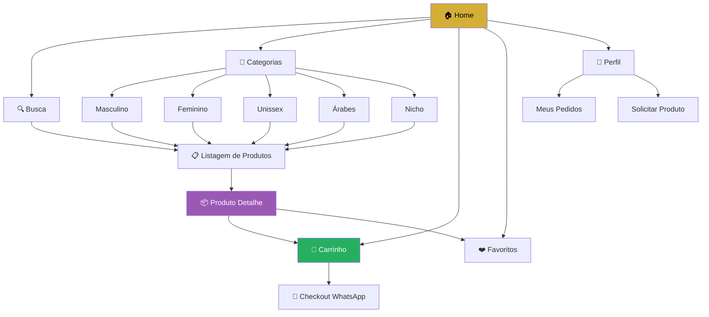
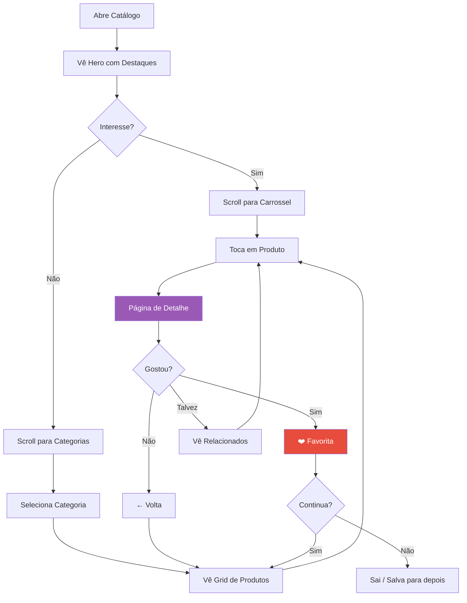
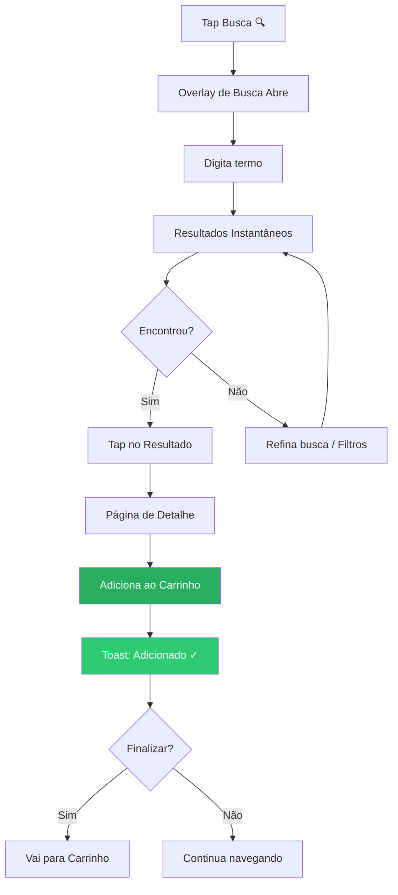
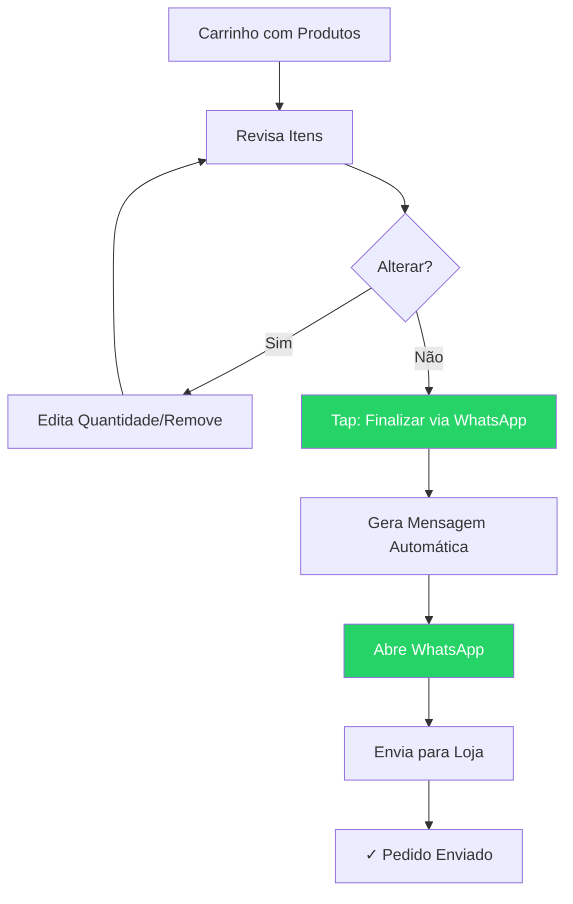

# Auralux Catálogo - UI/UX Specification
## Redesign Premium Mobile-First

> **Versão:** 2.0
> **Data:** 2025-11-29
> **Status:** Draft para Aprovação

---

## 1. Introduction

Este documento define os objetivos de experiência do usuário, arquitetura de informação, fluxos de usuário e especificações de design visual para o **Catálogo Auralux** - um redesign completo focado em criar uma experiência de descoberta de fragrâncias premium, mobile-first e visualmente deslumbrante.

### 1.1 Overall UX Goals & Principles

#### Target User Personas

| Persona | Descrição | Necessidades Chave | Contexto de Uso |
|---------|-----------|-------------------|-----------------|
| **Maria, a Exploradora** | Mulher 25-40, busca novidades, navega pelo celular no transporte/intervalos | Descoberta visual rápida, filtros intuitivos, wishlist fácil | Mobile 90%, sessões curtas (2-5min) |
| **João, o Decidido** | Homem 30-50, sabe o que quer, busca específica | Busca eficiente, informações claras de disponibilidade, checkout rápido | Mobile 60%, Desktop 40% |
| **Ana, a Presenteadora** | Qualquer idade, comprando para outros | Navegação por ocasião, faixa de preço clara, sugestões | Mobile 80%, decisão mais longa |

#### Usability Goals

| Goal | Métrica | Target |
|------|---------|--------|
| Descoberta imediata | Time to first meaningful interaction | < 3 segundos |
| Navegação one-handed | % de ações na thumb zone | 100% ações primárias |
| Favoritar sem fricção | Taps para adicionar favorito | 1 tap |
| Busca eficiente | Time to find specific product | < 15 segundos |
| Checkout rápido | Steps do carrinho ao WhatsApp | ≤ 2 steps |

#### Design Principles

1. **"Luxury Feels Light"** - Elegância através de espaço em branco generoso, não ornamentos
2. **"Touch is First"** - Cada elemento dimensionado e posicionado para o polegar
3. **"Show, Don't Tell"** - Imagens heroicas, copywriting mínimo e impactante
4. **"Delightful Surprises"** - Micro-animações que encantam sem atrapalhar a tarefa
5. **"Accessible Opulence"** - Luxo inclusivo, WCAG AA compliant em todas as telas

### 1.2 Change Log

| Date | Version | Description | Author |
|------|---------|-------------|--------|
| 2025-11-29 | 2.0 | Redesign completo mobile-first | Sally (UX Expert) |

---

## 2. Information Architecture (IA)

### 2.1 Site Map / Screen Inventory



### 2.2 Navigation Structure

#### Primary Navigation (Bottom Bar - Mobile)

| Position | Icon | Label | Destino |
|----------|------|-------|---------|
| 1 | 🏠 | Home | `/catalogo` |
| 2 | 🔍 | Buscar | Abre search overlay |
| 3 | ❤️ | Favoritos | `/catalogo/favoritos` |
| 4 | 🛒 | Carrinho | `/catalogo/carrinho` |
| 5 | 👤 | Perfil | Menu lateral ou modal |

#### Secondary Navigation (Category Pills)

- Horizontal scroll com snap
- Sticky abaixo do header em listagens
- "Todos" sempre primeiro
- Indicador visual da categoria ativa

#### Breadcrumb Strategy

- **Mobile:** Apenas botão "← Voltar" contextual
- **Desktop:** Breadcrumb completo: Home > Categoria > Produto

---

## 3. User Flows

### 3.1 Flow: Descoberta e Exploração (Maria)

**User Goal:** Descobrir novos perfumes interessantes de forma prazerosa

**Entry Points:**
- Acesso direto via link/QR
- Retorno via favoritos salvos

**Success Criteria:**
- Adiciona ≥1 produto aos favoritos
- Visualiza ≥3 produtos em detalhe
- Sessão > 2 minutos



**Edge Cases & Error Handling:**
- Produto indisponível → Mostrar "Avise-me quando voltar"
- Erro de conexão → Skeleton + retry automático
- Lista vazia de favoritos → Empty state com CTA para explorar

---

### 3.2 Flow: Busca Direta (João)

**User Goal:** Encontrar um perfume específico rapidamente

**Entry Points:**
- Tap no ícone de busca
- Tap na barra de busca do header

**Success Criteria:**
- Encontra produto em < 15 segundos
- Adiciona ao carrinho em < 30 segundos



**Edge Cases & Error Handling:**
- Zero resultados → Sugestões alternativas + "Solicitar produto"
- Typo comum → Autocorreção com "Você quis dizer...?"
- Produto fora de estoque → Destacar alternativas similares

---

### 3.3 Flow: Checkout WhatsApp

**User Goal:** Finalizar pedido de forma simples

**Entry Points:**
- Botão "Finalizar" no carrinho
- FAB no carrinho

**Success Criteria:**
- Abre WhatsApp com mensagem pré-formatada
- Lista completa de produtos no texto



---

## 4. Wireframes & Key Screens

### 4.1 Design Files

**Primary Design Tool:** Implementação direta em código (React/Next.js + Tailwind)
**Prototipação:** Pode usar v0.dev ou Lovable para iteração rápida

### 4.2 Key Screen Layouts

---

#### 📱 Screen: Home (Mobile)

**Purpose:** Landing page que inspira descoberta e mostra a curadoria premium

**Layout (top to bottom):**

```
┌─────────────────────────────────┐
│  ▔▔▔▔▔▔▔▔▔▔▔▔▔▔▔▔▔▔▔▔▔▔▔▔▔▔▔  │ ← Status Bar (transparent)
│                                 │
│      ✦ AURALUX ✦               │ ← Logo centralizado (pequeno)
│         🔍                      │ ← Search icon (tap expande)
├─────────────────────────────────┤
│                                 │
│   ╔═══════════════════════════╗ │
│   ║                           ║ │
│   ║    [HERO IMAGE FULL]      ║ │ ← 70vh, imagem de perfume luxo
│   ║                           ║ │
│   ║   ─────────────────────   ║ │
│   ║   Descubra sua           ║ │ ← Texto sobre gradient
│   ║   Fragrância Perfeita    ║ │
│   ║                           ║ │
│   ║   [ Explorar ▼ ]          ║ │ ← CTA sutil, scroll indicator
│   ╚═══════════════════════════╝ │
│                                 │
├─────────────────────────────────┤
│  ✨ EM DESTAQUE                 │ ← Section title
│  ─────────────────────────────  │
│  ┌──────┐ ┌──────┐ ┌──────┐    │
│  │      │ │      │ │      │ ←──│ Carrossel horizontal
│  │ IMG  │ │ IMG  │ │ IMG  │    │ Cards 160px width
│  │      │ │      │ │      │    │ Snap scroll
│  │ Nome │ │ Nome │ │ Nome │    │
│  │ R$XX │ │ R$XX │ │ R$XX │    │
│  └──────┘ └──────┘ └──────┘    │
│        ● ○ ○ ○                  │ ← Dots indicator
├─────────────────────────────────┤
│  🆕 NOVIDADES                   │
│  ─────────────────────────────  │
│  ┌──────┬──────┐               │
│  │      │      │               │ ← Grid 2 colunas
│  │ PROD │ PROD │               │ Gap 12px
│  │      │      │               │
│  ├──────┼──────┤               │
│  │      │      │               │
│  │ PROD │ PROD │               │
│  │      │      │               │
│  └──────┴──────┘               │
│                                 │
│  [ Ver Todos os Produtos → ]   │ ← Link button
├─────────────────────────────────┤
│  📂 CATEGORIAS                  │
│  ─────────────────────────────  │
│  ┌─────────────┬─────────────┐ │
│  │  MASCULINO  │  FEMININO   │ │ ← Cards grandes
│  │   (image)   │   (image)   │ │ Aspect 3:4
│  └─────────────┴─────────────┘ │ Gradient overlay
│  ┌─────────────┬─────────────┐ │
│  │   UNISSEX   │   ÁRABES    │ │
│  │   (image)   │   (image)   │ │
│  └─────────────┴─────────────┘ │
│                                 │
├─────────────────────────────────┤
│  FOOTER                         │
│  Auralux © 2025                 │
│  [Instagram] [WhatsApp]         │
├─────────────────────────────────┤
│                                 │
│  🏠    🔍    ❤️    🛒    👤    │ ← Bottom Navigation (fixed)
│  Home  Busca Favs  Cart  Perfil │
│                                 │
└─────────────────────────────────┘
```

**Interaction Notes:**
- Hero: Parallax sutil no scroll
- Carrossel: Snap to center, swipe com momentum
- Cards: Tap anywhere navega, heart icon tem hit area expandida
- Bottom nav: Haptic feedback no tap, badge animado no carrinho

---

#### 📱 Screen: Listagem de Produtos (Mobile)

**Purpose:** Browsing eficiente com filtros não-intrusivos

**Layout:**

```
┌─────────────────────────────────┐
│  ← Voltar     MASCULINO    🔍  │ ← Header contextual
├─────────────────────────────────┤
│ ┌─────┐┌─────┐┌─────┐┌─────┐   │
│ │Todos││Woody││Fresh││Spicy│←──│ Category pills (scroll)
│ └─────┘└─────┘└─────┘└─────┘   │ Pill ativa = filled
├─────────────────────────────────┤
│  245 produtos    ⚙️ Filtros    │ ← Counter + filter button
├─────────────────────────────────┤
│                                 │
│  ┌───────────┬───────────┐     │
│  │  ┌─────┐  │  ┌─────┐  │     │
│  │  │     │  │  │     │  │     │
│  │  │ IMG │  │  │ IMG │  │     │ ← Grid 2 cols
│  │  │     │  │  │     │  │     │ Aspect 4:5
│  │  │  ❤️ │  │  │  ❤️ │  │     │ Heart top-right
│  │  └─────┘  │  └─────┘  │     │
│  │  Nome     │  Nome     │     │
│  │  R$ 289   │  R$ 359   │     │
│  ├───────────┼───────────┤     │
│  │  ┌─────┐  │  ┌─────┐  │     │
│  │  │     │  │  │     │  │     │
│  │  │ IMG │  │  │ IMG │  │     │
│  │  │     │  │  │     │  │     │
│  │  │  ❤️ │  │  │  ❤️ │  │     │
│  │  └─────┘  │  └─────┘  │     │
│  │  Nome     │  Nome     │     │
│  │  R$ 199   │  R$ 429   │     │
│  └───────────┴───────────┘     │
│                                 │
│         ◌ Loading...            │ ← Infinite scroll indicator
│                                 │
├─────────────────────────────────┤
│  🏠    🔍    ❤️    🛒    👤    │
└─────────────────────────────────┘
```

**Filter Sheet (Bottom Sheet):**

```
┌─────────────────────────────────┐
│  ════════════════════════════   │ ← Drag handle
│                                 │
│  FILTROS              Limpar ↺  │
│  ─────────────────────────────  │
│                                 │
│  Preço                          │
│  ├──●────────────────●──┤      │ ← Range slider
│  R$ 50              R$ 800      │
│                                 │
│  Intensidade                    │
│  ○ Leve  ◉ Moderada  ○ Intensa │
│                                 │
│  Disponibilidade                │
│  ☑ Em estoque                   │
│  ☐ Incluir indisponíveis       │
│                                 │
│  ┌─────────────────────────────┐│
│  │     Aplicar (127 itens)     ││ ← Primary button
│  └─────────────────────────────┘│
└─────────────────────────────────┘
```

---

#### 📱 Screen: Produto Detalhe (Mobile)

**Purpose:** Apresentar o produto de forma desejável com todas as informações

**Layout:**

```
┌─────────────────────────────────┐
│  ←                          ↗️  │ ← Back + Share
├─────────────────────────────────┤
│                                 │
│  ╔═══════════════════════════╗ │
│  ║                           ║ │
│  ║                           ║ │
│  ║      [PRODUCT IMAGE]      ║ │ ← Full width, aspect 1:1
│  ║                           ║ │   Pinch to zoom
│  ║                           ║ │   Swipe para mais fotos
│  ║                           ║ │
│  ╚═══════════════════════════╝ │
│         ○ ● ○                   │ ← Image dots
│                                 │
│  ┌─────────────────────────────┐│
│  │ MASCULINO                   ││ ← Category chip
│  │                             ││
│  │ Bleu de Chanel              ││ ← Product name (H1)
│  │ Eau de Parfum 100ml         ││ ← Variant
│  │                             ││
│  │ ★★★★☆ (124 avaliações)      ││ ← Rating (se houver)
│  │                             ││
│  │ R$ 589,00                   ││ ← Price (large, primary color)
│  │ ou 12x de R$ 49,08          ││ ← Installments
│  │                             ││
│  │ ✓ Em estoque                ││ ← Stock badge (green)
│  └─────────────────────────────┘│
│                                 │
│  ┌─────────────────────────────┐│
│  │ 🎵 NOTAS DA FRAGRÂNCIA      ││
│  │ ─────────────────────────   ││
│  │                             ││
│  │ TOPO      Bergamota, Limão  ││
│  │ CORAÇÃO   Jasmin, Rosa      ││
│  │ BASE      Sândalo, Âmbar    ││
│  │                             ││
│  │ ════════════════════════    ││
│  │ Intensidade: ████████░░ 80% ││ ← Visual meter
│  │ Longevidade: ██████░░░░ 60% ││
│  └─────────────────────────────┘│
│                                 │
│  ┌─────────────────────────────┐│
│  │ 📝 DESCRIÇÃO            ▼  ││ ← Collapsible
│  └─────────────────────────────┘│
│  ┌─────────────────────────────┐│
│  │ 🎁 OCASIÕES             ▼  ││
│  └─────────────────────────────┘│
│                                 │
│  ─────────────────────────────  │
│  VOCÊ TAMBÉM VAI GOSTAR         │
│  ┌──────┐ ┌──────┐ ┌──────┐    │ ← Related carousel
│  │      │ │      │ │      │    │
│  └──────┘ └──────┘ └──────┘    │
│                                 │
│  ▓▓▓▓▓▓▓▓▓▓▓▓▓▓▓▓▓▓▓▓▓▓▓▓▓▓▓  │ ← Safe area for sticky
├─────────────────────────────────┤
│ ┌─────────────┬───────────────┐ │
│ │    ❤️       │  🛒 ADICIONAR │ │ ← Sticky bottom actions
│ │  Favoritar  │   AO CARRINHO │ │   Heart = outline/filled
│ └─────────────┴───────────────┘ │   Cart = primary button
└─────────────────────────────────┘
```

---

#### 📱 Screen: Carrinho (Mobile)

**Purpose:** Revisar pedido e finalizar via WhatsApp

**Layout:**

```
┌─────────────────────────────────┐
│  ←  MEU CARRINHO (3)            │
├─────────────────────────────────┤
│                                 │
│  ┌─────────────────────────────┐│
│  │ ┌─────┐                     ││
│  │ │     │  Bleu de Chanel     ││
│  │ │ IMG │  100ml              ││
│  │ │     │                     ││
│  │ └─────┘  R$ 589,00          ││
│  │                             ││
│  │     [ - ]  1  [ + ]    🗑️   ││ ← Quantity controls
│  └─────────────────────────────┘│
│                                 │
│  ┌─────────────────────────────┐│
│  │ ┌─────┐                     ││
│  │ │     │  Sauvage Dior       ││
│  │ │ IMG │  60ml               ││
│  │ │     │                     ││
│  │ └─────┘  R$ 459,00          ││
│  │                             ││
│  │     [ - ]  2  [ + ]    🗑️   ││
│  └─────────────────────────────┘│
│                                 │
│  ┌─────────────────────────────┐│
│  │ ┌─────┐                     ││
│  │ │     │  Good Girl          ││
│  │ │ IMG │  80ml               ││
│  │ │     │                     ││
│  │ └─────┘  R$ 649,00          ││
│  │                             ││
│  │     [ - ]  1  [ + ]    🗑️   ││
│  └─────────────────────────────┘│
│                                 │
│  ─────────────────────────────  │
│                                 │
│  Subtotal (4 itens)   R$ 2.156  │
│                                 │
│  ▓▓▓▓▓▓▓▓▓▓▓▓▓▓▓▓▓▓▓▓▓▓▓▓▓▓▓  │
├─────────────────────────────────┤
│ ┌─────────────────────────────┐ │
│ │  💬 FINALIZAR VIA WHATSAPP  │ │ ← Green WhatsApp button
│ └─────────────────────────────┘ │
│                                 │
│   Você será redirecionado para  │
│   o WhatsApp da loja            │
└─────────────────────────────────┘
```

---

#### 📱 Screen: Search Overlay (Mobile)

**Purpose:** Busca rápida e inteligente

**Layout:**

```
┌─────────────────────────────────┐
│                                 │
│  ┌─────────────────────────┐ ✕ │
│  │ 🔍  Buscar perfumes...  │   │ ← Auto-focus input
│  └─────────────────────────┘   │
│                                 │
│  BUSCAS RECENTES           ↺   │
│  ─────────────────────────────  │
│  ⏱ Bleu de Chanel              │
│  ⏱ perfumes masculinos         │
│  ⏱ carolina herrera            │
│                                 │
│  ─────────────────────────────  │
│                                 │
│  POPULARES AGORA                │
│  ─────────────────────────────  │
│  🔥 Sauvage                     │
│  🔥 Good Girl                   │
│  🔥 212 VIP                     │
│  🔥 One Million                 │
│                                 │
│  ─────────────────────────────  │
│                                 │
│  CATEGORIAS                     │
│  ┌─────┐┌─────┐┌─────┐┌─────┐  │
│  │ 👨 ││ 👩 ││ 🌟 ││ 🕌 │  │
│  │Masc ││ Fem ││Uniss││Árabe│  │
│  └─────┘└─────┘└─────┘└─────┘  │
│                                 │
└─────────────────────────────────┘

--- Digitando... ---

┌─────────────────────────────────┐
│  ┌─────────────────────────┐ ✕ │
│  │ 🔍  bleu de c|          │   │
│  └─────────────────────────┘   │
│                                 │
│  ┌─────────────────────────────┐│
│  │ ┌───┐                       ││
│  │ │IMG│ Bleu de Chanel EDP    ││ ← Live results
│  │ └───┘ R$ 589,00             ││
│  ├─────────────────────────────┤│
│  │ ┌───┐                       ││
│  │ │IMG│ Bleu de Chanel EDT    ││
│  │ └───┘ R$ 489,00             ││
│  ├─────────────────────────────┤│
│  │ ┌───┐                       ││
│  │ │IMG│ Bleu de Chanel Parfum ││
│  │ └───┘ R$ 789,00             ││
│  └─────────────────────────────┘│
│                                 │
│  Ver todos os resultados (12) → │
│                                 │
└─────────────────────────────────┘
```

---

## 5. Component Library / Design System

### 5.1 Design System Approach

**Base:** shadcn/ui (já implementado no projeto)
**Extensão:** Componentes customizados para e-commerce premium
**Tokens:** CSS variables com tema Auralux (purple/magenta)

### 5.2 Core Components

#### ProductCard (Redesigned)

**Purpose:** Exibir produto de forma desejável e clicável

**Variants:**
- `default` - Grid card padrão (listagens)
- `featured` - Card maior para carrosséis de destaque
- `compact` - Versão mínima para resultados de busca
- `horizontal` - Layout lado a lado para carrinho

**States:**
- `default` - Estado normal
- `hover` - Escala sutil (1.02), sombra elevada
- `pressed` - Escala 0.98
- `loading` - Skeleton com shimmer
- `out-of-stock` - Overlay semi-transparente + badge

**Props:**
```typescript
interface ProductCardProps {
  product: CatalogProduct
  variant?: 'default' | 'featured' | 'compact' | 'horizontal'
  showQuickAdd?: boolean  // Mostra botão de add rápido no hover
  priority?: boolean      // Para LCP optimization
}
```

---

#### BottomNavigation (New)

**Purpose:** Navegação principal mobile fixa no bottom

**Variants:**
- `default` - 5 items padrão
- `minimal` - 3-4 items (contextos específicos)

**States:**
- Item `active` - Ícone filled + cor primária
- Item `inactive` - Ícone outlined + cor muted
- `badge` - Contador animado (cart/favorites)

**Props:**
```typescript
interface BottomNavProps {
  items: NavItem[]
  activeItem: string
  onItemClick: (id: string) => void
}

interface NavItem {
  id: string
  icon: LucideIcon
  activeIcon: LucideIcon
  label: string
  href: string
  badge?: number
}
```

---

#### SearchOverlay (New)

**Purpose:** Experiência de busca imersiva full-screen

**Sections:**
- Search input (auto-focus)
- Recent searches (localStorage)
- Popular/trending
- Quick category access
- Live results (debounced)

**States:**
- `idle` - Mostra recentes + populares
- `typing` - Mostra resultados live
- `no-results` - Empty state com sugestões
- `loading` - Skeleton de resultados

---

#### FilterSheet (New)

**Purpose:** Bottom sheet com filtros avançados

**Filter Types:**
- Range slider (preço)
- Radio group (intensidade, ordenação)
- Checkbox group (disponibilidade, ocasião)
- Category pills (subcategorias)

**Behavior:**
- Drag to expand/collapse
- "Aplicar" mostra preview de resultados
- "Limpar" reseta todos os filtros

---

#### HeroSection (Redesigned)

**Purpose:** Impacto visual imediato na home

**Variants:**
- `fullscreen` - 100vh com scroll indicator
- `standard` - 70vh
- `compact` - 50vh

**Elements:**
- Background image/video (lazy loaded)
- Gradient overlay (bottom)
- Headline + subheadline
- CTA button ou scroll indicator
- Optional: floating product images

---

#### CategoryPills (Redesigned)

**Purpose:** Navegação horizontal por categorias

**Behavior:**
- Horizontal scroll com snap
- Active state filled
- Sticky quando aplicável
- Touch-friendly (min 44px height)

---

## 6. Branding & Style Guide

### 6.1 Visual Identity

**Brand Guidelines:** Auralux - Luxo Acessível
**Mood:** Elegante, Moderno, Confiável, Premium mas não Esnobe

### 6.2 Color Palette

| Color Type | Hex/OKLCH | Usage |
|------------|-----------|-------|
| **Primary** | `oklch(0.55 0.22 320)` ~#9B59B6 | CTAs, links, destaques |
| **Primary Light** | `oklch(0.75 0.15 320)` | Hover states, backgrounds suaves |
| **Accent** | `oklch(0.6 0.24 310)` ~#E91E8C | Badges especiais, promoções |
| **Success** | `#27AE60` | Em estoque, confirmações |
| **Warning** | `#F39C12` | Em breve, alertas |
| **Error** | `#E74C3C` | Indisponível, erros |
| **Background** | `#FAFAFA` | Fundo principal |
| **Surface** | `#FFFFFF` | Cards, modals |
| **Text Primary** | `#1A1A1A` | Títulos, texto principal |
| **Text Secondary** | `#6B7280` | Descrições, labels |
| **Border** | `#E5E7EB` | Divisores, inputs |

### 6.3 Typography

#### Font Families

- **Primary:** `Geist Sans` (já configurado)
- **Display:** `Geist Sans` weight 600-700 para headlines
- **Monospace:** `Geist Mono` para preços/SKUs

#### Type Scale

| Element | Size (Mobile) | Size (Desktop) | Weight | Line Height |
|---------|---------------|----------------|--------|-------------|
| H1 (Hero) | 32px | 56px | 700 | 1.1 |
| H2 (Section) | 24px | 36px | 600 | 1.2 |
| H3 (Card Title) | 16px | 18px | 500 | 1.3 |
| Body | 14px | 16px | 400 | 1.5 |
| Small | 12px | 14px | 400 | 1.4 |
| Price | 20px | 24px | 700 | 1.2 |
| Badge | 11px | 12px | 600 | 1 |

### 6.4 Iconography

**Icon Library:** Lucide React (já em uso)

**Guidelines:**
- Tamanho padrão: 20px (mobile), 24px (desktop)
- Stroke width: 1.5px (elegância) a 2px (destaque)
- Ícones de ação: filled quando ativo
- Consistência: usar sempre do mesmo conjunto

**Ícones Chave:**
- Heart (favorito): `Heart` / `HeartFilled`
- Cart: `ShoppingBag` (mais premium que ShoppingCart)
- Search: `Search`
- Filter: `SlidersHorizontal`
- Share: `Share2`
- Back: `ArrowLeft`
- Menu: `Menu`

### 6.5 Spacing & Layout

**Grid System:**
- Mobile: 16px padding lateral
- Tablet: 24px padding lateral
- Desktop: Container max 1280px, centered

**Spacing Scale (8px base):**
```
4px   - xs (micro gaps)
8px   - sm (entre elementos relacionados)
12px  - md (gaps de grid mobile)
16px  - lg (padding de cards)
24px  - xl (separação de seções)
32px  - 2xl (margens de seção)
48px  - 3xl (espaçamento hero)
64px  - 4xl (mega espaçamento)
```

**Border Radius:**
- Small (badges, pills): 9999px (full rounded)
- Medium (buttons, inputs): 8px
- Large (cards): 12px
- XL (modals, sheets): 16px top

---

## 7. Accessibility Requirements

### 7.1 Compliance Target

**Standard:** WCAG 2.1 Level AA

### 7.2 Key Requirements

#### Visual
- **Contrast:** Mínimo 4.5:1 para texto, 3:1 para elementos gráficos
- **Focus indicators:** Ring 2px offset, cor primária
- **Text sizing:** Suportar até 200% zoom sem quebra de layout

#### Interaction
- **Keyboard:** Toda funcionalidade acessível via teclado
- **Touch targets:** Mínimo 44x44px para elementos interativos
- **Screen readers:** Labels descritivos, landmarks ARIA

#### Content
- **Alt text:** Todas as imagens de produto com descrição
- **Headings:** Hierarquia correta (H1 > H2 > H3)
- **Forms:** Labels associados, mensagens de erro claras

### 7.3 Testing Strategy

- axe DevTools para checagem automática
- VoiceOver (iOS) e TalkBack (Android) para testes manuais
- Lighthouse accessibility score target: ≥90

---

## 8. Responsiveness Strategy

### 8.1 Breakpoints

| Breakpoint | Min Width | Max Width | Target Devices |
|------------|-----------|-----------|----------------|
| **Mobile** | 0 | 639px | Smartphones |
| **Tablet** | 640px | 1023px | Tablets, landscape phones |
| **Desktop** | 1024px | 1279px | Laptops |
| **Wide** | 1280px | - | Desktop monitors |

### 8.2 Adaptation Patterns

#### Layout Changes
- **Mobile:** Single column, bottom navigation
- **Tablet:** 2-3 columns, bottom or side navigation
- **Desktop:** 3-4 columns, top navigation + sidebar filters

#### Navigation Changes
- **Mobile:** Bottom bar (fixed) + hamburger para extras
- **Tablet:** Bottom bar ou top bar (configurável)
- **Desktop:** Top header completo com mega menu

#### Content Priority
- **Mobile:** Imagem > Preço > Nome > Categoria
- **Desktop:** Mais informações visíveis, hover actions

#### Interaction Changes
- **Mobile:** Tap, swipe, pull-to-refresh
- **Desktop:** Hover states, click, keyboard shortcuts

---

## 9. Animation & Micro-interactions

### 9.1 Motion Principles

1. **Purposeful:** Animação deve comunicar, não decorar
2. **Swift:** Duração curta (150-300ms) para não atrasar
3. **Natural:** Easing curves que imitam física real
4. **Respectful:** Honrar prefers-reduced-motion

### 9.2 Key Animations

| Animation | Description | Duration | Easing |
|-----------|-------------|----------|--------|
| **Page Transition** | Fade + slide up sutil | 200ms | ease-out |
| **Card Hover** | Scale 1.02 + shadow lift | 150ms | ease-out |
| **Card Press** | Scale 0.98 | 100ms | ease-in |
| **Heart Toggle** | Scale bounce + color fill | 300ms | spring(1, 80, 10) |
| **Add to Cart** | Produto "voa" para ícone | 400ms | ease-in-out |
| **Sheet Open** | Slide up + backdrop fade | 250ms | ease-out |
| **Sheet Close** | Slide down + backdrop fade | 200ms | ease-in |
| **Skeleton Shimmer** | Gradient sweep | 1500ms | linear, infinite |
| **Badge Bounce** | Scale pulse | 300ms | spring |
| **Toast Enter** | Slide up + fade | 200ms | ease-out |
| **Toast Exit** | Fade out | 150ms | ease-in |

### 9.3 Reduced Motion

```css
@media (prefers-reduced-motion: reduce) {
  *, *::before, *::after {
    animation-duration: 0.01ms !important;
    transition-duration: 0.01ms !important;
  }
}
```

---

## 10. Performance Considerations

### 10.1 Performance Goals

| Metric | Target | Critical |
|--------|--------|----------|
| **LCP** | < 2.5s | < 4s |
| **FID** | < 100ms | < 300ms |
| **CLS** | < 0.1 | < 0.25 |
| **TTI** | < 3.5s | < 7s |
| **Bundle Size** | < 200kb (gzipped) | < 350kb |

### 10.2 Design Strategies

#### Images
- WebP/AVIF com fallback JPEG
- Responsive images com srcset
- Lazy loading abaixo do fold
- Blur placeholder (já implementado)
- CDN com transformação on-the-fly

#### Code
- Code splitting por rota
- Dynamic imports para componentes pesados
- Prefetch de rotas prováveis (hover/visible)
- Service Worker para cache de assets

#### Rendering
- ISR para listagens (revalidate 60s)
- SSG para páginas estáticas
- Streaming SSR para páginas dinâmicas
- Skeleton loading para perceived performance

#### Fonts
- Font subsetting (apenas caracteres usados)
- font-display: swap
- Preload de fontes críticas

---

## 11. Implementation Priority

### Phase 1: Foundation (Sprint 1)

1. BottomNavigation component
2. Novo layout do CatalogHeader (simplificado)
3. SearchOverlay component
4. CSS/tokens de animação

### Phase 2: Home Redesign (Sprint 2)

1. HeroSection full-screen
2. FeaturedProductsSection com novo carrossel
3. CategoriesSection com cards visuais
4. NewProductsSection com grid melhorado

### Phase 3: Listagem & Filtros (Sprint 3)

1. ProductCard redesenhado
2. FilterSheet (bottom sheet)
3. CategoryPills melhoradas
4. Infinite scroll refinado

### Phase 4: Detalhe & Checkout (Sprint 4)

1. Product detail page redesign
2. Carrinho com nova UX
3. Checkout WhatsApp flow
4. Favoritos page

### Phase 5: Polish (Sprint 5)

1. Todas as animações
2. Empty states
3. Error states
4. Performance optimization
5. A11y audit

---

## 12. Next Steps

### Immediate Actions

1. **Review com stakeholders** - Apresentar este documento para alinhamento
2. **Prototipação rápida** - Usar v0.dev para validar conceitos visuais
3. **Component audit** - Listar componentes existentes vs novos necessários
4. **Setup de design tokens** - Atualizar globals.css com novos tokens
5. **Criar branch de feature** - `feat/catalog-redesign-v2`

### Design Handoff Checklist

- [x] Todos os user flows documentados
- [x] Inventário de componentes completo
- [x] Requisitos de acessibilidade definidos
- [x] Estratégia responsiva clara
- [x] Brand guidelines incorporados
- [x] Metas de performance estabelecidas
- [ ] Protótipos visuais criados (próximo passo)
- [ ] Design review com time

---

## Appendix A: Component Checklist

| Component | Status | Priority | Notes |
|-----------|--------|----------|-------|
| BottomNavigation | 🆕 New | P0 | Crítico para mobile |
| SearchOverlay | 🆕 New | P0 | Substituir busca atual |
| HeroSection | 🔄 Redesign | P1 | Full-screen com parallax |
| ProductCard | 🔄 Redesign | P1 | Hover states, quick-add |
| FilterSheet | 🆕 New | P1 | Bottom sheet filters |
| CategoryPills | 🔄 Improve | P2 | Melhor visual feedback |
| CartItem | 🔄 Redesign | P2 | Layout horizontal |
| Toast | ✅ Exists | - | Verificar animações |
| Skeleton | ✅ Exists | - | Adicionar shimmer |

---

## Appendix B: Reference Screenshots

> Nota: Adicionar screenshots de referência de:
> - Sephora App (bottom nav, quick add)
> - Dior Beauty (hero, typography)
> - Cult Beauty (product cards)
> - SSENSE (minimal elegance)

---

**Document Status:** ✅ Complete - Ready for Review

**Next:** Aprovar spec → Criar protótipos → Iniciar implementação

---

*Powered by BMAD™ Core - Created by Sally, UX Expert*
