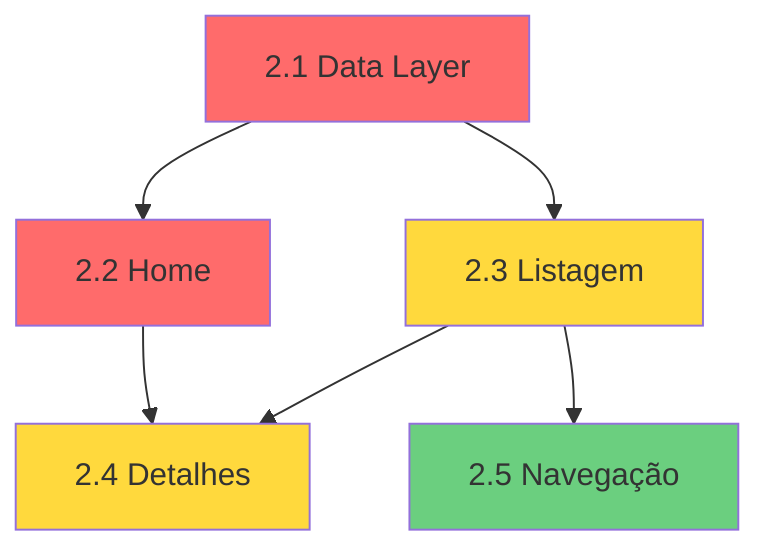

# Epic 2: Visualização Pública do Catálogo e Navegação ✅

## 📋 Resumo Executivo

Este diretório contém **TODAS as 5 stories** necessárias para implementar o **Epic 2: Visualização Pública do Catálogo e Navegação** - Interface pública do catálogo de perfumes Auralux com listagem, filtros, busca e detalhes de produtos.

### ✅ Stories Criadas (5 de 5) 🎉

| # | Story | Prioridade | Estimativa | Arquivo |
|---|-------|------------|------------|---------|
| **2.1** | Criar Serviço de Catálogo (Data Layer) | 🔴 CRÍTICA | 2-3 dias | [2.1.catalog-service-data-layer.md](./2.1.catalog-service-data-layer.md) |
| **2.2** | Home do Catálogo com Produtos em Destaque e Novidades | 🔴 CRÍTICA | 3-4 dias | [2.2.catalog-home-featured-products.md](./2.2.catalog-home-featured-products.md) |
| **2.3** | Listagem de Produtos com Filtros e Busca | 🟡 ALTA | 3-4 dias | [2.3.catalog-product-listing-filters.md](./2.3.catalog-product-listing-filters.md) |
| **2.4** | Página de Detalhes do Produto | 🟡 ALTA | 3-4 dias | [2.4.catalog-product-details-page.md](./2.4.catalog-product-details-page.md) |
| **2.5** | Sistema de Categorias e Navegação | 🟢 MÉDIA | 2-3 dias | [2.5.catalog-category-navigation.md](./2.5.catalog-category-navigation.md) |

**Total Estimado:** 13-18 dias de desenvolvimento (aproximadamente 2.5-3.5 semanas com 1 desenvolvedor)

---

## 🎯 Visão Geral das Entregas por Story

### 🔴 CRÍTICAS (Fundação do Catálogo Público)

#### Story 2.1: Serviço de Catálogo (Data Layer)
**Por que é CRÍTICA:** Todas as outras stories dependem deste serviço.

**Entregas:**
- ✅ Arquivo `/lib/services/catalog.ts` com 5 funções de busca
- ✅ Interface TypeScript `CatalogProduct` completa
- ✅ Funções: `getFeaturedProducts()`, `getNewProducts()`, `getProductsByCategory()`, `searchProducts()`, `getProductDetails()`
- ✅ React Query hooks: `useFeaturedProducts()`, `useNewProducts()`, `useProductsByCategory()`, `useSearchProducts()`, `useProductDetails()`
- ✅ Cache configurado: `staleTime: 60000` (1 minuto)
- ✅ RLS enforcement: todas as queries retornam apenas `visible = true`
- ✅ Testes unitários de segurança e busca

**Dependências:** Epic 1 Stories 1.1-1.3 (Database, RLS, Auth)

---

#### Story 2.2: Home do Catálogo
**Por que é CRÍTICA:** Ponto de entrada do catálogo público.

**Entregas:**
- ✅ Página `/app/catalogo/page.tsx` com ISR (revalidate: 60s)
- ✅ Hero Banner com CTA "Explorar Catálogo"
- ✅ Seção "Produtos em Destaque" (carrossel swipeable, até 6 produtos)
- ✅ Seção "Novidades" (grid 2 col mobile, últimos 10 produtos)
- ✅ Seção "Categorias em Destaque" (cards com links)
- ✅ Componente `/components/catalog/ProductCard.tsx` (reutilizável):
  - Imagem lazy-load
  - Badge de estoque: "Disponível", "Em breve", "Indisponível"
  - Ícone de favorito
  - Link para detalhes
- ✅ Skeleton screens para loading states
- ✅ Performance: LCP < 2.5s em 3G (testes E2E)

**Dependências:** Story 2.1 (hooks de dados)

---

### 🟡 ALTA PRIORIDADE (Core Features)

#### Story 2.3: Listagem de Produtos com Filtros e Busca
**Por que é ALTA:** Funcionalidade central de navegação do catálogo.

**Entregas:**
- ✅ Página `/app/catalogo/produtos/page.tsx` (SSR)
- ✅ Grid responsivo (2 col mobile, 4 col desktop)
- ✅ Componente `FilterBar.tsx` (sticky):
  - Dropdown de categorias com contador
  - Input de busca com debounce 300ms
  - Botão "Limpar filtros"
- ✅ Filtros combinados (categoria AND busca)
- ✅ Scroll infinito (Intersection Observer, 20 produtos/página)
- ✅ URL state management (query params)
- ✅ Hook `useProductFilters()` com `useInfiniteQuery`
- ✅ Hook `useDebouncedValue()` (utilitário)
- ✅ Testes E2E: busca textual, scroll infinito

**Dependências:** Story 2.1 (serviços), Story 2.2 (ProductCard)

---

#### Story 2.4: Página de Detalhes do Produto
**Por que é ALTA:** Conversão - adicionar favoritos/carrinho.

**Entregas:**
- ✅ Página `/app/catalogo/produto/[id]/page.tsx` (ISR, revalidate: 60s)
- ✅ Imagem com pinch-to-zoom (mobile) e modal (desktop)
- ✅ Informações básicas: nome, preço, categoria, badge estoque, descrição
- ✅ Seção "Detalhes de Fragrância":
  - Notas: Topo, Corpo, Fundo
  - Chips: Ocasião, Intensidade, Durabilidade
- ✅ Botões de ação fixos (bottom bar):
  - "Adicionar aos Favoritos" (toggle)
  - "Adicionar ao Carrinho"
  - Auth guard: abre modal se não autenticado
- ✅ Serviço `/lib/services/catalog-favorites.ts`:
  - `checkIsFavorite()`, `addFavorite()`, `removeFavorite()`
- ✅ Hooks: `useIsFavorite()`, `useAddFavorite()`, `useRemoveFavorite()`
- ✅ Seção "Produtos Relacionados" (4 produtos mesma categoria)
- ✅ SEO completo:
  - Meta tags Open Graph e Twitter Cards dinâmicas
  - Structured data Schema.org Product (JSON-LD)
- ✅ Testes E2E: adicionar carrinho/favorito autenticado

**Dependências:** Story 2.1 (getProductDetails), Epic 1 Story 1.5 (AuthModal)

---

### 🟢 MÉDIA PRIORIDADE (Polish & UX)

#### Story 2.5: Sistema de Categorias e Navegação
**Por que é MÉDIA:** Melhora UX mas não é bloqueante.

**Entregas:**
- ✅ Componente `/components/catalog/CategoryNav.tsx`:
  - Barra sticky abaixo do header
  - Scroll horizontal com chips
  - Chip "Todos" + contador total
  - Chips de categorias + contadores individuais
  - Categoria ativa destacada visualmente
- ✅ Página redirect `/app/catalogo/categoria/[id]/page.tsx`
- ✅ Função `getCategories()` em `catalog.ts`:
  - Retorna categorias com contador de produtos visíveis
  - Filtra categorias sem produtos
- ✅ Hook `useCategories()` (cache: 5 minutos)
- ✅ Skeleton durante loading
- ✅ Testes E2E: navegação entre categorias

**Dependências:** Story 2.3 (filtro por categoria já funcional)

---

## 🚀 Como Executar as Stories

### Ordem de Execução Recomendada:

```
┌─────────────────────────────────────────────────────┐
│ FASE 1: DATA LAYER (Semana 1)                      │
├─────────────────────────────────────────────────────┤
│ 2.1 → Serviço de Catálogo (2-3 dias)               │
└─────────────────────────────────────────────────────┘

┌─────────────────────────────────────────────────────┐
│ FASE 2: PÁGINAS PÚBLICAS (Semanas 1-2)             │
├─────────────────────────────────────────────────────┤
│ 2.2 → Home do Catálogo (3-4 dias)                  │
│ 2.3 → Listagem + Filtros (3-4 dias)                │
└─────────────────────────────────────────────────────┘

┌─────────────────────────────────────────────────────┐
│ FASE 3: DETALHES & NAVEGAÇÃO (Semana 3)            │
├─────────────────────────────────────────────────────┤
│ 2.4 → Detalhes do Produto (3-4 dias)               │
│ 2.5 → Navegação de Categorias (2-3 dias)           │
└─────────────────────────────────────────────────────┘
```

### Dependências entre Stories:



### Comandos para o Dev Agent:

```bash
# 1. Carregar o Dev Agent
/BMad:agents:dev

# 2. Carregar story específica do Epic 2
*load 2.1

# 3. Dev agent executará todos os tasks/subtasks automaticamente

# 4. Após conclusão, marcar story como "Done"

# 5. Repetir para próxima story
*load 2.2
```

---

## ⚠️ ATENÇÕES CRÍTICAS

### 1. **DEPENDÊNCIA DO EPIC 1** (MÁXIMA PRIORIDADE!)
- ⚠️ Epic 2 **REQUER** que Epic 1 Stories 1.1-1.4 estejam completadas:
  - **Story 1.1**: Schema `catalog_items`, `catalog_users`, etc.
  - **Story 1.2**: RLS policies configuradas
  - **Story 1.3**: Sistema de autenticação WhatsApp
  - **Story 1.4**: Layout e rotas `/app/catalogo/*`
- ✅ Verificar que essas stories estão "Done" antes de iniciar Epic 2

### 2. **PERFORMANCE É CRÍTICA**
- ⚠️ Target: LCP < 2.5s em 3G
- ✅ Story 2.2: ISR com revalidate 60s
- ✅ Story 2.3: Debounce 300ms em busca
- ✅ Story 2.4: ISR + SEO completo
- ✅ Todas: Next.js Image com lazy loading

### 3. **RLS ENFORCEMENT**
- ⚠️ Todas as queries DEVEM incluir `.eq('visible', true)`
- ✅ RLS policies já garantem isolamento, mas queries explícitas são best practice
- ✅ Story 2.1 testa que produtos `visible = false` não são retornados

### 4. **SEO E COMPARTILHAMENTO**
- ℹ️ Story 2.4 implementa meta tags Open Graph e Schema.org
- ✅ Permite compartilhamento em redes sociais
- ✅ Melhora rankeamento Google Shopping

---

## 🎨 Design System & Patterns

### Paleta de Cores (Catálogo Público)

| Uso | Cor | Hex | Classe Tailwind |
|-----|-----|-----|-----------------|
| Primary (CTA) | Dourado | #D4AF37 | `bg-brand` |
| Background | Off-white | #FAFAF8 | `bg-background` |
| Text | Charcoal | #2D2D2D | `text-foreground` |
| Cards | White | #FFFFFF | `bg-white` |
| Borders | Gray | #E5E5E5 | `border-gray-200` |

### Component Patterns

**ProductCard (reutilizável):**
```typescript
<ProductCard
  product={product}
  onFavoriteClick={(id) => addFavorite(id)}
/>
```

**FilterBar (sticky):**
```typescript
<FilterBar
  categories={categories}
  selectedCategory={categoryId}
  searchQuery={query}
  onCategoryChange={setCategory}
  onSearchChange={setQuery}
/>
```

**CategoryNav (sticky horizontal scroll):**
```typescript
<CategoryNav
  categories={categories}
  activeCategory={categoryId}
/>
```

### Performance Patterns

**ISR Configuration:**
```typescript
// page.tsx
export const revalidate = 60 // 60 segundos
```

**React Query Cache:**
```typescript
staleTime: 60 * 1000       // 1 minuto para dados de catálogo
cacheTime: 5 * 60 * 1000   // 5 minutos em memória
```

**Infinite Scroll:**
```typescript
useInfiniteQuery({
  queryKey: ['products', filters],
  getNextPageParam: (lastPage) => lastPage.nextPage
})
```

---

## 📚 Documentação de Referência

### PRD e Épicos
- **Epic 2 PRD:** `docs/prd/epic-2-visualizao-pblica-do-catlogo-e-navegao.md`
- **Epic List:** `docs/prd/epic-list.md`

### Arquitetura
- **Overview C4:** `docs/architecture/architecture-overview-c4-model.md`
- **Database Schema:** `docs/architecture/database-schema-migrations.md`
- **Service Layer:** `docs/architecture/service-layer-api-contracts.md`
- **Performance Strategy:** `docs/architecture/performance-strategy.md`
- **Security (RLS):** `docs/architecture/security-architecture.md`
- **SEO Strategy:** `docs/architecture/seo-meta-tags-strategy.md`

---

## 📂 Estrutura de Arquivos Criada

```
app/
  catalogo/
    page.tsx                          # 2.2 - Home
    produtos/
      page.tsx                        # 2.3 - Listagem + Filtros
    produto/
      [id]/
        page.tsx                      # 2.4 - Detalhes
    categoria/
      [id]/
        page.tsx                      # 2.5 - Redirect

components/
  catalog/
    ProductCard.tsx                   # 2.2 - Card reutilizável
    ProductCardSkeleton.tsx           # 2.2 - Loading state
    CategoryCard.tsx                  # 2.2 - Card de categoria
    FilterBar.tsx                     # 2.3 - Barra de filtros
    InfiniteScrollTrigger.tsx         # 2.3 - Trigger scroll infinito
    ProductImageZoom.tsx              # 2.4 - Imagem com zoom
    FragranceDetails.tsx              # 2.4 - Detalhes de fragrância
    ProductActions.tsx                # 2.4 - Botões favoritos/carrinho
    ProductStructuredData.tsx         # 2.4 - SEO Schema.org
    CategoryNav.tsx                   # 2.5 - Navegação categorias

lib/
  services/
    catalog.ts                        # 2.1 - Serviço principal
    catalog-favorites.ts              # 2.4 - Favoritos
  hooks/
    use-catalog.ts                    # 2.1, 2.5 - Hooks React Query
    use-product-filters.ts            # 2.3 - Filtros combinados
    use-debounced-value.ts            # 2.3 - Utilitário debounce
    use-favorites.ts                  # 2.4 - Hooks favoritos

e2e/
  catalog-home.spec.ts                # 2.2 - Testes home
  catalog-products-filters.spec.ts   # 2.3 - Testes filtros
  catalog-product-details.spec.ts    # 2.4 - Testes detalhes
  catalog-category-nav.spec.ts       # 2.5 - Testes categorias
```

---

## 📊 Estatísticas do Epic 2

### Por Prioridade:
- 🔴 **CRÍTICA:** 2 stories (2.1, 2.2)
- 🟡 **ALTA:** 2 stories (2.3, 2.4)
- 🟢 **MÉDIA:** 1 story (2.5)

### Por Categoria:
- **Data Layer:** 1 story (2.1)
- **UI/UX Pages:** 3 stories (2.2, 2.3, 2.4)
- **Navigation:** 1 story (2.5)

### Estimativas:
- **Mínimo:** 13 dias (2.6 semanas)
- **Máximo:** 18 dias (3.6 semanas)
- **Média:** 15.5 dias (3.1 semanas)

---

## ✅ Checklist de Validação de Story

Antes de marcar uma story como "Done", verificar:

- [ ] Todos os Acceptance Criteria foram atendidos
- [ ] Todos os Tasks/Subtasks foram completados
- [ ] Testes E2E escritos e passando
- [ ] Performance testada (LCP < 2.5s para páginas públicas)
- [ ] SEO verificado (meta tags, structured data)
- [ ] Responsivo testado (mobile, tablet, desktop)
- [ ] Acessibilidade básica verificada
- [ ] RLS policies validadas (produtos `visible = true` only)
- [ ] Integração com stories anteriores funcionando
- [ ] Dev Agent Record preenchido no arquivo da story

---

## 🎯 Marcos do Projeto

| Marco | Stories | Data Estimada |
|-------|---------|---------------|
| **M1: Data Layer Completo** | 2.1 | Fim Semana 1 |
| **M2: Páginas Públicas** | 2.2, 2.3 | Fim Semana 2 |
| **M3: Catálogo Completo** | 2.4, 2.5 | Fim Semana 3 |
| **🚀 EPIC 2 COMPLETO** | Todas | ~3 semanas |

---

## 📞 Próximos Passos

Após completar Epic 2:

1. **Epic 3**: Favoritos, Carrinho e Solicitação de Produtos
2. **Epic 4**: Gestão de Catálogo no App Administrativo
3. **Epic 5**: Notificações em Tempo Real
4. **Epic 6**: Analytics e Otimizações Finais

---

## 🎉 Status Atual

**✅ EPIC 2 - 100% PLANEJADO**

- ✅ 5 de 5 stories criadas
- ✅ Todas as stories com AC, Tasks, Dev Notes completos
- ✅ Estimativas documentadas
- ✅ Dependências mapeadas
- ✅ Ordem de execução definida
- ✅ Pronto para desenvolvimento!

**Próximo passo:** Carregar Story 2.1 com o Dev Agent e começar! 🚀

---

**Criado por:** Bob 🏃 (Scrum Master Agent)
**Projeto:** Auralux - Catálogo Público de Perfumes de Luxo
**Epic:** 2 - Visualização Pública do Catálogo e Navegação
**Framework:** BMad™ Core
**Data:** 2025-11-09
**Versão:** 1.0 (Completo com todas as 5 stories)

---

## 🔄 Change Log

| Date | Version | Description | Author |
|------|---------|-------------|--------|
| 2025-11-09 | v1.0 | Created README with all 5 stories of Epic 2 | Bob (Scrum Master) |
