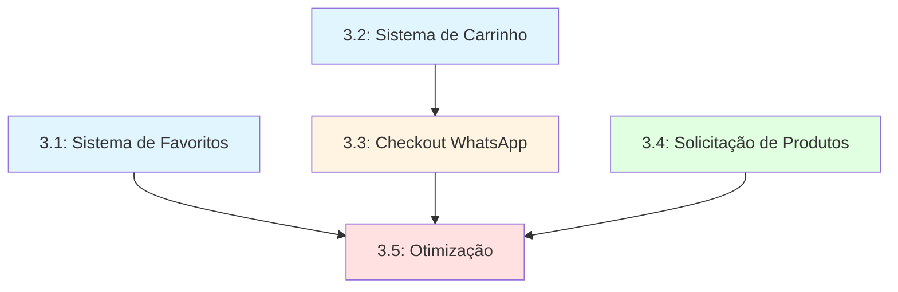

# Epic 3: Favoritos, Carrinho e Solicitação de Produtos

## Visão Geral

Este epic implementa as funcionalidades interativas do catálogo público que permitem aos clientes gerenciar suas preferências e realizar pedidos através do WhatsApp. Inclui sistema de favoritos, carrinho de compras com validação de estoque, checkout via WhatsApp, formulário de solicitação de produtos e otimizações de performance.

## Histórias do Epic

| Story | Título | Estimativa | Dependências | Status |
|-------|--------|-----------|--------------|--------|
| 3.1 | Sistema de Favoritos com Gestos | 2-3 dias | Epic 1, 2.1, 2.4 | Draft |
| 3.2 | Sistema de Carrinho com Validação | 3-4 dias | Epic 1, 2.1, 2.4 | Draft |
| 3.3 | Checkout via WhatsApp | 2-3 dias | 3.2 | Draft |
| 3.4 | Formulário de Solicitação de Produtos | 2-3 dias | Epic 1, 1.5 | Draft |
| 3.5 | Otimização de Performance | 3-4 dias | 3.1, 3.2, 3.3 | Draft |

**Total Estimado**: 12-17 dias de desenvolvimento

## Ordem de Execução Recomendada



### Fase 1: Funcionalidades Base (Paralelo)
- **3.1: Sistema de Favoritos** (2-3 dias)
- **3.2: Sistema de Carrinho** (3-4 dias)
- **3.4: Solicitação de Produtos** (2-3 dias)

### Fase 2: Checkout (Sequencial)
- **3.3: Checkout via WhatsApp** (2-3 dias) - Requer 3.2

### Fase 3: Otimização (Final)
- **3.5: Otimização de Performance** (3-4 dias) - Requer 3.1, 3.2, 3.3

## Principais Entregas por Story

### 3.1: Sistema de Favoritos com Gestos
**Tipo**: Feature | **Prioridade**: High

**Entregas**:
- ✅ CRUD completo de favoritos (catalog_favorites)
- ✅ Optimistic updates com React Query
- ✅ Swipe-to-remove gesture (mobile)
- ✅ Ícone coração com estado persistente
- ✅ Página /catalogo/favoritos com grid responsivo
- ✅ Badge contador no header
- ✅ Toast notifications
- ✅ E2E: adicionar/remover favoritos

**Padrão Técnico**:
```typescript
// Optimistic update pattern
const { mutate: addFavorite } = useMutation({
  mutationFn: (productId) => addFavoriteService(productId),
  onMutate: async (productId) => {
    await queryClient.cancelQueries(['favorites'])
    const previous = queryClient.getQueryData(['favorites'])
    queryClient.setQueryData(['favorites'], old => [...old, { product_id: productId }])
    return { previous }
  },
  onError: (err, variables, context) => {
    queryClient.setQueryData(['favorites'], context.previous)
  }
})
```

---

### 3.2: Sistema de Carrinho com Validação
**Tipo**: Feature | **Prioridade**: Critical

**Entregas**:
- ✅ CRUD carrinho (catalog_cart)
- ✅ Validação de estoque (server + client)
- ✅ Ajuste de quantidade (0-99, decrement/increment)
- ✅ FAB (Floating Action Button) com badge contador
- ✅ Página /catalogo/carrinho
- ✅ Swipe-to-remove (mobile)
- ✅ Cálculo total em tempo real
- ✅ Validação: produto indisponível se visible=false
- ✅ Toast notifications
- ✅ E2E: quantidade maior que estoque = erro

**Validação de Estoque**:
```typescript
// Server-side validation
export async function validateCartStock(userId: string) {
  const cart = await getCart(userId)
  const invalidItems = []

  for (const item of cart) {
    const product = await getProduct(item.product_id)
    if (product.quantity < item.quantity) {
      invalidItems.push({
        productId: item.product_id,
        requested: item.quantity,
        available: product.quantity
      })
    }
  }

  return { valid: invalidItems.length === 0, invalidItems }
}
```

---

### 3.3: Checkout via WhatsApp
**Tipo**: Feature | **Prioridade**: Critical

**Entregas**:
- ✅ Botão "Finalizar Pedido" no carrinho
- ✅ Validação de estoque antes do checkout
- ✅ Criação de registro em catalog_orders (status: pending)
- ✅ Link deep do WhatsApp (wa.me) com mensagem formatada
- ✅ Limpeza do carrinho após criação do pedido
- ✅ Histórico de pedidos em /catalogo/pedidos
- ✅ Badges de status (pending/confirmed/cancelled)
- ✅ E2E: checkout completo
- ✅ Integration: RLS protege pedidos por user

**Mensagem WhatsApp**:
```
Olá! Gostaria de finalizar meu pedido:

1. Perfume X (2x) - R$ 150,00
2. Perfume Y (1x) - R$ 80,00

Total: R$ 230,00

Nome: João Silva
WhatsApp: +5511999999999
```

---

### 3.4: Formulário de Solicitação de Produtos
**Tipo**: Feature | **Prioridade**: Medium

**Entregas**:
- ✅ Modal "Solicitar Produto" (botão na navbar)
- ✅ Form: Nome produto, Marca, Descrição (opcional)
- ✅ Validação Zod (nome: min 3 chars, marca: min 2 chars)
- ✅ Criação em catalog_requests (status: pending)
- ✅ Toast sucesso
- ✅ Página /catalogo/solicitacoes (histórico do usuário)
- ✅ Badges de status (pending/reviewing/available/unavailable)
- ✅ Notificação real-time para admin (Supabase Realtime)
- ✅ E2E: criar solicitação → admin notificado
- ✅ Integration: RLS por user

**Form Schema**:
```typescript
const schema = z.object({
  product_name: z.string().min(3, 'Mínimo 3 caracteres'),
  brand: z.string().min(2, 'Mínimo 2 caracteres'),
  description: z.string().max(500).optional()
})
```

---

### 3.5: Otimização de Performance
**Tipo**: Technical | **Prioridade**: High

**Entregas**:
- ✅ React Query cache optimization (staleTime, cacheTime)
- ✅ Prefetch de produtos na home (onMouseEnter)
- ✅ Debounce em buscas (300ms)
- ✅ Service Worker para cache offline (favorites, cart)
- ✅ ISR revalidation strategy (60s)
- ✅ Edge caching headers (produtos, categorias)
- ✅ Lazy load imagens (next/image)
- ✅ Bundle analysis e code splitting
- ✅ Lighthouse Performance ≥ 90
- ✅ Lighthouse Accessibility ≥ 95
- ✅ Core Web Vitals: LCP < 2.5s, FID < 100ms, CLS < 0.1

**Cache Strategy**:
```typescript
// React Query defaults
const queryClient = new QueryClient({
  defaultOptions: {
    queries: {
      staleTime: 60000,        // 1 min
      cacheTime: 300000,       // 5 min
      refetchOnWindowFocus: false,
      retry: 2
    }
  }
})

// ISR revalidation
export const revalidate = 60 // seconds
```

## Dependências Principais

### Epic 1 (Foundation)
- `catalog_favorites`, `catalog_cart`, `catalog_requests`, `catalog_orders` tables
- RLS policies para proteção por usuário
- WhatsApp Auth (JWT) para identificação

### Epic 2 (Visualization)
- Story 2.1: `catalog.ts` service layer
- Story 2.4: Product details page (favoritos/carrinho integration)

### Internas
- 3.1 e 3.2 podem ser desenvolvidas em paralelo
- 3.3 depende de 3.2 (carrinho completo)
- 3.4 independente (pode ser paralela)
- 3.5 é final (depende de 3.1, 3.2, 3.3)

## Padrões Técnicos Críticos

### 1. Optimistic Updates (3.1, 3.2)
```typescript
// Pattern: onMutate → setQueryData → onError rollback
onMutate: async (newData) => {
  await queryClient.cancelQueries([queryKey])
  const previous = queryClient.getQueryData([queryKey])
  queryClient.setQueryData([queryKey], optimisticData)
  return { previous }
},
onError: (err, variables, context) => {
  queryClient.setQueryData([queryKey], context.previous)
}
```

### 2. Stock Validation (3.2, 3.3)
- Client-side: UI feedback imediato
- Server-side: Validação antes de criar pedido
- Double-check: React Query refetch após mutação

### 3. WhatsApp Deep Link (3.3)
```typescript
const whatsappUrl = `https://wa.me/${STORE_WHATSAPP}?text=${encodeURIComponent(message)}`
window.open(whatsappUrl, '_blank')
```

### 4. Realtime Notifications (3.4)
```typescript
// Admin side
supabase
  .channel('catalog-requests')
  .on('postgres_changes', {
    event: 'INSERT',
    schema: 'public',
    table: 'catalog_requests'
  }, (payload) => {
    toast.info(`Nova solicitação: ${payload.new.product_name}`)
  })
  .subscribe()
```

### 5. Performance Budgets (3.5)
- JS Bundle: < 200KB (gzip)
- First Load: < 100KB
- Image optimization: WebP, lazy load
- Cache-first strategy para assets estáticos

## Testes Obrigatórios

### E2E (Playwright)
```typescript
// 3.1: Favoritos
test('User can add and remove favorites', async ({ page }) => {
  await page.goto('/catalogo')
  await page.click('[data-testid="favorite-btn-1"]')
  await page.goto('/catalogo/favoritos')
  await expect(page.locator('[data-testid="product-1"]')).toBeVisible()
})

// 3.2: Carrinho
test('Cannot add more than stock quantity', async ({ page }) => {
  // Product has quantity = 5
  await page.goto('/catalogo/produto/123')
  await page.fill('[data-testid="quantity-input"]', '10')
  await page.click('[data-testid="add-to-cart"]')
  await expect(page.locator('text=Estoque insuficiente')).toBeVisible()
})

// 3.3: Checkout
test('Checkout creates order and clears cart', async ({ page }) => {
  // Add items to cart, go to /catalogo/carrinho
  await page.click('[data-testid="checkout-btn"]')
  await page.goto('/catalogo/pedidos')
  await expect(page.locator('[data-testid="order-1"]')).toBeVisible()
})

// 3.4: Solicitações
test('Product request notifies admin', async ({ adminPage, clientPage }) => {
  await clientPage.click('[data-testid="request-product-btn"]')
  await clientPage.fill('input[name="product_name"]', 'Perfume X')
  await clientPage.click('button[type="submit"]')

  await adminPage.waitForSelector('text=Nova solicitação: Perfume X')
})
```

### Integration Tests (Jest)
- RLS policies: user can only see own favorites/cart/orders/requests
- Stock validation service
- WhatsApp message generation

### Performance Tests (Lighthouse CI)
```yaml
# .lighthouserc.json
{
  "ci": {
    "collect": {
      "url": ["/catalogo", "/catalogo/favoritos", "/catalogo/carrinho"]
    },
    "assert": {
      "assertions": {
        "categories:performance": ["error", {"minScore": 0.9}],
        "categories:accessibility": ["error", {"minScore": 0.95}],
        "first-contentful-paint": ["error", {"maxNumericValue": 2000}]
      }
    }
  }
}
```

## Riscos e Mitigações

### Risco 1: Sincronização de Estoque
**Problema**: Cliente adiciona ao carrinho, mas outro cliente finaliza pedido e esgota estoque.

**Mitigação**:
- Validação dupla: client + server
- Refetch após mutação
- Toast de erro se estoque mudou

### Risco 2: WhatsApp Deep Link Não Abre
**Problema**: Navegadores mobile podem bloquear window.open().

**Mitigação**:
- User gesture required (botão clicado pelo usuário)
- Fallback: copiar link para clipboard + toast
- Testar em Safari iOS, Chrome Android

### Risco 3: Performance Degradation
**Problema**: Muitos usuários simultâneos degradam performance.

**Mitigação**:
- Edge caching (Vercel/Cloudflare)
- ISR com revalidation strategy
- Service Worker para offline-first
- Bundle size monitoring (CI)

### Risco 4: Race Conditions em Optimistic Updates
**Problema**: Múltiplas mutações simultâneas causam inconsistência.

**Mitigação**:
- `await queryClient.cancelQueries()` antes de otimismo
- `onError` rollback obrigatório
- Disable button durante mutação

## Definition of Done

Para considerar o Epic 3 completo:

- [ ] Todas as 5 stories implementadas e testadas
- [ ] E2E tests cobrindo happy path + edge cases
- [ ] Integration tests de RLS passando
- [ ] Lighthouse Performance ≥ 90 em todas as páginas
- [ ] Lighthouse Accessibility ≥ 95
- [ ] Bundle size < 200KB (gzip)
- [ ] WhatsApp checkout testado em iOS e Android
- [ ] Real-time notifications funcionando (solicitações)
- [ ] Stock validation 100% server-side
- [ ] Responsivo em mobile, tablet, desktop
- [ ] Toast notifications em todas as ações
- [ ] Analytics events configurados (opcional)

## Recursos Adicionais

### Referências de Arquitetura
- [Performance Strategy](../architecture/performance-strategy.md) - ISR, cache, budgets
- [Service Layer API Contracts](../architecture/service-layer-api-contracts.md) - Padrões de serviços
- [Database Schema Migrations](../architecture/database-schema-migrations.md) - Tabelas catalog_*
- [Security Architecture](../architecture/security-architecture.md) - RLS policies

### Bibliotecas Críticas
- `@tanstack/react-query` - Server state + cache
- `zustand` - Client state (cart, favorites counters)
- `framer-motion` - Swipe gestures
- `zod` - Form validation
- `react-hook-form` - Form management
- `sonner` - Toast notifications

### Comandos Úteis
```bash
# Rodar testes E2E
pnpm test:e2e -- epic-3

# Performance audit
pnpm lighthouse -- /catalogo /catalogo/favoritos /catalogo/carrinho

# Bundle analysis
pnpm build && pnpm analyze

# Verificar RLS policies
psql -f tests/rls/catalog-policies.sql
```

---

**Status**: Epic 3 Ready for Development
**Última Atualização**: 2025-11-09
**Autor**: Bob (Scrum Master)
