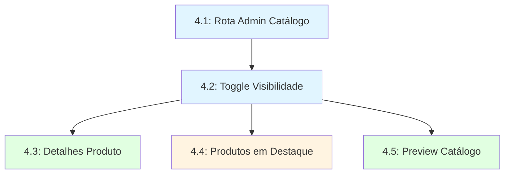

# Epic 4: Gestão de Catálogo no App Administrativo

## Visão Geral

Este epic estende o aplicativo administrativo existente com ferramentas de gestão do catálogo público. Permite que gestores controlem visibilidade de produtos, editem detalhes específicos do catálogo (notas de fragrância, ocasião, intensidade), gerenciem produtos em destaque com drag-and-drop, e visualizem preview do catálogo antes de publicar mudanças.

## Histórias do Epic

| Story | Título | Estimativa | Dependências | Status |
|-------|--------|-----------|--------------|--------|
| 4.1 | Criar Rota de Gestão de Catálogo | 1-2 dias | Epic 1 | Draft |
| 4.2 | Listagem de Produtos com Toggle de Visibilidade | 2-3 dias | 4.1, Epic 1 | Draft |
| 4.3 | Formulário de Detalhes Extras do Produto | 2-3 dias | 4.2 | Draft |
| 4.4 | Gestão de Produtos em Destaque com Ordenação | 3-4 dias | 4.2 | Draft |
| 4.5 | Implementar Preview do Catálogo Público | 1-2 dias | 4.2 | Draft |

**Total Estimado**: 9-14 dias de desenvolvimento

## Ordem de Execução Recomendada



### Fase 1: Fundação (Sequencial)
- **4.1: Rota Admin Catálogo** (1-2 dias)
- **4.2: Toggle Visibilidade** (2-3 dias) - Requer 4.1

### Fase 2: Funcionalidades (Paralelo)
- **4.3: Detalhes Produto** (2-3 dias)
- **4.4: Produtos em Destaque** (3-4 dias)
- **4.5: Preview Catálogo** (1-2 dias)

## Principais Entregas por Story

### 4.1: Criar Rota de Gestão de Catálogo
**Tipo**: Foundation | **Prioridade**: Critical

**Entregas**:
- ✅ Diretório `/app/(authenticated)/catalogo-admin` criado
- ✅ Item "Gestão de Catálogo" no menu lateral (ícone 🏷️)
- ✅ Middleware valida autenticação Supabase Auth
- ✅ Layout reutiliza RootLayout autenticado
- ✅ Dashboard com métricas:
  - Total produtos visíveis
  - Produtos em destaque
  - Solicitações pendentes
  - Pedidos hoje
- ✅ Cards clicáveis navegam para seções
- ✅ Tabs: Produtos, Solicitações, Pedidos, Analytics
- ✅ Integration test: redirect se não autenticado

**Métricas Dashboard**:
```typescript
// Queries para métricas
const metrics = {
  totalProducts: await supabase
    .from('catalog_items')
    .select('count')
    .eq('visible', true)
    .single(),

  featuredProducts: await supabase
    .from('catalog_items')
    .select('count')
    .eq('featured', true)
    .single(),

  pendingRequests: await supabase
    .from('catalog_requests')
    .select('count')
    .eq('status', 'pending')
    .single(),

  ordersToday: await supabase
    .from('catalog_orders')
    .select('count')
    .gte('created_at', new Date().toISOString().split('T')[0])
    .single()
}
```

---

### 4.2: Listagem de Produtos com Toggle de Visibilidade
**Tipo**: Feature | **Prioridade**: Critical

**Entregas**:
- ✅ Página `/catalogo-admin/produtos` com DataTable (shadcn/ui)
- ✅ Colunas: Imagem, Nome, Categoria, Preço, Estoque, Visível, Destaque, Ações
- ✅ Toggle "Visível" atualiza `catalog_items.visible`
- ✅ Toggle "Destaque" atualiza `catalog_items.featured`
- ✅ Ações: Editar Detalhes, Preview
- ✅ Filtro por categoria + busca por nome (debounce 300ms)
- ✅ Paginação 50 itens/página
- ✅ Auto-criar `catalog_items` ao ativar produto pela primeira vez
- ✅ Optimistic update + toast
- ✅ Badge vermelho se estoque = 0
- ✅ Tabela ordenável (nome, categoria, preço, estoque)
- ✅ E2E: ativar/desativar reflete no catálogo público

**Auto-Create Pattern**:
```typescript
async function toggleVisibility(productId: string, visible: boolean) {
  const { data, error } = await supabase
    .from('catalog_items')
    .upsert({
      product_id: productId,
      visible: visible,
      // Defaults: featured: false, featured_order: null
    }, {
      onConflict: 'product_id'
    })

  if (!error) {
    toast.success(`Produto ${visible ? 'ativado' : 'desativado'} no catálogo`)
  }
}
```

---

### 4.3: Formulário de Detalhes Extras do Produto
**Tipo**: Feature | **Prioridade**: High

**Entregas**:
- ✅ Página `/catalogo-admin/produtos/[id]/editar` com formulário
- ✅ Campos (react-hook-form + zod):
  - Notas de fragrância (top/heart/base) - Textareas
  - Ocasião (multi-select) - ex: casual, formal, noturno
  - Intensidade (select) - suave, moderada, forte
  - Durabilidade (select) - curta, média, longa, muito longa
  - Data retorno estoque (date picker, opcional)
- ✅ Salvar atualiza `catalog_items`
- ✅ Botão "Preview" abre `/catalogo/produto/[id]` em nova aba
- ✅ Toast sucesso após salvar
- ✅ Validações: max 500 chars por nota, min 1 ocasião
- ✅ Aviso se produto não está visível
- ✅ Preview em tempo real abaixo do form
- ✅ Botão limpar campos
- ✅ E2E: salvar → público atualiza
- ✅ Integration: RLS admin only

**Form Schema**:
```typescript
const schema = z.object({
  fragrance_notes_top: z.string().max(500, 'Máximo 500 caracteres'),
  fragrance_notes_heart: z.string().max(500, 'Máximo 500 caracteres'),
  fragrance_notes_base: z.string().max(500, 'Máximo 500 caracteres'),
  occasion: z.array(z.string()).min(1, 'Selecione ao menos uma ocasião'),
  intensity: z.enum(['suave', 'moderada', 'forte']),
  longevity: z.enum(['curta', 'media', 'longa', 'muito_longa']),
  stock_return_date: z.date().optional()
})
```

---

### 4.4: Gestão de Produtos em Destaque com Ordenação
**Tipo**: Feature | **Prioridade**: High

**Entregas**:
- ✅ Página `/catalogo-admin/destaques` lista produtos `featured=true`
- ✅ Ordenado por `featured_order` (ASC)
- ✅ Drag-and-drop para reordenar (`@dnd-kit/core`)
- ✅ Reordenar atualiza `featured_order` de todos os itens
- ✅ Modal "Adicionar Produto em Destaque":
  - Busca produtos disponíveis
  - Adicionar: `featured=true`, `featured_order = max + 1`
- ✅ Remover dos destaques: `featured=false`
- ✅ Limite máximo 6 produtos em destaque
- ✅ Preview home ao lado com carrossel real-time
- ✅ Toast ao reordenar
- ✅ E2E: reordenar reflete no carrossel público
- ✅ E2E: tentar adicionar 7º produto = erro

**DnD Update Pattern**:
```typescript
async function handleDragEnd(event: DragEndEvent) {
  const { active, over } = event

  if (!over || active.id === over.id) return

  const oldIndex = items.findIndex(i => i.id === active.id)
  const newIndex = items.findIndex(i => i.id === over.id)

  const newItems = arrayMove(items, oldIndex, newIndex)

  // Update featured_order for all items
  await Promise.all(
    newItems.map((item, index) =>
      supabase
        .from('catalog_items')
        .update({ featured_order: index })
        .eq('id', item.id)
    )
  )

  toast.success('Ordem atualizada')
}
```

---

### 4.5: Implementar Preview do Catálogo Público
**Tipo**: Feature | **Prioridade**: Medium

**Entregas**:
- ✅ Botão "Preview do Catálogo" no header `/catalogo-admin`
- ✅ Abre `/catalogo` em nova aba
- ✅ Query param `?preview=true`
- ✅ Preview mostra produtos `visible=false` com badge "Oculto"
- ✅ Banner topo: "🔍 Modo Preview - Gestor"
- ✅ Navegação completa do catálogo
- ✅ Favoritos/carrinho desabilitados em preview mode
- ✅ Botão "Sair do Preview" → `/catalogo-admin`
- ✅ Responsivo mobile
- ✅ E2E: gestor vê produtos ocultos
- ✅ E2E: cliente não vê produtos ocultos com `?preview=true`

**Preview Middleware**:
```typescript
// middleware.ts
if (pathname.startsWith('/catalogo') && searchParams.get('preview') === 'true') {
  const token = request.cookies.get('sb-access-token')

  if (!token) {
    // Remove preview param for non-authenticated
    const url = new URL('/catalogo', request.url)
    return NextResponse.redirect(url)
  }
}
```

**Preview Context**:
```typescript
// app/catalogo/layout.tsx
const PreviewProvider = ({ children }) => {
  const searchParams = useSearchParams()
  const isPreview = searchParams.get('preview') === 'true'

  return (
    <PreviewContext.Provider value={{ isPreview }}>
      {isPreview && <PreviewBanner />}
      {children}
    </PreviewContext.Provider>
  )
}
```

## Dependências Principais

### Epic 1 (Foundation)
- `catalog_items` table com campos: `visible`, `featured`, `featured_order`, notas de fragrância, etc
- RLS policies para admin (update, insert em catalog_items)
- Middleware de autenticação

### Epic 2 (Public Catalog)
- Integração com páginas públicas para preview
- Reutilização de componentes (ProductCard, CategoryNav)

### App Administrativo Existente
- Layout autenticado (`/app/(authenticated)`)
- Menu lateral (sidebar)
- Middleware de autenticação Supabase Auth

## Padrões Técnicos Críticos

### 1. Auto-Create catalog_items (4.2)
```typescript
// Quando gestor ativa produto pela primeira vez
await supabase.from('catalog_items').upsert({
  product_id: productId,
  visible: true,
  featured: false,
  featured_order: null
}, {
  onConflict: 'product_id' // UNIQUE constraint
})
```

### 2. Featured Order Management (4.4)
```typescript
// Adicionar produto em destaque
const maxOrder = await supabase
  .from('catalog_items')
  .select('featured_order')
  .eq('featured', true)
  .order('featured_order', { ascending: false })
  .limit(1)
  .single()

await supabase.from('catalog_items').update({
  featured: true,
  featured_order: (maxOrder?.featured_order ?? -1) + 1
}).eq('id', productId)
```

### 3. Preview Mode Detection (4.5)
```typescript
// Client-side
const { isPreview } = usePreview()

// Server-side (Page/Layout)
export default async function CatalogoPage({ searchParams }) {
  const isPreview = searchParams.preview === 'true'

  const products = await getProducts({
    includeHidden: isPreview // Show hidden products in preview
  })
}
```

### 4. Drag-and-Drop (@dnd-kit) (4.4)
```typescript
import { DndContext, closestCenter } from '@dnd-kit/core'
import { SortableContext, verticalListSortingStrategy } from '@dnd-kit/sortable'

<DndContext onDragEnd={handleDragEnd} collisionDetection={closestCenter}>
  <SortableContext items={items.map(i => i.id)} strategy={verticalListSortingStrategy}>
    {items.map(item => <SortableItem key={item.id} item={item} />)}
  </SortableContext>
</DndContext>
```

### 5. Form Validation (4.3)
```typescript
import { useForm } from 'react-hook-form'
import { zodResolver } from '@hookform/resolvers/zod'

const form = useForm({
  resolver: zodResolver(schema),
  defaultValues: {
    fragrance_notes_top: product.fragrance_notes_top ?? '',
    fragrance_notes_heart: product.fragrance_notes_heart ?? '',
    fragrance_notes_base: product.fragrance_notes_base ?? '',
    occasion: product.occasion ?? [],
    intensity: product.intensity ?? 'moderada',
    longevity: product.longevity ?? 'media'
  }
})
```

## Testes Obrigatórios

### E2E (Playwright)
```typescript
// 4.2: Toggle Visibilidade
test('Admin can toggle product visibility', async ({ page }) => {
  await page.goto('/catalogo-admin/produtos')
  await page.click('[data-testid="toggle-visible-1"]')

  // Verify in public catalog
  await page.goto('/catalogo')
  await expect(page.locator('[data-testid="product-1"]')).toBeVisible()
})

// 4.3: Editar Detalhes
test('Admin can edit product details', async ({ page }) => {
  await page.goto('/catalogo-admin/produtos/1/editar')
  await page.fill('textarea[name="fragrance_notes_top"]', 'Bergamota, Limão')
  await page.click('button[type="submit"]')

  // Verify in public page
  await page.goto('/catalogo/produto/1')
  await expect(page.locator('text=Bergamota, Limão')).toBeVisible()
})

// 4.4: Reordenar Destaques
test('Admin can reorder featured products', async ({ page }) => {
  await page.goto('/catalogo-admin/destaques')

  // Drag item 1 to position 3
  const item1 = page.locator('[data-testid="featured-item-1"]')
  const item3 = page.locator('[data-testid="featured-item-3"]')
  await item1.dragTo(item3)

  // Verify in public home
  await page.goto('/catalogo')
  const carousel = page.locator('[data-testid="featured-carousel"]')
  const firstItem = carousel.locator('[data-testid^="carousel-item"]').first()
  await expect(firstItem).not.toHaveAttribute('data-product-id', '1')
})

// 4.5: Preview Mode
test('Admin sees hidden products in preview', async ({ page }) => {
  // Product 2 is hidden (visible=false)
  await page.goto('/catalogo?preview=true')
  await expect(page.locator('[data-testid="product-2"]')).toBeVisible()
  await expect(page.locator('text=Oculto')).toBeVisible()
})

test('Client cannot access preview mode', async ({ page }) => {
  await page.goto('/catalogo?preview=true')
  // Should redirect to /catalogo without preview
  await expect(page).toHaveURL('/catalogo')
  await expect(page.locator('text=Modo Preview')).not.toBeVisible()
})
```

### Integration Tests (Jest)
```typescript
// 4.2: RLS - Admin can update catalog_items
test('Admin can update catalog visibility', async () => {
  const { data, error } = await supabaseAdmin
    .from('catalog_items')
    .update({ visible: false })
    .eq('product_id', '123')

  expect(error).toBeNull()
})

// 4.4: Limit featured products to 6
test('Cannot set more than 6 featured products', async () => {
  // Add 6 products as featured
  for (let i = 1; i <= 6; i++) {
    await supabase.from('catalog_items').update({ featured: true }).eq('id', i)
  }

  // Try to add 7th
  const { error } = await supabase
    .from('catalog_items')
    .update({ featured: true })
    .eq('id', 7)

  // Should fail with constraint violation or be prevented by client
  expect(error).toBeTruthy()
})
```

### Unit Tests (Jest)
```typescript
// 4.3: Form validation
import { schema } from './product-details-form'

test('Validates fragrance notes max length', () => {
  const result = schema.safeParse({
    fragrance_notes_top: 'a'.repeat(501),
    occasion: ['casual'],
    intensity: 'moderada',
    longevity: 'media'
  })

  expect(result.success).toBe(false)
  expect(result.error.issues[0].message).toContain('500 caracteres')
})

// 4.4: DnD arrayMove utility
import { arrayMove } from './utils'

test('arrayMove reorders array correctly', () => {
  const items = [1, 2, 3, 4, 5]
  const result = arrayMove(items, 0, 3)
  expect(result).toEqual([2, 3, 4, 1, 5])
})
```

## Riscos e Mitigações

### Risco 1: Race Condition em featured_order
**Problema**: Dois admins reordenando simultaneamente podem gerar conflito.

**Mitigação**:
- Pessimistic locking na mutation
- Toast de erro se falhar
- Refetch automático após erro
- Considerar row-level locks no PostgreSQL

### Risco 2: Preview Mode Bypass
**Problema**: Cliente pode tentar acessar `/catalogo?preview=true`.

**Mitigação**:
- Middleware valida token JWT (admin)
- Remove `?preview=true` se não autenticado
- RLS garante que `visible=false` não aparece em queries públicas
- E2E test valida segurança

### Risco 3: Limite de 6 Destaques Não Respeitado
**Problema**: Client-side validation pode falhar.

**Mitigação**:
- Validação dupla: client + server
- Database constraint (CHECK) se possível
- Toast de erro se ultrapassar limite

### Risco 4: Form com Muitos Campos
**Problema**: UX ruim se form muito longo.

**Mitigação**:
- Separar em tabs/sections (Notas, Ocasião, Características)
- Auto-save (debounced)
- Preview real-time ao lado
- Progress indicator

## Definition of Done

Para considerar o Epic 4 completo:

- [ ] Todas as 5 stories implementadas e testadas
- [ ] E2E tests cobrindo:
  - Toggle visibilidade reflete no público
  - Edição de detalhes atualiza catálogo
  - Reordenação de destaques funciona
  - Preview mode seguro (admin only)
  - Cliente não acessa preview
- [ ] Integration tests de RLS (admin update catalog_items)
- [ ] Menu lateral com item "Gestão de Catálogo"
- [ ] Dashboard com 4 métricas funcionando
- [ ] DataTable com filtros, busca, paginação, sort
- [ ] Drag-and-drop de destaques fluido (60fps)
- [ ] Preview real-time em detalhes de produto
- [ ] Validações de form com feedback UX
- [ ] Toast notifications em todas as ações
- [ ] Responsivo em mobile, tablet, desktop
- [ ] Lighthouse Accessibility ≥ 95
- [ ] Zero console errors/warnings

## Recursos Adicionais

### Referências de Arquitetura
- [Database Schema Migrations](../architecture/database-schema-migrations.md) - Tabela catalog_items
- [Security Architecture](../architecture/security-architecture.md) - RLS para admin
- [Service Layer API Contracts](../architecture/service-layer-api-contracts.md) - Padrões de mutation

### Bibliotecas Críticas
- `@dnd-kit/core` - Drag-and-drop
- `@dnd-kit/sortable` - Sortable list
- `react-hook-form` - Form management
- `@hookform/resolvers` - Zod integration
- `zod` - Schema validation
- `@tanstack/react-query` - Data fetching
- `sonner` - Toast notifications
- `@radix-ui/react-*` - UI primitives (shadcn/ui)

### Comandos Úteis
```bash
# Rodar testes E2E do Epic 4
pnpm test:e2e -- epic-4

# Verificar RLS policies de admin
psql -f tests/rls/admin-catalog-policies.sql

# Build e verificar bundle size
pnpm build && pnpm analyze

# Lighthouse audit das páginas admin
pnpm lighthouse -- /catalogo-admin /catalogo-admin/produtos /catalogo-admin/destaques
```

### Figma/Design
- DataTable com colunas personalizadas
- Toggle switches (visible, featured)
- Drag handles para DnD
- Preview banner design
- Form layout (tabs ou sections)

---

**Status**: Epic 4 Ready for Development
**Última Atualização**: 2025-11-09
**Autor**: Bob (Scrum Master)
