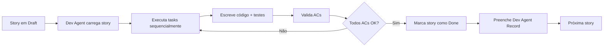

# Auralux - Stories do Epic 1 (MVP) ✅ COMPLETO

## 📋 Resumo - TODAS as Stories Criadas

Este diretório contém **TODAS as 13 stories detalhadas** para o desenvolvimento do **Epic 1: Auralux MVP** - Sistema de Gestão de Vendas e Estoque Mobile-First.

### ✅ Stories Criadas (13 de 13 do Epic MVP) 🎉

| # | Story | Status | Prioridade | Estimativa | Arquivo |
|---|-------|--------|------------|------------|---------|
| **1.1** | PWA Configuration, Database Setup & Auth Foundation | Draft | 🔴 CRÍTICA | 3-4 dias | [1.1.pwa-database-setup.md](./1.1.pwa-database-setup.md) |
| **1.2** | Login Screen, Bottom Navigation & Layout Structure | Draft | 🔴 CRÍTICA | 2-3 dias | [1.2.login-navigation-layout.md](./1.2.login-navigation-layout.md) |
| **1.3** | Customer Management - Registration, Gallery & Search | Draft | 🟡 ALTA | 2-3 dias | [1.3.customer-management.md](./1.3.customer-management.md) |
| **1.4** | Product/Inventory Management - Registration, Gallery & Metrics | Draft | 🟡 ALTA | 3-4 dias | [1.4.inventory-product-management.md](./1.4.inventory-product-management.md) |
| **1.5** | Category Management in Settings | Draft | 🟢 MÉDIA | 1-2 dias | [1.5.category-management-settings.md](./1.5.category-management-settings.md) |
| **1.6** | Sales Dashboard with Metrics and Visualizations | Draft | 🟡 ALTA | 2-3 dias | [1.6.sales-dashboard-metrics.md](./1.6.sales-dashboard-metrics.md) |
| **1.7** | New Sale Flow - Customer & Product Selection (Steps 1-2) | Draft | 🔴 CRÍTICA | 3-4 dias | [1.7.new-sale-customer-product.md](./1.7.new-sale-customer-product.md) |
| **1.8** | Payment Method Selection, Installment & Sale Completion (Step 3) | Draft | 🔴 CRÍTICA | 2-3 dias | [1.8.payment-sale-completion.md](./1.8.payment-sale-completion.md) |
| **1.9** | Inventory Update on Sale & Movement Tracking (Triggers Verification) | Draft | 🟡 ALTA | 1-2 dias | [1.9.inventory-tracking-triggers.md](./1.9.inventory-tracking-triggers.md) |
| **1.10** | PWA Offline Capability & Service Worker | Draft | 🟢 MÉDIA | 2-3 dias | [1.10.pwa-offline-capability.md](./1.10.pwa-offline-capability.md) |
| **1.11** | Responsive Design & Mobile Optimization | Draft | 🟢 MÉDIA | 1-2 dias | [1.11.responsive-design-optimization.md](./1.11.responsive-design-optimization.md) |
| **1.12** | Comprehensive Testing & Quality Assurance | Draft | 🔴 CRÍTICA | 3-5 dias | [1.12.testing-qa-comprehensive.md](./1.12.testing-qa-comprehensive.md) |
| **1.13** | Deployment & Production Launch | Draft | 🔴 CRÍTICA | 2-3 dias | [1.13.deployment-production-launch.md](./1.13.deployment-production-launch.md) |

**Total Estimado:** 27-38 dias de desenvolvimento (aproximadamente 5-8 semanas com 1 desenvolvedor)

---

## 🎯 Visão Geral das Entregas por Story

### 🔴 CRÍTICAS (Fundação do MVP)

#### Story 1.1: PWA, Database & Auth Foundation
**Por que é CRÍTICA:** Tudo depende disso.

**Entregas:**
- ✅ PWA manifest.json com **logos Auralux** (192x192, 512x512, apple-touch-icon)
- ✅ iOS splash screens e meta tags
- ✅ Database schema completo (7 tabelas + RLS + triggers + views)
- ✅ Supabase Storage bucket 'products'
- ✅ Autenticação Supabase configurada
- ✅ Auth hook (useAuth) e AuthContext

**⚠️ ATENÇÃO MÁXIMA:** Logos PWA são OBRIGATÓRIOS para instalação no iOS!

---

#### Story 1.2: Login, Navigation & Layout
**Por que é CRÍTICA:** Ponto de entrada do app.

**Entregas:**
- ✅ Tela de login com branding Auralux
- ✅ Autenticação Supabase (email/password)
- ✅ Protected routes (middleware)
- ✅ Bottom navigation (Clientes, Vendas, Estoque)
- ✅ Top bar com logo e settings
- ✅ Layout responsivo iOS
- ✅ Logout funcional

---

#### Story 1.7: New Sale Flow - Customer & Product (Steps 1-2)
**Por que é CRÍTICA:** Core business functionality.

**Entregas:**
- ✅ Wizard de venda (multi-step modal)
- ✅ Step 1: Seleção de cliente (searchable dropdown)
- ✅ Step 2: Seleção de produtos (grid + cart)
- ✅ Carrinho de compras (adicionar, remover, atualizar quantidade)
- ✅ Validação de estoque (não pode exceder disponível)
- ✅ Estado persistente entre steps
- ✅ Integração com AddCustomerModal inline

---

#### Story 1.8: Payment Method & Sale Completion (Step 3)
**Por que é CRÍTICA:** Conclusão do fluxo de vendas.

**Entregas:**
- ✅ Step 3: Seleção de método de pagamento (PIX, Dinheiro, Parcelado)
- ✅ Seletor de parcelas (1x-12x)
- ✅ Modal de valor recebido após taxas (parcelamento)
- ✅ Cálculo automático de desconto
- ✅ Resumo completo da venda antes de confirmar
- ✅ Criação atômica de sale + sale_items
- ✅ Triggers automáticos (inventário, cliente, movimentações)
- ✅ Feedback de sucesso e atualização do dashboard

---

#### Story 1.12: Testing & QA
**Por que é CRÍTICA:** Qualidade e confiabilidade.

**Entregas:**
- ✅ Unit tests (90% coverage em business logic)
- ✅ Integration tests (85% coverage em database ops)
- ✅ Component tests (70% coverage)
- ✅ E2E tests (5 fluxos críticos)
- ✅ RLS security tests
- ✅ Performance tests
- ✅ Accessibility tests (WCAG AA)
- ✅ Cross-browser tests (Safari iOS, Chrome iOS)

---

#### Story 1.13: Deployment & Production Launch
**Por que é CRÍTICA:** Go live!

**Entregas:**
- ✅ Supabase production setup
- ✅ Vercel deployment com CI/CD
- ✅ Custom domain + SSL
- ✅ Sentry error monitoring
- ✅ Vercel Analytics
- ✅ User documentation
- ✅ Deployment documentation
- ✅ Smoke tests em produção
- ✅ Rollback plan
- ✅ Support channels
- ✅ **GO LIVE! 🚀**

---

### 🟡 ALTA PRIORIDADE (Core Features)

#### Story 1.3: Customer Management
**Entregas:**
- ✅ CRUD de clientes (nome, WhatsApp)
- ✅ Validação de WhatsApp brasileiro
- ✅ Galeria de clientes com busca
- ✅ Métrica de total de clientes
- ✅ Real-time updates

---

#### Story 1.4: Product/Inventory Management
**Entregas:**
- ✅ CRUD de produtos (imagem, nome, preços, quantidade, categoria)
- ✅ Upload de imagens (Supabase Storage, 5MB, JPG/PNG/WEBP)
- ✅ Cálculo automático de margem de lucro
- ✅ Galeria de produtos visual
- ✅ Métricas: Total quantidade, Valor potencial, Estoque baixo
- ✅ Indicador de estoque baixo
- ✅ Edição de produtos

---

#### Story 1.6: Sales Dashboard with Metrics
**Entregas:**
- ✅ Dashboard como tela padrão
- ✅ Metrics cards (Daily, Weekly, Monthly Sales, Revenue)
- ✅ Line chart (vendas últimos 30 dias)
- ✅ Recent sales list (últimas 10)
- ✅ Payment method breakdown widget
- ✅ Revenue vs Actual Received metric
- ✅ Date range filter
- ✅ Real-time updates
- ✅ "+ Nova Venda" button

---

#### Story 1.9: Inventory Triggers Verification
**Entregas:**
- ✅ Verificação de triggers do Story 1.1
- ✅ Stock validation service
- ✅ Low stock alerts
- ✅ Inventory movements query
- ✅ Inventory history view (basic)
- ✅ Transaction integrity tests
- ✅ Audit trail completo

---

### 🟢 MÉDIA PRIORIDADE (Polish & Support)

#### Story 1.5: Category Management
**Entregas:**
- ✅ CRUD de categorias (settings)
- ✅ ON DELETE SET NULL para produtos
- ✅ Warning ao deletar categoria com produtos
- ✅ Integração com product form dropdown
- ✅ Real-time updates

---

#### Story 1.10: PWA Offline Capability
**Entregas:**
- ✅ Service worker configurado
- ✅ App shell caching
- ✅ API response caching (stale-while-revalidate)
- ✅ Offline operation queue (IndexedDB)
- ✅ Background sync
- ✅ Online/offline indicator
- ✅ Graceful degradation (read-only offline)

---

#### Story 1.11: Responsive Design Optimization
**Entregas:**
- ✅ Responsivo iPhone SE a Pro Max
- ✅ Touch targets >= 44x44pt
- ✅ Safe area insets (iOS notch)
- ✅ Image optimization (lazy load, WebP)
- ✅ Smooth animations (60fps)
- ✅ Accessibility audit (WCAG AA)
- ✅ Real device testing

---

## 🚀 Como Executar as Stories

### Ordem de Execução Recomendada:

```
┌─────────────────────────────────────────────────────┐
│ FASE 1: FUNDAÇÃO (Semana 1)                        │
├─────────────────────────────────────────────────────┤
│ 1.1 → PWA, Database & Auth (3-4 dias)              │
│ 1.2 → Login, Navigation & Layout (2-3 dias)        │
└─────────────────────────────────────────────────────┘

┌─────────────────────────────────────────────────────┐
│ FASE 2: CORE FEATURES (Semanas 2-3)                │
├─────────────────────────────────────────────────────┤
│ 1.3 → Customer Management (2-3 dias)               │
│ 1.4 → Inventory/Product Management (3-4 dias)      │
│ 1.5 → Category Management (1-2 dias)               │
└─────────────────────────────────────────────────────┘

┌─────────────────────────────────────────────────────┐
│ FASE 3: SALES FLOW (Semanas 4-5)                   │
├─────────────────────────────────────────────────────┤
│ 1.6 → Sales Dashboard (2-3 dias)                   │
│ 1.7 → New Sale - Customer & Products (3-4 dias)    │
│ 1.8 → Payment & Sale Completion (2-3 dias)         │
│ 1.9 → Inventory Triggers Verification (1-2 dias)   │
└─────────────────────────────────────────────────────┘

┌─────────────────────────────────────────────────────┐
│ FASE 4: POLISH & LAUNCH (Semanas 6-7)              │
├─────────────────────────────────────────────────────┤
│ 1.10 → PWA Offline Capability (2-3 dias)           │
│ 1.11 → Responsive Design Optimization (1-2 dias)   │
│ 1.12 → Testing & QA (3-5 dias)                     │
│ 1.13 → Deployment & Production Launch (2-3 dias)   │
└─────────────────────────────────────────────────────┘
```

### Comandos para o Dev Agent:

```bash
# 1. Carregar o Dev Agent
/BMad:agents:dev

# 2. Carregar uma story específica
*load 1.1

# 3. Dev agent executará todos os tasks/subtasks automaticamente

# 4. Após conclusão, marcar story como "Done" no arquivo

# 5. Repetir para próxima story
*load 1.2
```

### Execução em Paralelo (Opcional):
Se houver múltiplos desenvolvedores:
- Dev 1: Stories 1.1 → 1.2
- Dev 2: Story 1.3 (após 1.1 completado)
- Dev 3: Story 1.4 (após 1.1 completado)

---

## ⚠️ ATENÇÕES CRÍTICAS

### 1. **PWA LOGOS** (MÁXIMA PRIORIDADE!)
- ⚠️ Aplicação **PRECISA** ter logos configurados para instalar no iOS
- ✅ Story 1.1 Task 1 tem tudo preparado
- ✅ URLs dos logos já documentadas em `logos.md`
- ✅ Tamanhos necessários: 192x192, 512x512, 180x180 (apple-touch-icon)

### 2. **DATABASE NÃO EXISTE AINDA**
- ⚠️ Schema SQL completo está documentado mas **não foi criado**
- ✅ Story 1.1 Task 2 tem todo o SQL pronto para execução
- ✅ Inclui: 7 tabelas + RLS + triggers + views + storage bucket

### 3. **FRONTEND JÁ INICIADO**
- ℹ️ Alguns componentes já existem em `components/customers/`
- ✅ Dev agent pode revisar e integrar ou substituir conforme necessário

### 4. **TRIGGERS SÃO AUTOMÁTICOS**
- ℹ️ Story 1.1 cria triggers do banco
- ℹ️ Story 1.9 apenas **verifica e testa** que funcionam
- ✅ Inventário, cliente e movimentações atualizam automaticamente ao criar venda

---

## 🎨 Design System Auralux

Todas as stories seguem rigorosamente esta paleta:

| Cor | Hex | Uso | Classe Tailwind |
|-----|-----|-----|-----------------|
| **Carvão** | `#202020` | Fundo principal | `bg-[#202020]` |
| **Taupe/Greige** | `#A1887F` | Cards, banners | `bg-[#A1887F]` |
| **Rosa Queimado** | `#C49A9A` | **Botões CTA, highlights** | `bg-[#C49A9A]` |
| **Areia** | `#E0DCD1` | Textos sobre fundos escuros | `text-[#E0DCD1]` |
| **Off-White** | `#F7F5F2` | Fundos alternativos (modais) | `bg-[#F7F5F2]` |
| **Prata** | `#BDBDBD` | Logo, elementos premium | `text-[#BDBDBD]` |

**Hierarquia Visual:**
- Botões primários: Rosa Queimado (#C49A9A)
- Cards: Taupe/Greige (#A1887F) com border-radius 12px
- Modais: Off-White (#F7F5F2)
- Loading states: Rosa Queimado spinners

---

## 📚 Documentação de Referência

Todas as stories foram criadas com base em:

### PRD e Épicos
- **PRD Core:** [`docs/epics/00-prd-core.md`](../epics/00-prd-core.md)
- **Epic 1 MVP:** [`docs/epics/epic-01-mvp.md`](../epics/epic-01-mvp.md)
- **UI/UX Guidelines:** [`docs/epics/01-ui-ux-guidelines.md`](../epics/01-ui-ux-guidelines.md)
- **Tech Constraints:** [`docs/epics/02-tech-constraints.md`](../epics/02-tech-constraints.md)

### Arquitetura
- **Overview:** [`docs/architecture/00-overview.md`](../architecture/00-overview.md)
- **Tech Stack:** [`docs/architecture/01-tech-stack.md`](../architecture/01-tech-stack.md)
- **Data Models:** [`docs/architecture/02-data-models.md`](../architecture/02-data-models.md)
- **Services:** [`docs/architecture/03-services.md`](../architecture/03-services.md)
- **Database Schema:** [`docs/architecture/04-database-schema.md`](../architecture/04-database-schema.md)
- **Workflows:** [`docs/architecture/05-workflows.md`](../architecture/05-workflows.md)
- **Infrastructure:** [`docs/architecture/06-infrastructure.md`](../architecture/06-infrastructure.md)
- **Error Handling:** [`docs/architecture/07-error-handling.md`](../architecture/07-error-handling.md)
- **Source Tree:** [`docs/architecture/08-source-tree.md`](../architecture/08-source-tree.md)
- **Coding Standards:** [`docs/architecture/09-coding-standards.md`](../architecture/09-coding-standards.md)
- **Security:** [`docs/architecture/10-security.md`](../architecture/10-security.md)

---

## 📂 Estrutura de Arquivos

```
docs/stories/
├── README.md                                      # 📋 Este arquivo
├── 1.1.pwa-database-setup.md                    # ⚠️ CRÍTICA
├── 1.2.login-navigation-layout.md               # ⚠️ CRÍTICA
├── 1.3.customer-management.md                   # 🟡 ALTA
├── 1.4.inventory-product-management.md          # 🟡 ALTA
├── 1.5.category-management-settings.md          # 🟢 MÉDIA
├── 1.6.sales-dashboard-metrics.md               # 🟡 ALTA
├── 1.7.new-sale-customer-product.md             # ⚠️ CRÍTICA
├── 1.8.payment-sale-completion.md               # ⚠️ CRÍTICA
├── 1.9.inventory-tracking-triggers.md           # 🟡 ALTA
├── 1.10.pwa-offline-capability.md               # 🟢 MÉDIA
├── 1.11.responsive-design-optimization.md       # 🟢 MÉDIA
├── 1.12.testing-qa-comprehensive.md             # ⚠️ CRÍTICA
└── 1.13.deployment-production-launch.md         # ⚠️ CRÍTICA
```

---

## 📊 Estatísticas do Epic 1 MVP

### Por Prioridade:
- 🔴 **CRÍTICA:** 6 stories (1.1, 1.2, 1.7, 1.8, 1.12, 1.13)
- 🟡 **ALTA:** 4 stories (1.3, 1.4, 1.6, 1.9)
- 🟢 **MÉDIA:** 3 stories (1.5, 1.10, 1.11)

### Por Categoria:
- **Fundação/Infra:** 2 stories (1.1, 1.2)
- **CRUD Features:** 4 stories (1.3, 1.4, 1.5, 1.9)
- **Sales Flow:** 3 stories (1.6, 1.7, 1.8)
- **Polish/Support:** 2 stories (1.10, 1.11)
- **Quality/Deploy:** 2 stories (1.12, 1.13)

### Estimativas:
- **Mínimo:** 27 dias (5.4 semanas)
- **Máximo:** 38 dias (7.6 semanas)
- **Média:** 32.5 dias (6.5 semanas)

---

## ✅ Checklist de Validação de Story

Antes de marcar uma story como "Done", verificar:

- [ ] Todos os Acceptance Criteria foram atendidos
- [ ] Todos os Tasks/Subtasks foram completados
- [ ] Testes escritos e passando (unit, integration, component)
- [ ] Code review realizado
- [ ] Documentação atualizada (se aplicável)
- [ ] Sem console.log ou código de debug
- [ ] Performance testada (sem lentidão perceptível)
- [ ] Responsivo testado (mobile, tablet)
- [ ] Acessibilidade básica verificada
- [ ] Integração com stories anteriores funcionando
- [ ] Dev Agent Record preenchido no arquivo da story

---

## 🔄 Workflow de Desenvolvimento



---

## 🎯 Marcos do Projeto

| Marco | Stories | Data Estimada |
|-------|---------|---------------|
| **M1: Fundação Completa** | 1.1, 1.2 | Fim Semana 1 |
| **M2: CRUD Features** | 1.3, 1.4, 1.5 | Fim Semana 3 |
| **M3: Sales Flow Funcional** | 1.6, 1.7, 1.8, 1.9 | Fim Semana 5 |
| **M4: MVP Polido** | 1.10, 1.11 | Fim Semana 6 |
| **M5: Produção Ready** | 1.12, 1.13 | Fim Semana 7 |
| **🚀 GO LIVE** | Todas | ~8 semanas |

---

## 📞 Suporte e Questões

Se encontrar problemas ou tiver dúvidas:

1. **Revisar a story específica** - Dev Notes têm contexto detalhado
2. **Consultar arquitetura** - Links em cada story
3. **Verificar PRD/Epic** - Requirements originais
4. **Criar issue** - Documentar problema claramente

---

## 🎉 Status Atual

**✅ EPIC 1 MVP - 100% PLANEJADO**

- ✅ 13 de 13 stories criadas
- ✅ Todas as stories com AC, Tasks, Dev Notes completos
- ✅ Estimativas documentadas
- ✅ Dependências mapeadas
- ✅ Ordem de execução definida
- ✅ Pronto para desenvolvimento!

**Próximo passo:** Carregar Story 1.1 com o Dev Agent e começar! 🚀

---

**Criado por:** Bob 🏃 (Scrum Master Agent)
**Projeto:** Auralux - Mobile Sales & Inventory Management
**Epic:** 1 - MVP
**Framework:** BMad™ Core
**Data:** 2025-11-07
**Versão:** 2.0 (Completo com todas as 13 stories)

---

## 🔄 Change Log

| Date | Version | Description | Author |
|------|---------|-------------|--------|
| 2025-11-07 | v1.0 | Created README with stories 1.1-1.4 | Bob (Scrum Master) |
| 2025-11-07 | v2.0 | **COMPLETO:** Added stories 1.5-1.13, comprehensive guide | Bob (Scrum Master) |
